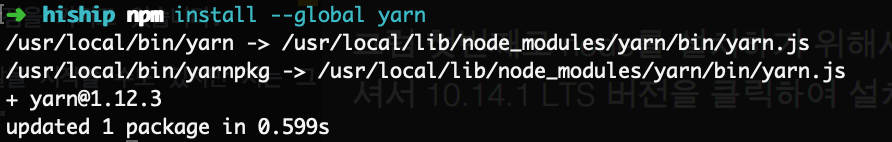

## Nuxt.Js란?
VueJs를 사용하시는 분들이라면 한 번은 들어봤을 단어이죠?  
VueJs로 어플리케이션을 개발할 때 클라이언트 사이드 렌더링과 서버 사이드 렌더링에 대해 먼저 고민하기 마련입니다.  
여기서 서버 사이드 렌더링을 선택한다면 Nuxt.Js를 사용하게 되는거죠.

## 클라이언트 사이드 렌더링? 서버 사이드 렌더링?  
- 클라이언트 사이드 렌더링: 이것은 어플리케이션에 필요한 정보를 한번에 불러와서 사용합니다. 초기에 페이지 로드시 속도가 느려지겠죠?
- 서버사이드 렌더링: 이것은 반대로 페이지별 필요한 정보만 불러옵니다.  상대적으로 초기에 페이지 로드시 빠릅니다.  
  
아주 간단히 기본적인 개념에 대해 설명을 드렸는데요.  
상기와 같은 차이로 인해 각기 장단점을 가지게 됩니다.  
예를 들어, 서버 사이드 렌더링이 검색엔진 최적화에 더 용이하다, 클라이언트 사이드는 페이지 렌더링 시 속도가 빠르다 등이 있겠습니다.  

## 설치방법
저는  Nuxt.js starter 템플릿을 사용하여 프로젝트 초기 셋팅을 합니다.  
Nuxt는 node 기반의 프로젝트라서 우선 Node를 설치합시다.  

### node 설치
node를 설치하기 위해서 http://www.nodejs.org에 접속하셔서 10.14.1 LTS 버전을 클릭하여 설치해줍니다.


node를 설치하면 npm 명령어를 사용할 수 있게 됩니다.  
제대로 설치가 되었는지 확인하기 위해 npm -v 명령어를 입력하여 해당 버전을 확인해봅시다.  


### yarn 설치
두번째로 yarn을 설치해봅시다.  
vue-cli 명령어를 사용하기 위해서는 yarn을 설치해야합니다.  
터미널에서 방금 설치한 npm 명령어로 npm install --global yarn을 입력하시면 npm과 마찬가지로 yarn을 명령어로 사용할 수 있습니다.



### nuxt 템플릿 사용하기
node설치로 npm, yarn을 사용할 준비가 되었다면 이제 npm install -g @vue/cli 명령어로 전역에서 vue 명령어를 사용할 수 있도록 해줍시다.  
이제 프로젝트를 개발할 해당 디렉토리로 이동하여 터미널을 열어줍니다.
  


위와 같이 vue init nuxt-community/starter-template (프로젝트 이름)을 입력하여 실행 후 프로젝트 이름과, 설명, 개발자까지 입력하면 알아서 프로젝트 셋팅을 시작합니다.        
to get started의 설명과 같이 해당 프로젝트 경로로 들어가 npm install과 npm run dev를 실행해봅시다.  

터미널에서 컴파일이 되면서 localhost:3000으로 접속하라는 문구가 떴나요?

## 디렉토리 구조 살펴보기
이제 프로젝트 디렉토리 구조를 살펴보면서 어떻게 개발해나가야 할지 생각해봅시다.  

```sh
├── assets
├── components
├── layouts
├── middleware
├── pages
├── plugins
├── static
├── store
├── package.json
├── nuxt.config.js
```

최상단에 있는 부분 및 중요한 파일 기준으로 설명을 드리겠습니다.  

### assets
이 폴더에서는 보통 css나 javacript, image 파일들이 저장됩니다.  
여기 저장되어 있는 파일들을 .vue 파일에서 참조하여 사용할 경우 webpack loader들에 의해서 컴파일됩니다.  

### components
component는 목적과 기능별로 쪼개서 사용을 합니다.  
이 폴더에서 페이지에 필요한 컴포넌트를 정리하여 사용합니다.  

### Layouts
페이지에 필요한 레이아웃을 정의하여 사용할 수 있습니다.  

### middleware
nuxt의 경우 페이지 렌더링 시 렌더링이 되기 전에 middleware를 거쳐서 갑니다.  
middleware에서 페이지 렌더링 전 사용해야 할 함수가 있다면 여기서 정의하여 사용할 수 있습니다.  

### pages
사용자에게 보여지는 페이지 파일들을 포함합니다.  
특이한 점은 디렉토리와 파일 위치에 따라 라우터를 생성하여 라우팅 되는 경로가 정해지니 참고하시면 되겠습니다.  

### plugins
어플리케이션을 개발하다보면 다양한 플러그인들을 참조하여 사용하는 경우가 많죠.  
여기서 사용하고 싶은 플러그인을 정의하고 사용할 수 있습니다.  

### static
assets 폴더와 달리 여기에 있는 파일들은 정적인 파일들입니다.  
그래서 /에 연결하여 필요한 파일을 참조하여 사용할 수 있습니다.  
참고로 이 옵션은 robots.txt나 sitemap.xml, CNAME(깃허브 페이지 같은) 파일들을 위해 도움이 된다고 합니다.  

### store
vuex를 알고 계신가요?  
vuex는 상태관리 즉, 글로벌한 데이터의 흐름을 관리하는 역할을 합니다.  
이런 역할을 이 폴더에서 하게 됩니다.  

### package.json
script 실행(npm run dev 등) 및 설정한 모듈과 관련한 정보를 확인하고 설정 수 있습니다.  

### nuxt.config.js
nuxt 프로젝트와 관련된 사용자 정의 설정 파일입니다.  
해당 파일을 열어보면 css, script, plugin, 환경변수 설정 뿐만 아니라 webpack 관련 설정도 할 수 있습니다.  

전반적으로 간단히 각각의 디렉토리 및 파일들이 어떤 역할을 하는지 살펴보았습니다.  
그럼 간단히 컴포넌트를 사용하는 페이지를 렌더링해보겠습니다. 

## 컴포넌트를 사용하여 페이지 출력하기
먼저 pages 디렉토리 하단에 폴더와 파일을 생성해보겠습니다.  

```sh
├── assets
├── components
├── layouts
├── middleware
├── pages
│   └── main (추가)
│       └── helloNuxt.vue (추가)
├── plugins
├── static
├── store
├── package.json
├── nuxt.config.js
```

그리고 helloNuxt.vue 파일에 다음과 같이 작성해보세요.  

```html
<template>
  <div>
    hello Nuxt!
  </div>
</template>

<script>
  export default {
    components: {
    },
    data() {
      return {}
    },
    methods: {
    },
    created() {
    },
  }
</script>

<style>

</style>

```
  
hello Nuxt!를 출력하는 페이지를 만들어 보았습니다.  
이제 이 페이지를 확인해봐야겠죠?  
그럼 어떤 경로로 접속해야할까요?  

좀 전에 설명드린 바와 같이 Nuxt는 디렉토리 및 파일 경로에 따라 라우터를 생성합니다.  
그래서 localhost:3000/main/helloNuxt로 접속해보세요.  
hello Nuxt!가 보이시나요?  

이제 컴포넌트 디렉토리에 파일을 생성하여 helloNuxt 파일에서 사용해보겠습니다.  

```sh
├── assets
├── components
│   └── comp.vue (추가)
├── layouts
├── middleware
├── pages
│   └── main
│       └── helloNuxt.vue
├── plugins
├── static
├── store
├── package.json
├── nuxt.config.js
```
  
상기와 같이 comp.vue 파일을 생성하고 아래 내용을 붙여 넣어봅시다.    

```html
<template>
  <div style="width: 100%; height: 100px; background: blue">
    <span style="color: white; font-weight: bold">컴포넌트입니다.</span>
  </div>
</template>

<script>
  export default {
    components: {
    },
    data() {
      return {}
    },
    methods: {
    },
    created() {
    },
  }
</script>

<style>

</style>

```

출력되는 화면에서 어떤 변화가 생겼나요?  
파란색 바탕에 하얀색 글씨로 컴포넌트입니다. 라는 문구가 보이는걸 확인하실 수 있습니다!


## 정리 
이렇게 Nuxt 템플릿으로 간단한 문구를 출력하는 내용까지 다뤄보았습니다.  
설명해야 할 내용이 아주 많지만 최대한 시작하는 입장에서 간결하게 작성해보았는데 잘 전달이 되었는지 모르겠네요.  
클라이언트 사이드 렌더링에 대해 개발해보신 분이라면 이해하는데 수월하셨겠지만 VueJs에 대한 기초가 부족한 분들은 난해하셨을 수도 있을 것 같습니다.  
디렉토리별 역할에 대해 좀 더 디테일하게 스터디 하신 후 필요한 페이지별로 각 기능에 충실한 컴포넌트를 개발하여 멋진 어플리케이션을 개발하시길 바랍니다.  
  
