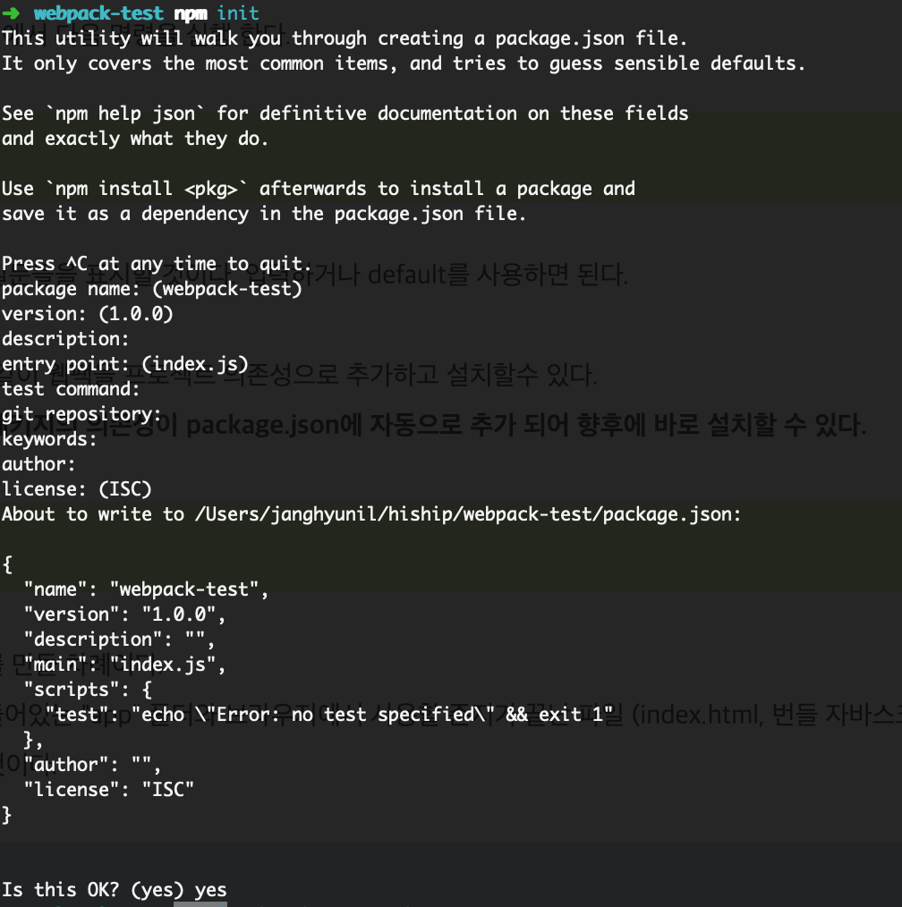
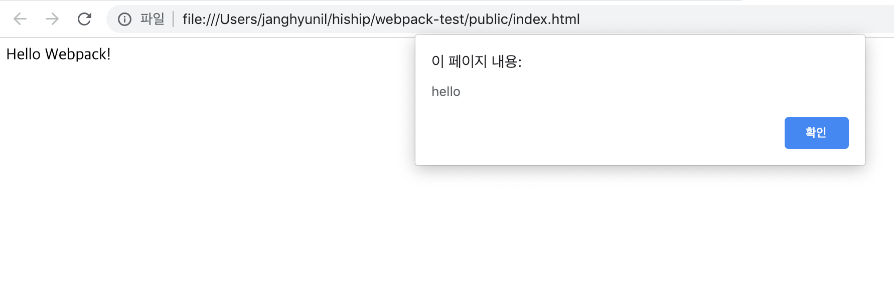

# [webpack](http://webpack.github.io)


## 개요 

Gulp, Grunt와 더불어 Webpack은 자바스크립트 빌드 도구입니다. 사실 출시 된지는 몇 년 되었지만 최근 리엑트 프로젝트에서 사용되면서 관심을 갖게 되었습니다. 그래서 요즘은 대부분의 자바스크립트 프로젝트에 웹팩을 사용하는 분위기 이며 Grunt, Gulp도 대체하는 것 같습니다. ECMAScript 2015의 트랜스파일러인 바벨(Babel)을 웹팩과 함께 사용하면서 웹팩의 활용도는 점점 증가하고 있습니다.


## 기본 철학

Webpack의 두가지 핵심 철학: * 모든것은 module이다. * JS 파일들은 모듈(modules)이 될 수 있다. 또한 다른 모든 것(CSS, Images, HTMLS..)들도 모듈(modules)이 될 수 있다. 즉 `require(“myJSfile.js”)` 또는 `require(“myCSS.css”)` 를 할 수 있다. 이는 다루기 쉬운 작은 조각으로 나누거나, 재사용할 수 있다는걸 의미합니다.


## webpack 사용해보기
node가 설치되어 있다는 전제하에 설명합니다.  
먼저 프로젝트를 생성할 디렉토리를 만들어줍니다.  
그리고 해당 디렉토리에서 터미널을 열어서 npm init으로 package.json 파일을 생성합니다. 

```bash
npm init 
```



`npm init` 을 실행하게 되면 여러가지 질문들을 물어보는데 필요한 정보를 입력하거나 굳이 필요하지 않은 부분들은 엔터로 넘어가줍니다.  

그리고 npm install 명령어로 webpack 모듈을 설치해봅시다.  

```bash
npm install webpack --save-dev
```

이제는 webpack을 사용하기 위해 번들로 묶을 파일들과 설정파일을 생성해봅시다.    

```sh
├── app
│   └── app.js
│   └── options.js
├── public
│   └── index.html
├── package.json
├── webpack.config.js
```

상기 디렉토리 구조와 같이 생성했다면 해당 파일의 내용을 아래와 같이 만들어봅시다.  

```html
// index.html
<!DOCTYPE html>
<html>
<head>
    <meta charset="utf-8"/>
    <title>Webpack Test</title>
</head>
<body>
    <div id="container"></div>

    <script src="./bundle.js"></script>
</body>
</html>
```

index.html에는 기본적인 html 구조와 추후에 생성될 bundle.js 파일을 참조하였습니다.  


```javascript
// app.js
import {hello} from './options'

hello()

let div = document.createElement('div')

div.innerHTML = "Hello Webpack!"

document.getElementById('container').appendChild(div)

```

app.js 파일에는 div 엘리먼트를 생성하여 `Hello Webpack!` 이라는 문구를 삽입하고 index.html의 container 엘리먼트 자식으로 삽입하는 코드를 넣어보았습니다.  
그리고 상단에 있는 `hello()`라는 함수는 같은 디렉토리 내에 있는 `options.js` 파일을 참조하여 사용했습니다.  
아래는 `options.js` 파일의 내용입니다.  

```javascript
export function hello() {
  document.getElementById('container').onclick = () => {
    alert('hello')
  }
}
```

```javascript
// webpack.config.js
module.exports = {
  entry : __dirname +'/app/app.js',
  output : {
    path : __dirname + '/public',
    filename : 'bundle.js'
  }
}
```

`webpack.config.js` 파일에는 webpack 사용을 위한 설정값을 정의하였습니다.  
    - entry: 번들로 묶을 파일들을 선언해주면됩니다.  
    - output: path에 생성될 파일이 위치해야하는 경로값을 적어주고 filename은 이름을 적어주면됩니다.  
   
   
```json
// package.json
{
  "name": "webpack-test",
  "version": "1.0.0",
  "description": "",
  "main": "index.js",
  "scripts": {
    "build": "node_modules/.bin/webpack"
  },
  "author": "",
  "license": "ISC",
  "devDependencies": {
    "webpack": "^4.28.2",
    "webpack-cli": "^3.1.2"
  }
}

```

이제 webpack 모듈을 실행시키기 위해 package.json 파일에서 build 스크립트를 상기와 같이 추가해봅시다.  
그리고 터미널에서 npm run build를 실행하면 output으로 지정해놓았던 경로에 bundle.js 파일이 생성됩니다.  

index.html 파일을 브라우저로 열어서 확인해보셨나요?  
Hello Webpack!이라는 문구를 클릭하면 hello라는 alert 창이 뜹니다. 



index.html은 bundle.js를 참조하고 있는데 app.js에서 작성한 내용이 반영되었습니다.  
그 뜻은 webpack이 app.js 파일과 참조하고 있던 options.js 파일을 번들링하여 bundle.js 파일로 표현해주었다는게 이해가 되시죠?  

## 정리 
webpack에 대한 아주 기본적인 개념과 사용방법에 대해 알아보았습니다.  
제가 처음 webpack을 접하게 된 것은 웹 프론트엔드 프레임워크인 VueJs로 프로젝트를 개발하면서 입니다.  
vue-cli를 통해 프로젝트를 생성하면 자동으로 webpack이 셋팅되어 html, css, javascript 파일들을 번들링하여 파일들을 묶어주었는데 처음에는 당연히 webpack의 역할이 무엇인줄 몰랐었습니다.  
상기와 같은 기본적인 개념과 하기의 참고자료 또는 튜토리얼을 참조하신다면 프로젝트를 개발하시는데 조금이라도 도움이 될 것 같습니다.    

## 참고 자료

[공식 가이드](http://webpack.github.io)


## 튜토리얼


[Webpack의 혼란스런 사항들](http://webframeworks.kr/tutorials/translate/webpack-the-confusing-parts/)
