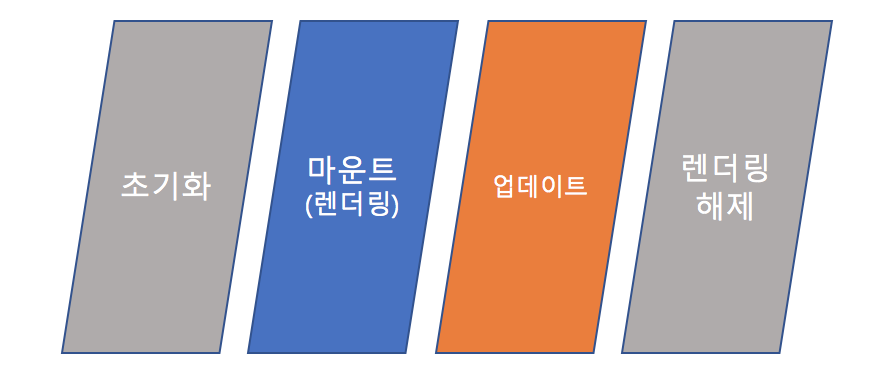

# NEXT JS - React JS의 라이프 사이클 이해하기
> NEXT JS는 React JS로 구현하고자 하는 것을 좀더 쉽게 사용할 수 있도록 제공해주는 인터페이스와 같은 역할을 하는 도구로 이해하고 있습니다. 
NEXT JS를 잘 사용하기 위해서 React JS에 라이프사이클에 대해서 알아보도록 하겠습니다.

## React JS의 LifeCycle

### 1. 초기화

     모든 구성요소들이 기본 상태로 구성되는 단계로서 컴포넌트 클래스의 생성자에서 수행되며 Props 가 생성되고, State 가 초기화 됩니다.    

**Props와 State**

* Props: 자식 노드에 있는 페이지에 데이타 또는 함수를 전달 시킬 수 있으며, 한 번 결정된 Props는 그 값을 수정 변경 할 수 없습니다.

* State: 렌더를 통해 지속적인 동기화된 데이터를 표현할 때 적합하며, 여러번 수정이 가능 합니다.

### 2. 마운트

     렌더링 메소드 자체에서 JSX 또는 NEXT JS에서 pages 에서 구성한 js 파일들이 렌더링(그리는)하는 단계입니다.

**함수**

* componentWillMount () : 이름에서 알 수 있듯이이 함수는 구성 요소가 DOM에 마운트되기 직전에 호출됩니다. 즉,이 함수는 render () 함수가 처음 실행되기 전에 한 번 호출됩니다.

* componentDidMount () : 이전처럼이 함수는 컴포넌트가 DOM에 마운트 된 직후에 호출됩니다. 즉,이 함수는 render () 함수가 처음 실행 된 후 한 번 호출됩니다.

### 3. 업데이트

     렌더링 된 구성요소 중에 상태가 수정 또는 삭제 되었을 때, 이를 확인하고 다시 렌더링 하는 단계입니다.
     
**함수**

* componentWillRecieveProps () : 이 함수는 마운트 된 구성 요소가 해당 소품을 재 할당하기 전에 호출됩니다. 함수는 원래 소품과 동일하거나 다를 수있는 Props를 통과합니다. 따라서 검사는이 점에서 필수적인 단계입니다

* setState () : 특히 라이프 사이클 함수는 아니며 언제든지 명시 적으로 호출 할 수 있습니다. 이 함수는 구성 요소의 상태를 업데이트하는 데 사용됩니다.

* shouldComponentUpdate () : 이 함수는 구성 요소의 출력이 업데이트의 영향을 받는지 여부를 React에 알려주며, 이미 마운트 된 구성요소를 렌더링 전에 호출하여 False 값을 리턴했을 경우 다음 스템은 실행하지 않습니다.

* componentWillUpdate () 기능 : 이름에서 알 수 있듯이이 함수는 구성 요소가 다시 렌더링되기 전에 호출됩니다. 즉이 함수는 State 또는 Props의 업데이트 후에 render () 함수가 실행되기 전에 한 번 호출됩니다.

* componentDidUpdate () 기능 : 마찬가지로이 함수는 구성 요소가 다시 렌더링 된 후에 호출됩니다. 즉이 함수는 State 또는 Props의 업데이트 후에 render () 함수가 실행 된 후에 한 번 호출됩니다.    

### 4. 마운트 해재(렌더링 해제)

     구성요소가 제거되는 단계로서 React JS의 구성요소중 마지막 단계입니다.
 
* componentWillUnmount () 기능 :이 함수는 컴포넌트가 마침내 DOM에서 마운트 해제되기 전에 호출됩니다. 즉,이 함수는 컴포넌트가 페이지에서 제거되기 전에 한 번 호출되며 이는 라이프 사이클의 끝을 나타냅니다  

## 정리

  

