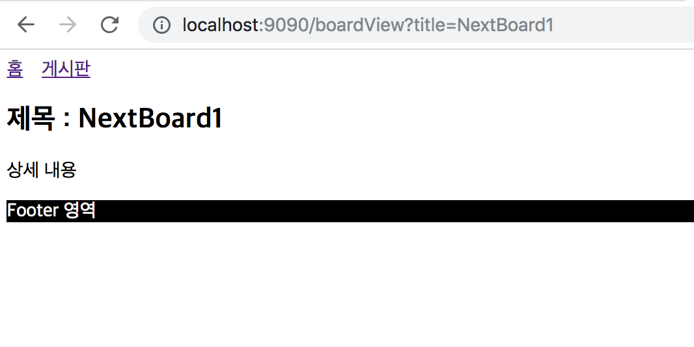
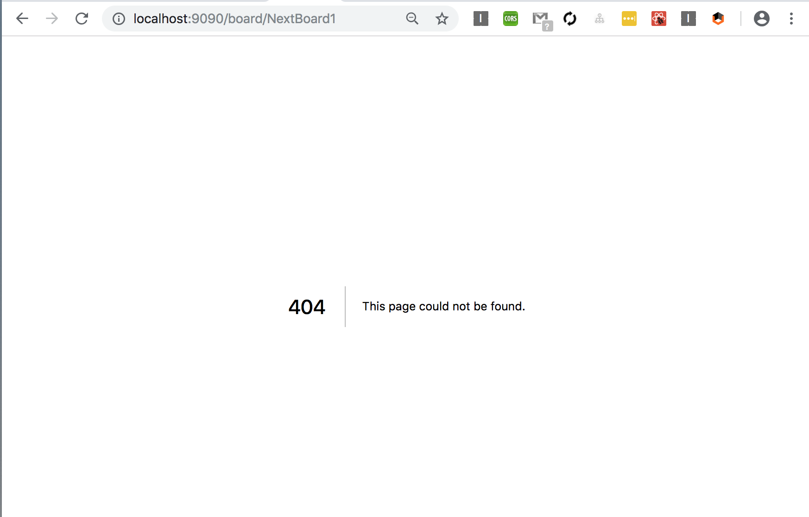

# NEXT JS - 커스텀 NEXT JS 실습
> 앞에서 이야기한 커스텀 된 서버와 라우터를 실습 해보도록 하겠습니다. 기본 구조는 페이지 추가하기 에서 말씀드린 구조로 진행하도록 하겠습니다.


##시작하기


####디렉터리 구조
```
├── .next           
├── components      
│   ├── Header.js
│   ├── Footer.js
│   └── Layout.js
├── node_modules
├── pages           
│   ├── board.js
│   ├── boardView.js    
│   └── index.js    
├── package.json
├── server.js
```


####1. 기본세팅 
```
mkdir next_project
cd next_project
npm init
npm install --save next react react-dom
mkdir pages
mkdir components
```

####2. package.json 의 script 추가

```
"scripts": {
    "dev": "node server.js",
    "build": "next build",
    "start": "next start"
  },

```


####3. 파일생성

* /pages/index.js

```
import Layout from '../components/Layout';
import Link from 'next/link';
import React from 'react';

import axios from 'axios'

const Index = (props) => (
    <Layout>
        <p>Hello, Next JS</p>
        <h2>
            홈 화면
        </h2>
    </Layout>
);

export default Index

```

* /pages/board.js

> 아래 스크립트에서 <Link> 엘리먼트의 'as' 를 제거하고 테스트를 먼저 해보고 추가하기 바랍니다, 'as'가 없을 경우에는 브라우저에 href 주소가 그대로 노출되지만, 'as'를 사용함으로써, 깔끔한 URL을 얻을 수가 있습니다.
 
```
import Layout from '../components/Layout';
import Link from 'next/link';

const BoardLink = (props) => (
    <li>
        <Link as={`/board/${props.title}`} href={`/boardView?title=${props.title}`}>
            <a>{props.title}</a>
        </Link>
    </li>
);

export default () => (
    <Layout>
        <h2>게시판 리스트</h2>
        <ul>
            <BoardLink title="Next Board 1"/>
            <BoardLink title="Next Board 2"/>
            <BoardLink title="Next Board 3"/>
        </ul>
    </Layout>
)

```

* /pages/boardView.js

```
import Layout from '../components/Layout';

export default (props) => (
    <Layout>
        <h2>제목 : {props.url.query.title}</h2>
        <p>
            상세 내용
        </p>
    </Layout>
)

```

* /components/Header.js

```
import Link from 'next/link';

const linkStyle = {
    marginRight: '1rem'
};

const Header = () => {
    return (
        <div>
            <Link href="/"><a style={linkStyle}>홈</a></Link>
            <Link href="/board"><a style={linkStyle}>게시판</a></Link>
        </div>
    );
};

export default Header;

```

* /components/Footer.js

```

const footerStyle = {
    backgroundColor: 'black',
    color: '#fff'
};

const Footer = () => {
    return (
        <div style={footerStyle}>
            Footer 영역
        </div>
    );
};

export default Footer;

```

* /components/Layout.js

```
import Header from './Header';
import Footer from './Footer';
import Router from 'next/router';

const Layout = ({children}) => (
    <div>
        <Header/>

        {children}
        <Footer/>
    </div>
);

export default Layout;

```

* /server.js

```
const express = require('express');
const next = require('next');

const dev = process.env.NODE_ENV !== 'production';
const app = next({dev});
const handle = app.getRequestHandler();

app.prepare()
.then(()=>{
    const server = express();
    
    //커스텀 라우터 전후 비교 시 아래 부분을 주석 처리 후 확인해 보세요
    server.get('/board/:title', (req, res) => {
        const page = '/boardView';
        const params = {title: req.params.title}
        app.render(req, res, page, params)
    });

    server.get('*', (req, res) => {
        return handle(req, res)
    });

    server.listen(9090, (err) => {
        if(err) throw err;
        console.log("> Ready on Server Port: 9090")
    })
})
.catch((ex) => {
    console.error(ex.stack);
    process.exit(1);
})

```

##결과

#### **Link 엘리먼트에 as 속성 적용 전**



---
#### **Link 엘리먼트에 as 속성 적용 후**


---
#### **커스텀 라우터 적용 전(링크된 페이지에서 리플레쉬 또는 직접 링크 시)**



---
#### **커스텀 라우터 적용 후**


---

##정리
> 라우팅을 할 때, 보통은 페이지만 정확이 연결이 되며, 이동할 페이지에 데이타만 제대로 전달할 수 있다면 아무런 문제가 없었지만, 좀더 정리되고 가독성 좋은 패턴으로 변경하여 사용해 보는 것은 어떨지에 대해 고민을 많이 해보았으면 합니다.