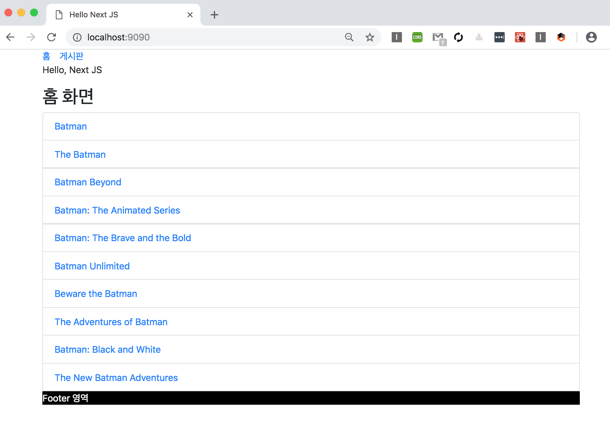

# NEXT JS - 커스텀 Document, Bootstrap 
> NEXT JS 프레임웍에 Bootstrap CSS (Style) 을 적용해 보도록 하겠습니다. 기존에는 HTML 문서의 `<HEAD>` 부분에 Bootstrap을 적용하면 되었지만, 
NEXT JS에 Bootstrap 을 적용하기 위해서는 NEXT JS의 기본 Commponent 인 _document 를 커스텀 할 필요가 있습니다.

## Bootstrap 이란?
> 트위터에서 사용하는 각종 레이아웃, 버튼, 입력창 등 HTML 엘리먼트와 CSS 결합된 형태의 디자인을 CSS와 Javascript로 만들어 놓은 프레임워크 입니다.

* [부트스트랩](http://bootstrapk.com/getting-started/)

### 장점

* 오픈소스
* 상업적 사용 가능
* 무료 템플릿이 많다.

## NEXT JS - 커스텀 Document
> 위에서 설명한 부트 스트랩 프레임워크를 NEXT JS에 기본적으로 사용을 해 보겠습니다.

**기존 HTML 프블리싱**

```
<html>
<head>
    <link rel="stylesheet" href="https://stackpath.bootstrapcdn.com/bootstrap/4.1.3/css/bootstrap.min.css" integrity="sha384-MCw98/SFnGE8fJT3GXwEOngsV7Zt27NXFoaoApmYm81iuXoPkFOJwJ8ERdknLPMO" crossorigin="anonymous">
</head>
<title>
<body>
...
```

#####Q. 보통 웹 퍼블리싱을 할 경우에는 위와 같이 구조를 잡으면 사용할 수 있었습니다. 하지만 NEXT JS의 구조에서는 어디에 설정을 해야 할까요?  

#####A. NEXT JS에서 `/pages` 안에 렌더링 될 때 기본적으로 같이 렌더링 되는 기본 컨퍼넌트가 있습니다. 이를 커스텀 하면 사용할 수 있습니다.

---

### 예제를 통해 시작하기
> 현재 아래와 같이 나오는 화면을 부트스트랩에 List 를 이용하여 정리한 화면으로 적용해 보도록 하겠습니다.

**현재 화면**


####1. `/pages/_document.js` 파일 생성하여 다음에 스크립트를 작성합니다.

```
import Document, { Head, Main, NextScript } from 'next/document';

class CustomDocument extends Document {
    render() {
        return (
            <html>
            <Head>
                <link rel="stylesheet" href="https://stackpath.bootstrapcdn.com/bootstrap/4.1.3/css/bootstrap.min.css" integrity="sha384-MCw98/SFnGE8fJT3GXwEOngsV7Zt27NXFoaoApmYm81iuXoPkFOJwJ8ERdknLPMO" crossOrigin="anonymous"/>
            </Head>
            <body>
            <div className="container">
                <Main/>
            </div>
            <NextScript/>
            </body>
            </html>
        );
    }
}

export default CustomDocument;
``` 

####2. `/pages/index.js` 파일 수정
> 아래 HTML `<ul>` 엘리먼트에 부트스트랩에 list-group 이라는 css class 를 적용하는 부분이 보입니다. NEXT JS를 사용하다 보면 낯선 부분들이 많이 보이는데,
기존에 HTML 에서는 `<ul class = 'list-group'>` 이라고 하여 해당 class를 호출하였지만, NEXT JS 에서 그대로 사용하면 `Warning` 이 나옵니다.
`Warning`을 없애기 위해서는 '**class**' 대신에 '**className**'을 사용해 주시면 됩니다. 

```
import Layout from '../components/Layout';
import Link from 'next/link';
import React from 'react';

import axios from 'axios'

const Index = (props) => (
    <Layout>
        <p>Hello, Next JS</p>
        <h2>
            홈 화면
        </h2>

        <ul className="list-group">
            {props.data.map(({show}) => (
                <li className="list-group-item" key={show.id}>
                    <Link as={`/p/${show.id}`} href={`/post?title=${show.title}`}>
                        <a>{show.name}</a>
                    </Link>
                </li>
            ))}
        </ul>
    </Layout>
);

Index.getInitialProps = async function() {
        const res = await axios.get('https://api.tvmaze.com/search/shows?q=batman')
        const data = await res.data;

        console.log(`Show data fetched. Count: ${data.length}`);

        return {
            data: data
        }
    };

export default Index
```

**적용된 화면**




**이외 다른 Bootstrap의 컨포넌트**

[BOOTSTRAP 4.1 DOCS](https://getbootstrap.com/docs/4.1/components/alerts/)


 