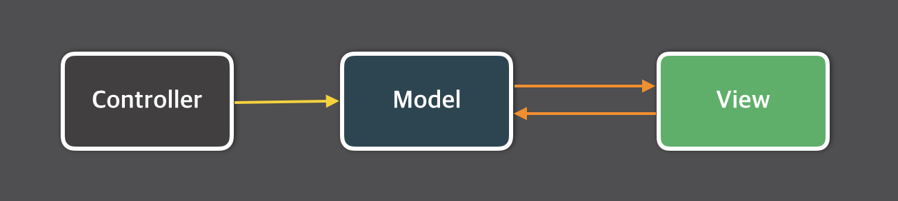
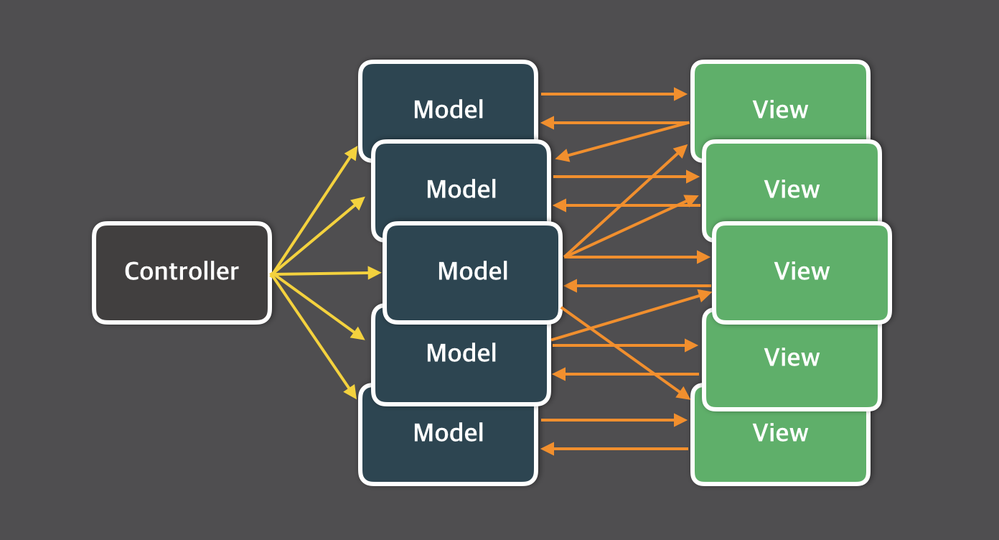

# Flux와 Redux

이 글에서는 Facebook에서 React와 함께 소개한 Flux 아키텍처에 대해 알아보고 Flux를 구현한 Redux 라이브러리를 살펴본 후 이를 적용한 간단한 React 애플리케이션을 작성해보겠다. 본문에 사용된 코드는 ​ES2015의 기능을 사용하고 있으므로 ES2015에 익숙하지 않다면 [이재호](http://jaeholee.org/)님이 작성한 [ES2015와 React](http://webframeworks.kr/tutorials/react/es2015-react/)를 먼저 읽으면 좋다.

## MVC 아키텍처의 한계
애플리케이션을 작성해 본 개발자라면 아마 적어도 한 번은 써봤을 정도로 [MVC(Model-View-Controller)](https://en.wikipedia.org/wiki/Model%E2%80%93view%E2%80%93controller)는 매우 널리 사용되는 디자인 패턴이다. Flux 아키텍처는 MVC 패턴의 문제점을 보완할 목적으로 고안되었으므로 먼저 MVC 패턴의 한계에 대해 짚고 넘어가는 것이 Flux를 이해하기에도 좋을 것이다.

MVC 패턴에서 컨트롤러(Controller)는 모델(Model)의 데이터를 조회하거나 업데이트하는 역할을 하며, 모델(Model)의 변화는 뷰(View)에 반영한다. 또한, 사용자는 뷰를 통해 데이터를 입력하는데 사용자의 입력​은 모델에 영향을 주기도 한다.​ 따라서 이와 같은 데이터 흐름은 다음과 같이 그림으로 표현할 수 있다.

​

문제는 페이스북과 같은 대규모 애플리케이션에서는 MVC가 너무 빠르게, 너무 복잡해진다는 것이다. 페이스북 개발팀에 따르면 구조가 너무 복잡해진 탓에 새 기능을 추가할 때마다 크고 작은 문제가 생겼으며 코드의 예측이나 테스트가 어려워졌으며 새로운 개발자가 오면 적응하는데만 한참이 걸려서 빠르게 개발할 수가 없었다. 소프트웨어의 품질을 담보하기가 힘들어졌다는 뜻이다.

​

이 같은 문제의 대표적인 사례가 바로 페이스북의 안 읽은 글 갯수(unread count) 표시이다. 사용자가 읽지 않았던 글을 읽으면 읽지 않은 글 갯수에서 읽은 글 수만큼 빼면 되는 일견 단순해보이는 기능인데도, 페이스북 서비스에서 이를 MVC로 구현하기는 어려웠다고 한다. 어떤 글을 '읽음' 상태로 두면, 먼저 글을 다루는 thread 모델을 업데이트 해야하고 동시에 unread ​count 모델도 업데이트 해야한다. 대규모 MVC 애플리케이션에서 이 같은 의존성과 순차적 업데이트는 종종 데이터의 흐름을 꼬이게 하여 예기치 못한 결과를 불러일으킨다.

결국 페이스북 개발팀은 MVC를 버리고 다른 아키텍처를 적용하기로 한다.

## Flux 소개
Flux는 페이스북에서 MVC의 문제를 해결할 목적으로 고안한 애플리케이션 아키텍처이다. Flux 애플리케이션은 크게 세 부분으로 구성되는데, 각각 ​디스패처(Dispatcher), 스토어(Store), 뷰(View)이다. 단, 여기서 말하는 뷰는 MVC의 뷰와는 달리 스토어에서 데이터를 가져오는 한편 데이터를 자식 뷰로 전달하기도 하는 일종의 뷰-컨트롤러로 보아야 한다. ​React를 기반으로 작성된 컴포넌트를 떠올리면 될 것이다.

Flux 아키텍처의 가장 큰 특징으로는 '단방향 데이터 흐름(unidirectional data flow)'을 들 수 있다. 데이터의 흐름은 언제나 디스패처(Dispatcher)에서 스토어(Store)로, 스토어에서 ​뷰(View)로, 뷰에서 액션(Action)으로 다시 액션에서 디스패처로 흐른다.


뷰에서 사용자의 입력이 있는 경우 뷰는 액션을 호출하므로 ​사용자의 입력을 고려하여 위 다이어그램을 표현하면 다음과 같이 작성할 수 있다.


페이스북 개발팀은 양방향 데이터 바인딩이 있기 때문에 한 모델을 업데이트 한 뒤 다른 모델을 업데이트 해야하는 순차적인 업데이트가 발생할 수 밖에 없으며, 애플리케이션의 크기가 증가할수록 이러한 순차적 업데이트가 사용자 인터랙션의 결과를 예측하기 어렵게 한다고 언급했다. 한편 Flux와 같이 일방적인 데이터 흐름에서 일어나는 데이터 변화는 훨씬 더 예측하기 쉽다고도 말했다.

이제 Flux 애플리케이션의 각 구성 요소에 대해 자세히 살펴보자.

### 디스패처
디스패처(Dispatcher)는 Flux 애플리케이션의 모든 데이터 흐름을 관리하는 허브 역할을 한다. 액션이 발생하면 디스패처로 메시지(또는 액션 객체)가 전달되고 디스패처는 디스패처에 등록된 콜백 함수를 통해 이 메시지를 스토어에 전달한다. 다른 구성요소와 달리 디스패처는 전체 애플리케이션에서 한 개의 인스턴스만 사용한다.

### 액션
디스패처의 특정 메소드를 실행하면 스토어에 변화를 일으킬 수 있는데, 이 메소드를 호출할 때는 데이터 묶음을 인수로 전달한다. 이 때 이 데이터 묶음을 액션(Action)이라 한다. 디스패치에 전달할 액션 객체는 대체로 액션 생성자(Action creator)라는 함수 또는 메소드를 통해 만들어진다. 액션은 보통 액션 타입 또는 액션 아이디라 부르는 고유한 키와 관련 데이터를 포함하는 객체로 만들어진다. 다음은 페이스북의 예제 Todo 애플리케이션에 있는 [액션 생성자 코드](https://github.com/facebook/flux/blob/master/examples/flux-todomvc/js/actions/TodoActions.js)를 간소화한 버전이다.

```js
var TodoActions = {
  create(text) {
    AppDispatcher.dispatch({
      actionType: Constants.TODO_CREATE,
      text
    });
  },
  ...
  destroy(id) {
    AppDispatcher.dispatch({
      actionType: Constants.TODO_DESTROY,
      id
    });
  },
  ...
};

// 리액트 컴포넌트에서 새 Todo 항목을 작성할 때
TodoActions.create(text);
```

위 코드에서 액션은 `TodoActions.create`와 `TodoActions.destroy`라는 액션 생성자를 통해 만들어지고, 뷰에서는 액션 생성자를 실행하여 액션을 만들고 이렇게 만들어 진 액션은 디스패처로 전달되고 디스패처는 액션의 데이터를 스토어로 전달한다.

### 스토어
스토어는 애플리케이션의 상태를 저장한다. MVC 패턴의 모델과 유사하지만 ORM(Ojbect-relational Mapping) 스타일로 데이터를 다루지 않는다. 그보다는 애플리케이션의 특정 도메인에 해당하는 상태를 다룬다고 보는 편이 좋다. MVC의 모델은 어떤 객체를 모델링하는데 주력하고 있다면, Flux의 스토어는 상태를 다룬다는 개념으로 접근해야 하므로 무엇이든 저장할 수 있다. 그리고 대체로 단순한 자바스크립트 Object로 구성된다.

예를 들어, 페이스북의 [돌아보기 동영상 편집기(Loopback Video Editor)](https://facebook.com/lookback/edit)는 TimeStore를 사용해 재생 상태와 위치를 다루고, ImageStore를 사용해 이미지 컬렉션을 다룬다. 물론, [Todo 애플리케이션](https://github.com/facebook/flux/tree/master/examples/flux-todomvc/)의 예처럼 ​MVC의 모델과 비슷하게 스토어 데이터를 구성할 수도 있다.

앞서 언급했듯이 스토어는 디스패치로부터 메시지를 수신하는데 그럴려면 먼저 콜백 함수를 디스패치에 등록해야 한다. 콜백 함수에서는 함수에 전달된 메시지(또는 액션 객체)에 따라 특정 동작을 수행한다. 다음은 이해를 돕기 위해 페이스북이 제공한 Todo 애플리케이션의 [예제 코드](https://github.com/facebook/flux/blob/master/examples/flux-todomvc/js/stores/TodoStore.js) 일부를 간소화한 버전이다.

```js
var TodoStore = Object.assign({}, EventEmitter.prototype, {
  ...
});

// TODO 항목 작성
function create(text) { ... }

// TODO 항목 삭제
function destroy(id) { ... }

// 스토어를 업데이트하는 ​콜백 함수 등록
AppDispatcher.register(function(action){
  switch(action.actionType) {
    case Constants.TODO_CREATE:
      create(action.text);
      TodoStore.emitChange();
      break;
    case Constants.TODO_DESTROY:
      destroy(action.id);
      TodoStore.emitChange();
      break;
    ...
  }
});
```
MVC의 모델과 달리 스토어는 단지 상태만을 다루므로 서버에서 데이터를 가져오는 것과 같은 비동기 동작은 액션에서 처리해야 한다.
이때, 서버 동기화와 같은 비동기 동작은 동작이 실패할 가능성도 있으므로 액션 타입을 여러 단계로 나눈다.
예를 들어 앞서 살펴본 `TODO_CREATE` 액션을 실행할 때 서버에 저장하는 비동기 동작도 같이 이루어진다고 가정해본다면
서버에 문제없이 저장했을 때 발생할 `TODO_CREATE_SUCCESS` 액션과 저장하지 못했을 때 발생할 `TODO_CREATE_FAIL` 액션을 추가하여 비동기 액션을 작성한다.
이 동작을 코드로 작성해본다면 다음과 같다.

```js
var TodoActions = {
  create(text) {
    var id = getUniqueId();
    AppDispatcher.dispatch({
      actionType: Constants.TODO_CREATE,
      id
      text
    });

    ajaxPost(saveURL)
      .then(data => {
        AppDispatcher.dispatch({
          actionType: Constants.TODO_CREATE_SUCCESS,
          id
        });
      })
      .catch(reason => {
        AppDispatcher.dispatch({
          actionType: Constants.TODO_CREATE_FAIL,
          reason
        });
      });
  },
  ...
};
```


### 뷰
앞서 말했듯이 Flux에서의 뷰는 MVC의 뷰와는 달리 화면을 표시하는 것은 물론 컨트롤러의 성격도 가지고 있다. 특히 중첩된 뷰 레이어의 최상위 뷰는 스토어에서 데이터를 가져와 이를 자식 뷰로 배분하는 역할을 하고 있기 때문에 컨트롤러-뷰(controller-view)라고도 부른다. 컨트롤러-뷰가 있다는 것은 달리 말하면 곧 자식 뷰에서는 직접 데이터를 가져오는 대신 `props` 형태로 상위 뷰에서 전달받는 방식을 주로 사용한다는 의미도 된다. 물론 필요에 따라 하위 뷰에서도 직접 스토어의 데이터를 가져오기도 한다.

뷰는 관련 스토어의 변경 사항을 감지할 수 있는 이벤트 리스너를 스토어에 등록하고, 스토어에 변경 사항이 발생하면 이를 뷰에 반영한다. 이 때 뷰에서는 자신의 `setState()`나 `forceUpdate()` 메소드를 실행하고, 이로 인해 자동적으로 `render()` 메소드도 호출된다. 다음은 페이스북의 Todo 예제에서 가져온 React 컴포넌트의 일부 코드이다. 이를 통해 React로 작성된 뷰와 스토어가 어떻게 동작하는지 짐작해 볼 수 있다.

```js
function getTodoState() {
  return {
    allTodos: TodoStore.getAll(),
    areAllComplete: TodoStore.areAllComplete()
  };
}

var TodoApp = React.createClass({
  getInitialState() {
    return getTodoState();
  },

  componentDidMount() {
    TodoStore.addChangeListener(this._onChange);
  },

  componentWillUnmount() {
    TodoStore.removeChangeListener(this._onChange);
  },

  render(){
    ...
  },

  _onChange() {
    this.setState(getTodoState());
  }
});
```

## Redux
페이스북은 Flux 아키텍처를 발표한 후 Flux에 대한 구현체도 공개했는데, 이 구현체에는 디스패처만 구현되어 있어 완전한 Flux 프레임워크라 부르기엔 다소 무리가 있었다. 2015년 ​10월에 발표한 2.1.0 버전에서 스토어를 지원하기 전까지는 사실상 완전한 공식 Flux 구현체가 없던 셈이다. 이 시기에 많은 Flux 구현체들이 나타났는데, 널리 사용되는 것 중 하나로 [Redux](http://redux.js.org/)가 있다.

Redux는 ​Dan Abramov가 작성했는데, 그는 Webpack의 유명 플러그인인 React hot loader(이하 핫 로더)의 개발자이기도 하다. 핫 로더는 Webpack dev server와 함께 사용하면 React 컴포넌트 소스 코드의 변경 사항을 즉시 웹 페이지에 반영하는 플러그인이다. 현재 이 플러그인은 폐기 예정 상태가 되었으나, Dan은 ​React Transform HMR이라는 핫 로더와 비슷한 역할을 하는 플러그인을 새롭게 개발했다. 이 글은 Flux에 대해 다루고 있으므로 이런 플러그인에 대해 다루지 않겠지만, Webpack과 함께 React를 사용하게 된다면 살펴보기를 추천한다.

다시 Redux로 돌아와서, Redux는 다른 구현체와 비교해 사용법이 단순한 편이며 ​ES2015도 잘 지원하며 ​크기도 2Kb 정도로 상당히 작은 편이다.​ React와 함께 많이 사용되지만 의존성이 없어 React와 상관없이 독립적으로 사용할 수도 있다. Redux는 Flux 보다는 조금 단순화 된 면이 있는데 덕분에 사용이 간편해진 반면 Flux를 개발한 Jing Chen이나 Bill Fisher의 찬사도 얻었을 정도로 충실한 Flux 구현체이다.

Redux를 사용한 애플리케이션 예제를 살펴보기 전에 Redux에서 Flux의 각 구성 요소를 어떻게 작성하는지 알아보자.

### 액션
Redux에서 액션은 액션 타입(또는 액션 아이디)을 상수로 작성한 후 액션 생성자 함수를 호출하는 방식으로 작성한다. 예를 들어, Todo 항목을 추가하는 액션 생성자 `addTodo`를 포함한 `actions.js` 파일은 다음과 같이 작성할 수 있다.

```js
export const ADD_TODO = 'ADD_TODO';

export function addTodo(text) {
  return { type: ADD_TODO, text };
}
```

원래 페이스북이 고안한 Flux에서는 액션 생성자가 디스패처를 호출하는 작업도 한다. 하지만 Redux의 액션 생성자는 만에 하나라도 있을 수 있는 부작용을 없애기 위해 말 그대로 액션을 만드는 역할만 담당한다. 다음은 디스패처도 호출하는 Flux 액션 생성자의 예제이다.

```js
export function addTodoWithDispatch(text) [
  const action = { type: ADD_TODO, text };
  dispatch(action);
]
```

### 디스패처
Redux는 디스패처를 명시적으로 생성하지 않고도 Flux를 구현할 수 있도록 작성되었으므로 디스패처를 생략할 수 있다.
실제 디스패치 동작은 스토어의 `dispatch` 메소드를 호출하여 실행한다.

### 리듀서
리듀서(Reducer)는 Flux에는 없는, Redux에서만 찾을 수 있는 용어이다.
액션은 어떤 일이 일어났는지는 알려주지만 애플리케이션의 상태를 어떻게 바꾸어야 할지는 알려주지 않는데, Redux 프레임워크에서는 리듀서가 이 역할을 담당한다.
간단히 말해 Flux 애플리케이션에서 스토어 객체를 업데이트하는 콜백 함수와 하는 역할은 비슷하다.

다만, Flux 스토어의 콜백과는 달리 [`Array.prototype.reduce(리듀서콜백, ?초기값)`](https://developer.mozilla.org/en-US/docs/Web/JavaScript/Reference/Global_Objects/Array/Reduce)에 전달된 `리듀서콜백`처럼 동작하기에 `리듀서(reducer)`라고 부른다.
아무래도 이 용어가 직관적이지 못하다고 생각한 개발자들이 있었는지 [다른 이름으로 부르자는 논의](https://github.com/rackt/redux/issues/137)도 있었으나 명확한 이름이라는 다수의 의견에 따라 그대로 유지하기로 했다.
이 논의 중에 Redux의 개발자인 Dan은 갱신자(updater)라는 이름도 괜찮은 것 같다는 의견을 냈다.

작성할 Todo 애플리케이션에 다음과 같은 상태 객체가 있다고 생각해보자.

```js
{
  visibilityFilter: 'SHOW_ALL',
  todos: [
    {
      text: '자료 준비하기',
      completed: true
    },
    {
      text: '블로그 글쓰기',
      completed: false
    }
  ]
}
```

이 데이터를 업데이트하는 함수 `todoApp`은 다음과 같이 작성할 수 있다.

```js
function todoApp(state = initialState, action) {
  switch (action.type) {
    case SET_VISIBILITY_FILTER:
      return Object.assign({}, state, {
        visibilityFilter: action.filter
      });
    default:
      return state;
  }
}
```

위 코드의 `todoApp`은 인수만 전달받던 Flux의 스토어 콜백과는 달리 첫 번째 인수로 기존 상태를 전달받고, 두 번째 인수로 액션 객체를 전달받는다.
리듀서를 작성할 때는 두 가지 사항을 유의해야 한다.

1. **첫 번째 인수로 전달받은 `state`는 수정하면 안된다.**
  상태를 수정할 때는 반드시 `Object.assign` 등을 사용하여 새로운 객체를 만들어서 반환해야 한다.
2. `default` 케이스에서 기존 `state`를 반환해야 한다.
  전달받은 액션 객체를 이 리듀서에서 처리하지 못하는 때를 대비해 `default` 케이스에서는 반드시 인수로 전달받은 `state`를 그대로 반환해야 한다.

리듀서 함수의 덩치가 커지면 코드를 읽기 힘들어지고 수정이나 디버깅도 어려워진다.
이 때는 리듀서를 여러 함수로 나누는 것도 한 가지 방법이다.
예를 들어, 다음과 같은 리듀서가 있다고 가정해보자.

```js
function todoApp(state = initialState, action) {
  switch (action.type) {
    case SET_VISIBILITY_FILTER:
      return Object.assign({}, state, {
        visibilityFilter: action.filter
      });
    case ADD_TODO:
      return Object.assign({}, state, {
        todos: [
          ...state.todos,
          {
            text: action.text,
            completed: false
          }
        ]
      });
    case COMPLETE_TODO:
      return Object.assign({}, state, {
        todos: [
          ...state.todos.slice(0, action.index),
          Object.assign({}, state.todos[action.index], {completed: true}),
          ...state.todos.slice(action.index+1)
        ]
      });
    default:
      return state;
  }
}

export default todoApp;
```
이를 `visibilityFilter`를 업데이트하는 함수와 `todos`를 업데이트하는 함수로 나눈다면 다음과 같이 작성할 수 있다.

```js
function visibilityFilter(state = SHOW_ALL, action) {
  switch (action.type) {
    case SET_VISIBILITY_FILTER:
      return Object.assign({}, state, {
        visibilityFilter: action.filter
      });
    default:
      return state;
  }
}

function todos(state = [], action) {
  switch (action.type) {
    case ADD_TODO:
      return [
        ...state,
        {
          text: action.text,
          completed: false
        }
      ];
    case COMPLETE_TODO:
      return [
        ...state.slice(0, action.index),
        Object.assign({}, state.todos[action.index], {completed: true}),
        ...state.slice(action.index+1)
      ];
    default:
      return state;
  }
}

function todoApp(state = initialState, action) {
  return {
    visibilityFilter: visibilityFilter(state.visibilityFilter, action),
    todos: todos(state.todos, action)
  };
}

export default todoApp;
```
이 중 `todoApp` 리듀서는 `redux`에서 제공하는 `combineReducers` 함수를 사용해 편리하게 작성할 수 있다.
위 코드의 마지막 함수 `todoApp`은 다음과 같이 작성할 수도 있다.

```js
import { combineReducers } from 'redux';

export default const todoApp = combineReducers({
  visibilityFilter,
  todos
});
```

### 스토어
리듀서를 만들었다면 스토어는 이미 거의 작성된 것과 다름없다. 스토어는 `redux` 패키지의 `createStore` 함수에 리듀서 함수와 초기 상태를 전달하여 만들기 때문이다(초기 상태는 생략 가능하다).
위에서 작성한 `todoApp` 리듀서를 사용하면 다음과 같이 스토어를 만들 수 있다.

```js
import { createStore } from 'redux';
import todoApp from './reducers';

let store = createStore(todoApp);
```

상태는 스토어의 `getState()` 메소드를 실행하면 구할 수 있고 스토어의 `subscribe` 메소드를 사용하여 콜백을 등록하면 스토어의 상태가 변경되는 때를 알 수 있다.
예를 들어 스토어의 상태가 변경될 때마다 상태를 구해 로그로 남기고 싶다면 다음과 같이 작성한다.

```js
// 상태가 변경될 때마다 로그로 기록한다.
store.subscribe(
  () => console.log(store.getState())
);
```

상태 리스닝을 중단하려면 `subscribe` 메소드를 실행할 때 반환되는 함수를 실행하면 된다.

```js
// 상태가 변경될 때마다 로그로 기록한다.
let unsubscribe = store.subscribe( () => console.log(store.getState()) );

...

// 상태 변경 리스닝을 중단한다.
unsubscribe();
```
Redux의 액션 생성자는 액션을 만들기만 할 뿐 디스패처에 전달하지는 않으므로 액션을 생성할 때는
명시적으로 디스패처에 전달하는 작업도 해주어야 한다. 이 때 스토어의 메소드인 `dispatch`를 사용한다.
앞서 만든 `addTodo` 액션 생성자는 다음과 같이 사용할 수 있다.

```js
store.dispatch(addTodo('새로운 할 일 항목'));
```

## Todo 애플리케이션 예제
이 절에서는 앞서 살펴본 Flux 아키텍처와 Redux 라이브러리를 사용해 간단한 Todo 애플리케이션을 작성해보겠다. 이 글에서는 Flux 아키텍처에 집중하고 있으므로 서버측 코드 및 Webpack 개발 환경 구성에 관해서는 거의 다루지 않고 있다. 이 부분은 나중에 기회가 되는대로 다른 글을 통해 다루도록 하겠다.

### 설치
먼저 React와 ES2015를 함께 사용하기 위해 `webpack` 패키지를 설치해야 한다.

```
npm install -g webpack
```

전체 애플리케이션 코드는 [GitHub의 저장소](https://github.com/taggon/redux-example-todo)에서 다음과 같이 다운로드 받을 수 있다.
코드를 모두 다운로드 받은 다음에는 `npm install`을 실행해 필요한 패키지를 설치한다.

```
git clone https://github.com/taggon/redux-example-todo
npm install
```

이제 간단하게 만든 웹 서버를 실행하여 웹 브라우저에서 `http://localhost:3000`로 접속하면 다음과 같은 간단한 Todo 애플리케이션을 볼 수 있다. 웹 서버는 다음과 같이 실행한다.

```
npm start
```

상단에 있는 입력 상자에 할 일을 입력한 후 엔터를 누르면 새 할 일을 추가할 수 있으며, 각 항목 왼쪽에 있는 체크박스를 클릭하면 해당 작업에 완료 표시를 하며 오른쪽에 있는 `X` 버튼을 클릭하면 해당 작업을 삭제할 수 있다.


### 디렉토리 구조
이 애플리케이션은 다음과 같은 디렉토리 구조를 가지고 있다(이름 뒤에 * 표시가 붙은 디렉토리는 설치 또는 빌드 과정에서 자동으로 만들어진다).

```
root + node_modules*
     + dist*
     + src
       + actions
       + components
       + constants
       + reducers
       + store
       + styles
```

CSS 파일이 포함된 `styles`를 제외하면 `src`의 자식 디렉토리는 Redux 애플리케이션의 각 구성 요소를 의미한다.
`constatns`에 있는 파일은 액션 타입을 의미하는 상수를 정의하는데, 여러 구성 요소에서 사용되기 때문에 별도의 파일로 나눴다.
그 외 파일에 관한 원리는 이미 앞에서 다루었으므로 여기서는 React 뷰 컴포넌트에서 이 구성 요소를 어떻게 사용하는지 살펴보자.

### 컴포넌트
이 애플리케이션은 다음과 같이 5종류의 컴포넌트로 구성되어 있다.


`MainApp` 컴포넌트는 전체 애플리케이션의 컨테이너(container)인데, 스토어의 변경 이벤트를 구독하고 하위 컴포넌트에 데이터를 전달하는 역할을 한다.

```js
import React, { Component } from 'react';
import { bindActionCreators } from 'redux';
import Header from './Header';
import MainSection from './MainSection';
import * as TodoActions from '../actions/todos';
import todoStore from '../store/todoStore';

var actions = bindActionCreators(TodoActions, todoStore.dispatch);

class TodoApp extends Component {
  constructor(props, context) {
    super(props, context);
    todoStore.subscribe(this._onChange.bind(this));
  }

  _onChange() {
    this.forceUpdate();
  }

  render() {
    return (
      <div>
        <Header addTodo={actions.addTodo} />
        <MainSection todos={todoStore.getState()} actions={actions} />
      </div>
    );
  }
}
```

`MainApp` 컴포넌트에는 저장하는 상태가 없으므로 `todoStore`가 변경될 때마다 `forceUpdate()`를 실행하여 변경된 스토어 상태를 화면에 반영하도록 했다.
이 외에는 `shouldComponentUpdate()`를 따로 구현하여 상태가 변할 때마다 업데이트 해주도록 하는 방법도 있다.
참고로 React에서 Redux를 사용할 때 유용한 `react-redux` 패키지에서는 후자의 방법을 사용한다.
이 글에서는 Flux와 Redux 자체에 집중하고 있어서 `react-redux`와 같은 유틸리티 패키지를 다루지 않지만,
사실 React와 Redux를 사용할 때 `react-redux`를 활용하면 편리한 점이 많으므로 두 라이브러리를 같이 쓸 거라면 도입을 고려해봐도 좋다.

Redux에서는 액션 생성자가 자동으로 디스패처에 액션을 전달하지 않으므로 일일이 실행해주어야 하는데,
Redux에서 제공하는 [`bindActionCreators`](http://redux.js.org/docs/api/bindActionCreators.html) 메소드를 사용하면
스토어의 `dispatch` 메소드와 액션 생성자를 바인딩하여 액션을 생성한 후 자동으로 디스패처에 전달하는 새로운 액션 생성자를 만들 수 있다.

`TodoApp`을 제외한 나머지 컴포넌트는 일반적인 React 컴포넌트와 크게 다르지 않다.
이미 React에 대해 지식이 있는 사람이라면 어렵지 않게 이해할 수 있을 것이므로 이 글에서는 생략하도록 하겠다.

### 마치며
지금까지 Flux 아키텍처와 구현 방법에 대해 간단히 살펴보았다.
페이스북 개발팀이 말했듯 작은 규모의 애플리케이션에서는 MVC 아키텍처도 큰 무리없이 사용할 수 있으므로 지금 당장 모든 React 애플리케이션을 Flux 방식으로 구현할 필요는 없다.
하지만 규모가 크거나 급격히 증가할 것이 예상되는 상황에서는 Flux를 도입하면 단방향 데이터 흐름덕분에 애플리케이션의 복잡도를 크게 증가시키지 않을 수 있다.

Redux는 Flux를 충실히 구현한 라이브러리로서 가볍고 단순한 구조가 특징이다. 또한 개발자가 직접 작성한 여러 유틸리티와 함께 사용하면 더욱 편리하다.

## 참고자료
* [Flux 공식 사이트 (영문)](https://facebook.github.io/flux/)
* [Hacker Way: Rethinking Web App Development at Facebook (컨퍼런스 동영상, 영문)](https://www.youtube.com/watch?t=18&v=nYkdrAPrdcw)
* [A Cartoon Guide to Flux (영문)](https://code-cartoons.com/a-cartoon-guide-to-flux-6157355ab207)
* [Redux 공식 사이트 (영문)](http://redux.js.org/)
* [Redux 문서 (영문)](http://rackt.org/redux/)
* [Redux 문서 (한국어)](http://dobbit.github.io/redux/)
