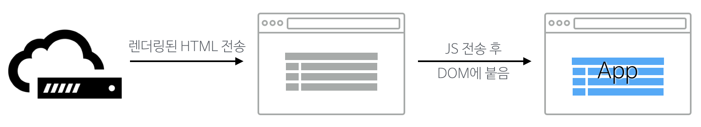

## React 애플리케이션의 서버 렌더링

React는 클라이언트에서 많이 사용되는 라이브러지만 공식사이트 홈페이지에 서버측 렌더링을 언급할 정도로 이를 염두에 두고 만들어졌다.
뿐만 아니라 최근 릴리스한 0.14 버전부터는 코어 패키지에 있던 DOM 의존성을 별도의 패키지로 분리함으로써 호환성을 더욱 높였다는 평을 받고 있다.
이 글에서는 React를 사용해 클라이언트와 서버에서 동시에 렌더링하는 방법을 살펴본다.
예제에는 Redux를 사용할 것이므로 이 글을 읽기 전에 Flux와 Redux를 읽어보면 도움이 된다.

### 서버측 렌더링은 왜 필요한가?

뷰의 렌더링을 클라이언트에서만 담당하는 웹 애플리케이션이 많다. 이런 웹 애플리케이션에서 서버는 화면에 거의 관여하지 않으며, 주로 클라이언트에서 보내는 혹은 클라이언트로 보내는 데이터를 XML/JSON 따위의 형식으로 제공하는 역할만 담당한다. 이와 같은 클라이언트측 렌더링은 다음과 같은 장점이 있다.

1. **성능**  
  사용자의 행동에 따라 필요한 부분만 다시 읽어들이기 때문에 서버측에서 렌더링하여 전체 페이지를 다시 읽어들이는 것보다 훨씬 빠른 인터랙션을 기대할 수 있다.
2. **코드의 일관성**  
  근래의 웹 사이트는 많든 적든 Ajax 통신을 하고 이를 통해 일부 영역만 렌더링하는 기능을 포함하고 있다. 서버측 렌더링을 한다해도 클라이언트 렌더링을 완전히 배제할 수는 없으므로 서버와 클라이언트 양측에 렌더링 코드를 작성해야 해서 일관성을 보장하기 어렵다. 반면 클라이언트에서만 렌더링을 하게 한다면 서버측 렌더링없이 일관성있는 코드를 작성할 수 있다.

이렇게 쓰고 보면 당장 모든 사이트에 서버측 렌더링을 클라이언트측 렌더링으로 바꿔야 할 것 같지만 클라이언트측 렌더링에는 다음과 같은 문제가 있다.

1. **성능**  
  특이하게도 장점과 마찬가지로 단점의 첫 번째 항목이 성능이다. 여기서 말하는 성능을 조금 더 정확히 말하면 **초기 구동 속도** 이다. 서버측에서 렌더링된 애플리케이션은 콘텐츠가 이미 HTML로 만들어져 있으므로 웹 브라우저가 서버에서 페이지를 읽어들이자마자 볼 수 있다. 하지만 클라이언트측 렌더링 애플리케이션은 페이지를 읽어들이는 시간 + 자바스크립트를 읽어들이는 시간 + 자바스크립트가 화면을 그리는 시간까지 더해져야 비로소 사용자가 콘텐츠를 볼 수 있다. 때로는 여기에 웹 서버에서 콘텐츠 데이터를 가져오는 시간까지 포함되기도 하는데, 이렇게 되면 더 많은 시간이 소요될 수 밖에 없다.

  물론, 초기 구동 속도를 제외하면 그 뒤부터는 앞에서 말한 장점이 발휘되어 성능이 빨라진다.
2. **검색 엔진 최적화**  
  비록 [구글 검색 엔진은 자바스크립트를 실행하지만](http://searchengineland.com/tested-googlebot-crawls-javascript-heres-learned-220157), 구글 봇외에도 콘텐츠를 수집하는 검색 엔진이나 웹 애플리케이션은 많으며 이 중에는 자바스크립트를 실행하지 못하는 것이 많다. 이런 애플리케이션은 서버에서 처음 렌더링된 HTML에서만 콘텐츠를 수집하기 때문에 클라이언트에서만 렌더링하는 웹 페이지를 빈 페이지로 인식할 것이다.

클라이언트에서만 렌더링을 하는 방법은 위와 같은 장점과 단점이 존재하기 때문에 가장 좋은 방법은 양측 렌더링을 혼용해서 사용하는 것이다. 단, 이 때 일관성을 보장하기 위해 **서버측과 클라이언트측은 똑같은 렌더링 코드를 공유해야 한다**.

### 클라이언트측 렌더링과 서버측 렌더링

클라이언트에서만 렌더링하는 웹 애플리케이션은 필요한 파일을 포함한 간단한 HTML 문서를 서버에서 반환한다. 웹 브라우저는 이 문서를 다운로드 한 후 포함된 자바스크립트와 CSS를 읽어들이고, 필요한 자바스크립트를 모두 다운로드 한 후에 이를 실행하여 화면을 그린다. 이 과정을 그림으로 표현해보면 다음과 같다.


반면, 서버 렌더링까지 함께하면 서버는 렌더링된 HTML 문서를 웹 브라우저로 전송한다. 웹 브라우저는 필요한 자바스크립트를 모두 다운로드 한 후에 화면에 있는 HTML 요소에 이벤트 핸들러를 추가하는 등 DOM에 기능을 더하게 된다. 이 시기 전까지 사용자는 화면에 있는 콘텐츠를 볼 수는 있지만 애플리케이션과 인터랙션은 할 수 없다. 다음은 이 과정을 그림으로 표현한 것이다.



이해를 돕기 위해 이 두 과정을 코드와 함께 살펴보자. 우리가 작성할 웹 애플리케이션에 `main.css`와 `bundle.js`라는 파일을 포함한다고 가정한다면 클라이언트 렌더링만 사용하는 애플리케이션에서 서버는 다음과 같은 HTML 문서를 반환한다.

```html
<html>
<head>
  <title>클라이언트에서만 렌더링하는 웹 애플리케이션</title>
  <link rel="stylesheet" href="main.css" type="text/css" />
  <script src="bundle.js"></script>
</head>
<body>
  <div id="app"></div>
</body>
</html>
```

하지만 서버 렌더링도 지원한다면 `#app` 요소에 다음과 같이 렌더링된 React 컴포넌트를 미리 포함하므로 사용자들이 HTML 문서를 다운로드 받는 즉시 콘텐츠를 볼 수 있다.

```html
<div id="app">
  <div data-reactid=".0">
    <header class="header" data-reactid=".0.0">
      <h1 data-reactid=".0.0.0">애플리케이션 제목</h1>
      <input type="text" class="input" data-reactid=".0.0.1">
    </header>
  </div>
</div>
```

### 서버 애플리케이션

이제 직접 코드를 작성하면서 애플리케이션의 구조를 생각해보자. 먼저 앞서 [Flux와 Redux](http://taegon.kim/archives/5288)라는 글에서 만든 간단한 Todo 애플리케이션을 설치한다. 코드는 [Redux 예제 저장소](https://github.com/taggon/redux-example-todo)에서 내려받을 수 있다.

```
$ git clone git@github.com:taggon/redux-example-todo.git
$ cd redux-example-todo
```

이 애플리케이션은 [webpack](https://webpack.github.io/)이라는 모듈 번들러를 사용해 필요한 자바스크립트를 모두 `bundle.js`로 합쳐두고 있는데 여기에는 DOM에 의존성이 있는 클라이언트에서만 사용되는 코드도 포함되어 있다. React 0.14 버전 이전까지는 DOM 의존성을 해결하기 위해 [jsdom](https://github.com/tmpvar/jsdom)과 같은 라이브러리를 사용해 서버에서 DOM 환경을 흉내내곤 했지만, 0.14부터는 DOM 관련 기능은 `react-dom`이라는 라이브러리로 분리하고 서버 렌더링 관련 기능은 `react-dom/server`로 분리되었다.

이 코드에 있는 `src/index.js` 파일은 클라이언트 렌더링을 위한 코드이므로 서버 렌더링을 위한 `src/page.js`를 새롭게 만들고 다음과 같이 작성한다.

```js
import React from 'react';
import ReactDOMServer from 'react-dom/server';
import TodoApp from './components/TodoApp';

export default function() {
  return ReactDOMServer.renderToString(
    <TodoApp />
  );
}
```

Webpack의 설정 파일인 `webpack.config.js`도 수정해야 한다. 브라우저 환경의 번들 파일만 생성하던 설정을 조금 수정하여 서버 환경의 파일도 생성하도록 만든다. 당연히 시작 파일(`entry`)은 방금 위에서 작성한 `src/page.js`로 설정한다. 이 글은 Webpack에 대해 다루고 있지 않으므로 설정에 대해 자세히 설명하지 않는다. 설정 파일은 [GitHub의 예제 저장소](https://github.com/taggon/redux-example-todo)에서 볼 수 있다. 설정을 완료했으면 콘솔 환경에서 `webpack`을 실행하여 번들 파일을 생성한다.

```
$ webpack
```

이제 서버에서 렌더링을 하고 이를 HTML 문서에 출력하도록 `server.js` 파일을 수정한다.

```js
...
var http = require('http');
var page = require('./dist/page'); // 번들 파일을 불러온다
...
  switch (location.path) {
    case '/':
      status = 200;
      content = fs.readFileSync('./index.html');
      content = content.toString().replace('<% page %>', page());
      break;
  }
...
```

`index.html`을 수정하여 렌더링된 결과물이 출력될 위치에 `<% pgae %>`를 삽입한다.

```html
...
  <div id="app"><% page %></div>
...
```

웹 서버를 실행한 후 웹 브라우저를 통해 접속해보면 결과물을 확인할 수 있다. 일단 다음과 같이 서버를 실행한다.

```
$ npm start
```

웹 브라우저의 소스 보기 기능을 사용하면 다음과 같이 서버에서 렌더링된 결과물이 함께 전송되었음을 알 수 있다.


### 초기 상태 전송

웹 애플리케이션의 큰 특징 중 하나는 URL 또는 해시에 따라 애플리케이션의 상태가 달라진다는 것이다. 현재 작성된 애플리케이션은 어느 페이지에 접속하든 항상 같은 초기 상태만 반환한다.
하지만, 일반적인 서버 애플리케이션을 대체하려면 URL에 따라서 달라지는 상태도 구현해야 한다. 이를 위해 각 파트별로 수정하는 방법을 알아본다.

#### 웹 페이지

초기 상태를 전역 변수로 저장할 수 있도록 `index.html` 파일을 수정한다.

```html
...
<script>
window.__INITIAL_STATE__ = <% state %>;
</script>
<script src="/bundle.js"></script>
...
```

그리고 `src/index.js` 파일과 `src/page.js` 파일을 수정하여 TodoApp 컴포넌트에 초기 상태를 전송한다.

```js
// index.js
...
render(
  <TodoApp state={window.__INITIAL_STATE__} />,
  document.getElementById('app')
);
```

```js
// page.js
...
export default function(initialState) {
  return ReactDOMServer.renderToString(
    <TodoApp state={initialState} />
  );
}
```

#### 서버

페이지에 따라 상태가 달라지는 것을 확인하기 위해 초기 상태가 있는 페이지는 다른 URL로 추가한다.

```js
...
var location = url.parse('http://'+req.url), status = 404, content = 'Page not found.', todos = [];

switch (location.path) {
  case '/':
    status = 200;
    content = fs.readFileSync('./index.html');
    content = content.toString().replace('<% page %>', page());
    content = content.replace('<% state %>', JSON.stringify(todos)); // 초기 상태 전송
    break;
  // 새 페이지를 추가한다.
  case '/added':
    todos = [ 'React 애플리케이션 만들기', 'Flux 공부하기' ];
    status = 200;
    content = fs.readFileSync('./index.html');
    content = content.toString().replace('<% page %>', page(todos))
    content = content.replace('<% state %>', JSON.stringify(todos)); // 초기 상태 전송
    break;
...
```

#### 컴포넌트, 액션, 스토어

이제 `src/components/TodoApp.js` 파일을 수정하여 `TodoApp` 컴포넌트가 스토어의 초기 상태를 설정하게 한다.

```js
...
var actions = bindActionCreators(TodoActions, todoStore.dispatch);

class TodoApp extends Component {
  constructor(props, context) {
    super(props, context);

    // 초기 상태를 업데이트한다.
    actions.initTodo(props.state);

    todoStore.subscribe(this._onChange.bind(this));
  }
...
```

이에 따라 할 일 목록을 초기화하는 `initTodo` 액션을 작성한다. 먼저 `constants/ActionTypes.js` 파일에 다음과 같이 상수를 추가한다.

```js
...
export const INIT_TODO = 'INIT_TODO';
```

그 다음에는 `actions/todo.js`에 `initTodo` 액션 생성자를 추가한다.

```js
...
export function initTodo(todos) {
  return { type: types.INIT_TODO, todos };
}
```

이제 `INIT_TODO` 액션에 대응하는 동작을 리듀서에 추가한다. `reducers/todos.js`에 다음과 같은 코드를 추가한다.

```js
import { ADD_TODO, DELETE_TODO, COMPLETE_TODO, COMPLETE_ALL, CLEAR_COMPLETED, INIT_TODO } from '../constants/ActionTypes';
...
  case INIT_TODO:
    return [ ...action.todos ];
  default:
    return state;
...
```

다시 번들 파일을 만들고 서버를 실행한 후 웹 브라우저에서 `http://localhost:3000/added`로 접근하면 초기 상태가 추가된 화면을 볼 수 있다. 이제 남은 것은 클라이언트와 서버 간에 데이터를 동기화하는 것이지만 이 글은 렌더링에만 집중하고 있으므로 클라이언트-서버 간의 동기화는 글을 읽는 이들에게 과제로 남겨두겠다.

### 마치며

지금까지 React + Flux 애플리케이션에 서버측 렌더링을 적용하는 방법을 살펴보았다. 이 글에서 보았다시피 서버측 렌더링을 위한 코드는 의외로 많지 않다. 게다가 서버 렌더링의 장점과 클라이언트 렌더링의 장점을 모두 살려 네트워크 속도, 브라우저의 버전, 자바스크립트 가능 여부 등 다양한 환경에서 더 나은 사용자 경험을 제공해 줄 수 있는만큼 익혀두면 반드시 유용하리라 생각한다. 서버 렌더링까지 적용된 전체 애플리케이션은 [redux-example-todo의 server 브랜치](https://github.com/taggon/redux-example-todo/tree/server)에서 다운로드 받을 수 있다.

### 부록: Isomorphic JavaScript

앞서 '서버측과 클라이언트측이 똑같은 코드를 공유해야 한다'고 말했는데 이 같은 개념을 한 단어로 **Isomorphic JavaScript** 라고 표현한다. 혹자는 이 용어가 이해하기 어렵고 양쪽 모두에서 사용할 수 있으므로 **Universal JavaScript** 로 표현해야 한다고 주장하기는 하지만 이미 Isomorphic JavaScript라는 용어가 자리잡은 상황이라 크게 반향이 있는 편은 아니다.

이 용어는 Nodejitsu의 찰리 로빈스(Charlie Robbins)가 처음 고안하고 이후 Airbnb의 스파이크 브렘(Spike Brehm) 덕분에 널리 알려졌는데, 처음 그들이 이 용어를 소개하고 설명할 때는 MVC 애플리케이션을 예로 들었다. 현재에 이르러서는 [React](http://facebook.github.io/react/)처럼 View만 담당하는 라이브러리는 물론 [invisible.js](https://invisiblejs.github.io/)처럼 모델만 담당하는 라이브러리도 있다. 관련 정보는 Isomorphic JavaScript 관련 라이브러리를 모아놓는 <http://isomorphic.net>을 참고하자.
