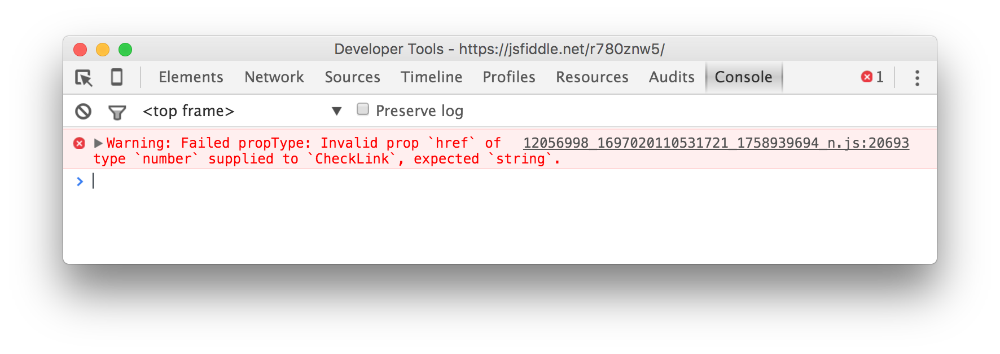

## React 컴포넌트를 테스트하는 세 가지 방법

자바스크립트는 타입이 느슨한 언어이기 때문에 문법 오류가 아닌 대부분의 오류는 런타임에 발생한다.
즉, 실행해보기 전에는 문제를 발견하기 어렵다. 반면 C, Java와 같이 타입이 강한 컴파일 언어에서는 함수나 메소드에 인수 선언과 타입이 다른 변수나 값을 전달하면 컴파일 에러가 발생하기 때문에 런타임 에러보다 발견하기 쉬운 편이다.

자바스크립트의 이런 약점을 보완해주는 도구는 많다. 이 글에서는 React 자체에 포함된 타입 검사 기능을 사용하는 방법부터 [`Jest`](https://facebook.github.io/jest/)와 같은 테스트 러너(test runner), Flow와 같은 정적 타입 검사기를 어떻게 사용하는지 간략하게 다룬다.

이 글에 등장하는 코드 일부는 ECMASScript 6 (또는 ECMAScript 2015)의 기능을 사용하므로 관련 지식이 필요할 수 있다.

### React의 타입 검사

상위 React 컴포넌트는 하위 React 컴포넌트에 값을 전달할 때 프로퍼티(property)를 사용하고, 하위 프로퍼티에서는 `props` 프로퍼티를 통해 전달된 값에 접근할 수 있다. 예를 들어, 다음과 같은 코드를 생각해보자.

```js
const React = require('react');
const ReactDOM = require('react-dom');

var CheckLink = React.createClass({
  render() {
    // 상위 컴포넌트에서 CheckLink에 전달한 프로퍼티를 전부 <a> 엘리먼트로 전달한다.
    return <a {...this.props}>{'√ '}{this.props.children}</a>;
  }
});

ReactDOM.render(
  <CheckLink href="/checked.html">
    여기를 클릭하세요
  </CheckLink>,
  document.getElementById('example')
);
```

위에서 `CheckLink` 컴포넌트에는 `href`라는 프로퍼티가 전달되었다. 그래서 위 결과물이 최종적으로 렌더링하는 결과물은 다음과 같다.

```html
<a href="/checked.html">
  여기를 클릭하세요
</a>
```

그런데 모든 HTML 속성은 항상 문자열이어야 한다. 만약 `CheckLink` 컴포넌트의 `href` 프로퍼티에 실수로 `Object` 타입의 값을 전달하면 다음과 같이 의도하지 않은 결과를 보게 될 것이다.

```html
<a href="[object Object]">
  여기를 클릭하세요
</a>
```

다행히 React 컴포넌트를 작성할 때 `propTypes` 프로퍼티를 함께 작성해주면 전달되는 프로퍼티의 타입을 정해둘 수 있다.

#### 단순 타입 검사

위 코드에서 `propTypes`를 통해 `href` 프로퍼티의 타입을 문자열로 정하려면 다음과 같이 작성한다.

```js
...
var CheckLink = React.createClass({
  propTypes: {
    href: React.PropTypes.string
  },
  render() {
...
```

`propTypes`는 컴포넌트에서 전달받는 프로퍼티의 이름을 키로, 타입을 값으로 포함하는 객체이다. 위 코드처럼 `href` 프로퍼티의 타입을 문자열(string)으로 설정할 때는 값으로 `React.PropTypes.string`을 사용하면 된다. 앞에서 사용된 `propTypes`와 달리 대문자로 시작하므로 대소문자 구별에 유의하자.

그런데 이 설정은 전달받은 값만 검사한다. 다시 말해 `href` 프로퍼티가 아예 전달되지 않으면 검사를 하지 않는다는 의미이다. 만약 반드시 전달되어야 하는 프로퍼티라면 타입 설정 값뒤에 `.isRequired`를 붙여서 표시해 줄 수 있다.

```js
...
var CheckLink = React.createClass({
  propTypes: {
    href: React.PropTypes.string.isRequired
  },
  render() {
...
```

만약 필수 프로퍼티로 설정한 값을 컴포넌트에 전달하지 않은 채 실행하면 웹 브라우저 콘솔에서 다음과 같은 오류가 나타난다. 관련 코드는 <https://jsfiddle.net/m3sd9306/>에서 직접 실행해 볼 수 있다.


또한 설정한 타입과 타입이 다른 프로퍼티를 전달하면 다음과 같은 오류가 발생한다. 관련 코드는 <https://jsfiddle.net/r780znw5/>에서 직접 실행해 볼 수 있다.



물론 문자열 외에도 검사할 수 있는 타입은 많다. 다음은 `propTypes` 프로퍼티를 통해 검사할 수 있는 타입 일부와 그에 해당하는 상수를 정리한 표이다. 필수 프로퍼티로 설정하고 싶다면 앞에서 살펴본 것처럼 해당 상수 뒤에 `.isRequired`를 추가하면 된다.

| 타입        | 상수                      |
|------------|--------------------------|
| 불리언       | React.PropTypes.bool     |
| 숫자         | React.PropTypes.number  |
| 문자열       | React.PropTypes.string   |
| 함수         | React.PropTypes.func    |
| 배열         | React.PropTypes.array   |
| 객체         | React.PropTypes.object  |
| HTML 엘리먼트 | React.PropTypes.element |
| 모든 타입     | React.PropTypes.any     |

#### 고급 타입 검사

앞서 살펴본 단순 타입 검사만으로는 부족한 때가 있다. 만약 전달받는 프로퍼티의 타입을 문자열만 포함하고 있는 배열로 설정하고 싶거나 `size`와 `color`라는 프로퍼티를 반드시 포함하는 객체로 설정하고 싶다면 어떻게 해야할까? 다행히 React 컴포넌트의 `propTypes`는 이런 요구 사항도 다룰 수 있다.

* **특정 클래스의 인스턴스**  
  예를 들어 `msg`라는 프로퍼티가 `Message`라는 클래스의 인스턴스인지 확인하고 싶다면 다음과 같이 작성한다.  

  ```js
  propTypes: {
    msg: React.PropTypes.instanceOf(Message)
  }
  ```

* **여러 값 중 하나여야 할 때**  
  다른 언어에서 볼 수 있는 열거형(enum) 타입은 다음과 같이 `oneOf` 메소드에 취할 수 있는 값의 배열을 전달하여 설정한다.

  ```js
  propTypes: {
    category: React.PropTypes.oneOf(['News', 'Photos'])
  }
  ```

* **여러 타입 중 하나여야 할 때**  
  한 프로퍼티에 여러 종류의 타입을 허용할 때는 `oneOfType` 메소드에 취할 수 있는 타입의 배열을 전달하여 설정한다.

  ```js
  propTypes: {
    any: React.PropTypes.oneOfType([
      React.PropTypes.string,
      React.PropTypes.number,
      React.PropTypes.instanceOf(Message)
    ])
  }
  ```

* **숫자 배열, 문자열 배열 등 특정 타입으로만 구성된 배열**  
  원소의 타입이 모두 같은 종류인 배열을 설정할 때는 `arrayOf` 메소드를 사용한다.

  ```js
  propTypes: {
    numbers: React.PropTypes.arrayOf(React.PropTypes.number),
    messages: React.PropTypes.arrayOf(React.PropTypes.instanceOf(Message))
  }
  ```

* **숫자 배열, 문자열 배열 등 특정 타입으로만 구성된 배열**  
  원소의 타입이 모두 같은 종류인 배열을 설정할 때는 `arrayOf` 메소드를 사용한다.

  ```js
  propTypes: {
    numbers: React.PropTypes.arrayOf(React.PropTypes.number)
  }
  ```

* **특정 프로퍼티 이름을 포함하는 객체**  
  `shape` 메소드를 사용하면 전달받은 객체가 반드시 포함해야 할 프로퍼티 이름을 설정할 수 있다.

  ```js
  propTypes: {
    background: React.PropTypes.shape({
      image: React.PropTypes.string,
      repeat: React.PropTypes.bool
    })
  }
  ```

  단, **반드시 포함해야 할** 이름을 정하는 것이므로 설정한 프로퍼티가 없을 때는 오류가 발생하지만 설정한 프로퍼티보다 더 많은 프로퍼티가 설정될 때는 아무런 오류도 발생하지 않는다. 실제 사용예는 <https://jsfiddle.net/d0gau4z7/>에서 볼 수 있다.

* **함수를 통한 설정**
  지금까지 배운 여러 메소드로도 충분히 검증하기 어려운 값이라면 직접 유효성 검사 함수를 작성해서 확인하는 방법도 있다. 예를 들어, 항상 0 또는 양수여야 하는 `padding` 프로퍼티가 있다고 가정해보자. 앞서 살펴본 `React.PropTypes.number`를 사용하면 숫자 타입인지는 확인할 수 있지만 값의 범위는 확인할 수 없으므로 이 문제는 검사 함수를 작성해서 해결하는 편이 좋다.

  ```js
  propTypes: {
    padding: function(props, propName, componentName) {
      // 숫자 타입이 아니거나 0보다 작은 값이면 유효하지 않은 것으로 판단한다.
      if (typeof props[propName] !== 'number' || props[propName] < 0) {
        return new Error(propName + ' 프로퍼티의 값은 0보다 작을 수 없습니다.');
      }
    }
  }
  ```

  유효하지 않은 값으로 판단했다면 에러를 던지는(throw) 대신 반드시 **반환하도록** 작성해야 한다.

### Flow 정적 타입 검사기

정적 타입(static type)이라는 말은 변수의 자료형이 사용하기 전에 결정된다는 뜻이다. 보통 타입이 강한 컴파일 언어에서는 소스를 컴파일 할 때 타입이 결정된다. 다음은 대표적인 정적 타입 언어 중 하나인 C 언어의 예제 코드이다.

```c
int numA, numB, sum; // 타입을 명시적으로 설정
numA = 5;
numB = 10;
sum = numA + numB;
```

위에서 `int`라는 키워드는 뒤에 나오는 변수 `numA`, `numB`, `sum`의 타입이 정수라는 것을 의미한다. 컴파일러는 세 변수에는 반드시 정수가 할당되어야 한다는 사실을 알고 있으므로, 두 번째 줄의 값을 `numA = "Hello";`로 작성하면 컴파일 에러가 발생한다.

반면 자바스크립트에서는 변수를 선언할 때 타입을 정하지 않으며 모든 변수는 `var`라는 키워드 만으로 선언할 수 있다. 선언된 변수는 어떤 타입으로든 변할 수 있기 때문에 다음과 같이 정수를 담았던 변수에 문자열을 담아서 사용하는 것도 가능하다.

```js
var num;
num = 5;
num = "number";
```

이 같은 특성 덕분에 코드 작성이 유연하다는 장점을 얻었을 지 몰라도 함수나 메소드의 인수, 클래스의 프로퍼티 등에 특정 타입을 강제하고 싶을 때는 불편함이 따른다. 게다가 반드시 코드를 실행해야 문제점을 확인할 수 있으므로 버그를 발견하기도 쉽지 않다.

바로 이런 문제를 해결하기 위해 페이스북에서 개발한 것이 [Flow](http://flowtype.org/)라는 정적 타입 분석 도구이다.

#### 설치

Flow 공식 사이트의 [시작하기 문서](http://flowtype.org/docs/getting-started.html)에 가면 Flow 설치 파일을 다운로드 받을 수 있다.

* Mac OS X: https://facebook.github.io/flow/downloads/flow-osx-latest.zip
* Linux (64 bit): https://facebook.github.io/flow/downloads/flow-linux64-latest.zip

아쉽게도 Windows 버전은 아직 공식적으로 제공하지 않고 있지만, [OCaml ](http://www.ocamlpro.com/pub/ocpwin/flow-builds/)에서 예전 버전의 빌드를 제공해주고 있으므로 아쉬운대로 사용해볼만하다.

* Windows (비공식): [flow-simple-windows-20141127.zip](http://www.ocamlpro.com/pub/ocpwin/flow-builds/flow-simple-windows-20141127.zip)

맥에서는 `brew install flow`를 통해 설치할 수 있고 맥/리눅스 환경에서는 `npm install -g flow-bin`을 통해서도 설치할 수 있으니 자신에게 편한 방법을 사용하면 된다. 설치하지 않고도 간단하게 사용할 수 있는 [온라인 도구](http://tryflow.org/)도 있다.

설치에 관한 보다 자세한 내용은 <http://flowtype.org/docs/getting-started.html>에서 볼 수 있다.

#### Hello, world!

먼저 Flow를 이해하기 위해 간단한 예제를 살펴보자.

```js
function foo(x) {
  return x * 10;
}

foo('Hello, world!');
```

위 코드에서 `foo` 함수의 `x` 인수는 아마 숫자 타입을 기대했을 것이다. 하지만 실행 중에 전달된 값은 `Hello, world!`라는 문자열이므로 `x * 10`은 기대하지 않은 `NaN`이라는 결과를 반환한다. 이 파일을 `hello.js`로 저장한 후 Flow를 사용해 검사해보자.

검사할 파일이 있는 폴더로 가서 다음 명령어를 실행한다. 원래는 프로젝트 루트 폴더에서 실행하는 명령어지만 지금은 프로젝트가 따로 설정되어 있지 않으니 JS 파일이 저장된 폴더에서 실행한다.

```
$ flow init
```

이 명령을 실행하면 Flow를 실행하는데 필요한 `.flowconfig`라는 파일이 만들어진다. 이제 간단하게 `flow`라는 명령어를 실행해보자.

```
$ flow
```

하지만 막상 실행해보면 코드에 명백한 오류가 있음에도 불구하고 에러가 없다는 메시지가 출력된다. 사실 flow를 사용해 정적 타입 검사를 하고자 하는 파일은 공백을 제외한 첫 줄에 다음과 같이 표시해두어야 한다.

```js
/* @flow */

function foo(x) {
...
```

첫 줄이라고는 했지만 반드시 1번 줄에 이 선언이 있어야 한다는 뜻은 아니다. 처음 시작한 주석에 포함되어 있어도 되기 때문에 다음과 같이 라이선스 선언 바로 뒤에 붙어서 표시하기도 한다.

```
/**
 * This file is provided by Facebook for testing and evaluation purposes
 * only. Facebook reserves all rights not expressly granted.
 *
 * THE SOFTWARE IS PROVIDED "AS IS", WITHOUT WARRANTY OF ANY KIND, EXPRESS OR
 * IMPLIED, INCLUDING BUT NOT LIMITED TO THE WARRANTIES OF MERCHANTABILITY,
 * FITNESS FOR A PARTICULAR PURPOSE AND NONINFRINGEMENT. IN NO EVENT SHALL
 * FACEBOOK BE LIABLE FOR ANY CLAIM, DAMAGES OR OTHER LIABILITY, WHETHER IN
 * AN ACTION OF CONTRACT, TORT OR OTHERWISE, ARISING FROM, OUT OF OR IN
 * CONNECTION WITH THE SOFTWARE OR THE USE OR OTHER DEALINGS IN THE SOFTWARE.
 *
 * @flow
 */
```

또는 다음과 같이 실행하면 `@flow` 설정에 관계없이 프로젝트 내에 있는 모든 대상 파일을 전부 검사할 수도 있다.

```
$ flow check --all
```

Flow는 기본적으로 `.js`와 `.jsx` 확장자를 모두 확인하고 설정에 따라 검사 대상을 추려낸다.
이제 예제 폴더에서 Flow를 실행하면 다음과 같은 화면을 볼 수 있다.
실행 결과는 [온라인에서도 확인](http://tryflow.org/#6687372ae4f8a211d8425f7bde0b6286)할 수 있다.


#### 명시적 타입 표기

Flow는 코드에 있는 변수/인수의 타입을 알아서 추론하기 때문에 일부러 타입을 표기해주지 않아도 어느 정도 잘 동작한다. 그러나 명시적으로 타입 표기(type annotation)를 해두면 검사를 보다 더 정확하게 할 수 있음은 물론 코드의 가독성에도 도움이 되므로 명시적으로 작성하는 것을 추천한다. 사실 가끔 추론하기 어려운 부분이 나타나면 Flow가 사용자에게 명시적인 타입 표기를 요구하기도 한다.

바로 앞 절에서 작성한 코드로 돌아가서 함수의 인수 `x`는 반드시 숫자 타입이어야하므로 다음과 같이 타입을 표기할 수 있다.

```js
/* @flow */

function foo(x: number): number {
  return x * 10;
}

foo('Hello, world!');
```

이 같은 타입 표기는 올바르지 않은 자바스크립트 문법이므로 실제로 배포할 자바스크립트 코드에서는 **Babel의 플러그인인 [stript flow annotations](http://flowtype.org/docs/running.html#using-the-offline-transform-tool) 등을 사용해 제거해야 한다.** 타입 표기를 제거하는 방식에 관한 자세한 정보는 공식 사이트의 [Running Flow code](http://flowtype.org/docs/running.html)를 참고하자.

**[Flow Comments](http://flowtype.org/blog/2015/02/20/Flow-Comments.html#1)를 통해 주석 형태로 작성하는 방법도 있다.** 간단히 말해 `/*:`로 시작하는 주석은 Flow 타입 검사기가 타입 표기로 인식한다.

```js
...
function foo(x/*: number*/)/*: number*/ {
...
```

당연히 자바스크립트 문법을 위반하지 않으므로 Babel과 같은 트랜스파일러를 사용하지 않아도 되며, 자바스크립트 주석 형태이기 때문에 `uglify`와 같은 최소화 도구를 사용하면 제거된다.

Flow에서 지원하는 타입으로는 `string`, `number`, `boolean`, `any`, `mixed`, `void` 등 원시 타입과 배열 또는 클래스 형태를 나타내는 `Array<T>`, `Boolean`, `Class<T>`, `Function`, `Number`, `Object`, `String`은 물론 객체 시그니처와 함수 시그니처도 정할 수 있다. 사용할 수 있는 타입은 [Flow 공식 문서](http://flowtype.org/docs/quick-reference.html)에서 더 자세히 볼 수 있다.

#### 객체 시그니처와 함수 시그니처

객체의 시그니처는 포함해야 할 프로퍼티의 이름과 값으로 구성된다. 예를 들어 `{ color: 'red', size: 10 }`과 같은 객체를 저장하는 변수는 다음과 같이 타입을 표기한다.

```js
var a: { color: string, size: number } = {
  color: 'color',
  size: 10
};

var b: { color: string, size: number } = {
  color: 'color',
  size: 10
};
```

마찬가지로 함수 시그니처를 통해 함수가 전달받아야 할 인수와 반환해야 할 값의 타입을 설정할 수 있다. 예를 들어 바로 위에서 작성한 객체를 첫 번째 인수로 전달받고 불리언 값을 반환하는 함수는 다음과 같이 기술한다.

```js
var isBigRed: ( (shape: { color: string, size: number}) => boolean ) = function( shape ) {
  return (color === 'red' && size > 10);
};
```

객체 및 함수 시그니처에 관한 내용은 [Flow 공식 문서](http://flowtype.org/docs/quick-reference.html#the-object-signature-type)에서 더 자세히 볼 수 있다.

#### 타입 정의

바로 앞 절의 첫 코드를 보면 `a`와 `b`에 똑같은 타입이 사용되었음을 알 수 있다. 변수를 선언할 때마다 이렇게 타입을 나열하는 것은 굉장히 번거로우므로 사용할 타입을 다른 이름으로 정의해두고 사용하는 편이 좋다. 타입을 정의할 때는 `type`이라는 키워드 뒤에 타입 이름과 기술할 내용을 입력하면 된다. 예를 들어 다음은 문자열만 포함하는 배열을 `Strings`라는 타입으로 정의하는 코드이다.

```js
type Strings = Array<string>;
```

이렇게 정의한 타입은 Flow에 내장된 다른 타입과 동일하게 사용할 수 있다. 다음은 구분자와 문자열 배열을 각각 인수로 전달받고 배열에 포함된 문자열을 모두 하나로 합친 후 반환하는 `implode` 함수의 예이다.

```js
/* @flow */
type Strings = Array<string>;

function implode(glue: string, array: Strings): string {
  return array.join(glue);
}

console.log( implode(' | ', ['Apple', 'Banana', 'Cherry']) );
```

#### React 컴포넌트 검사

Flow를 사용해 React 컴포넌트를 검사하기 위해 이 글에서 가장 먼저 작성했던 코드로 돌아가보자. 단, 첫 줄에는 `/* @flow */`를 추가해야 한다.

```js
/* @flow */
const React = require('react');
const ReactDOM = require('react-dom');

var CheckLink = React.createClass({
  render() {
    // 상위 컴포넌트에서 CheckLink에 전달한 프로퍼티를 전부 <a> 엘리먼트로 전달한다.
    return <a {...this.props}>{'√ '}{this.props.children}</a>;
  }
});

ReactDOM.render(
  <CheckLink href="/checked.html">
    여기를 클릭하세요
  </CheckLink>,
  document.getElementById('example')
);
```

Flow는 기본적으로 몇 가지 모듈에 대해 각 기능을 정의한, 마치 C/C++ 계열 언어의 헤더 파일처럼 보이는 미리 작성된 타입 정의 파일을 보유하고 있다. 미리 정의된 모듈에는 브라우저 객체 모델(BOM), 문서 객체 모델(DOM)과 더불어 React도 속해있기 때문에 React 모듈을 비교적 빠르고 정확하게 처리할 수 있다. Flow에서 미리 정의된 타입은 [GitHub 저장소](https://github.com/facebook/flow/tree/master/lib)에서 볼 수 있으며 모듈과 클래스 타입을 선언하는 방법은 공식 문서의 [Declarations](http://flowtype.org/docs/declarations.html)에서 확인할 수 있다.

이제 Flow를 실행해보면 `react-dom` 모듈을 찾을 수 없다는 오류가 발생할 수 있는데 `node_modules` 아래에 `react-dom` 패키지를 설치하지 않았을 때 발생하므로 해당 패키지를 설치해주고 나면 문제가 해결된다. `react-dom`을 설치했다면 이번에는 `node_modules/fbjs` 모듈에서 다음과 같이 모듈을 찾을 수 없다는 메시지가 나타날 수 있다.

```
node_modules/fbjs/flow/include/PromiseMap.js:15
 15: var Deferred = require('Deferred');
                    ^^^^^^^^^^^^^^^^^^^ Deferred. Required module not found

node_modules/fbjs/flow/include/PromiseMap.js:17
 17: var invariant = require('invariant');
                     ^^^^^^^^^^^^^^^^^^^^ invariant. Required module not found

...
```

이처럼 사용한 외부 라이브러리에서 오류가 발생할 때는 두 가지 방법을 사용할 수 있다. 첫 번째는 [React 모듈 인터페이스 ](https://github.com/facebook/flow/blob/master/lib/react.js)처럼 해당 라이브러리의 인터페이스를 Flow에 맞춰 정의하는 것이다. 번거롭기는 하지만 라이브러리에서 강제하는 타입로 지킬 수 있으므로 조금 더 정밀한 타입 검사가 가능하다. 하지만 [Flow를 underscore와 함께 사용하는 법](http://flowtype.org/docs/underscore.html)이라는 공식 문서에서 보듯 상당한 번거로움을 감수해야 한다. 어느 정도 수준인지는 문서 말미에 있는 수정 코드만 봐도 충분히 짐작 가능할 것이다.

두 번째는 아예 에러가 발생한 외부 모듈을 무시하는 것이다. 이 때는 프로젝트 루트에 있는 `.flowconfig` 파일을 열고 `[ignore]` 섹션에 다음과 같이 `fbjs` 모듈을 모두 무시하도록 설정한다.

```
[ignore]
.*node_modules/fbjs.*
```

같은 원리를 다른 라이브러리에서 비슷한 오류가 발생할 때도 적용할 수 있다. 몇 가지 문제를 해결했다면 그 다음부터는 다소 쉬운 편이다. React와 Flow는 둘 다 페이스북에서 만들어졌기 때문인지 서로 굉장히 잘 맞는다. 일례로 앞서 배운 것처럼 `propTypes` 프로퍼티를 설정하면 Flow가 자동으로 프로퍼티의 타입을 인식한다. `propTypes` 프로퍼티를 사용해 `href`가 반드시 문자열을 입력받도록 설정한 다음과 같이 숫자를 전달해보자.

```js
...
ReactDOM.render(
  <CheckLink href={123}>
    여기를 클릭하세요
  </CheckLink>,
  document.getElementById('example')
);
...
```

물론 `isRequired` 프로퍼티도 잘 기대한 대로 잘 동작한다. 위 코드의 실행 결과는 [온라인](http://tryflow.org/#bea04f5bed7e3f49f242b8811913b77c)에서도 볼 수 있다. 사실 여기까지는 실행 전에 확인이 가능하다는 점만 제외하면 React에 기본적으로 내장된 `propTypes` 설정과 크게 다를 바가 없다. 하지만 Flow를 사용하면 메소드에 전달하는 데이터 타입도 강제할 수 있어 검사 범위가 더 넓어진다.

이해를 돕기 위해 위에서 작성한 `CheckLink` 컴포넌트에 체크 여부를 설정하는 `setChecked()` 메소드를 만든다고 가정하자. 이 메소드의 인수로는 불리언 값이 전달되고, 이를 Flow 타입 표기와 함께 코드로 표현하면 다음과 같다([온라인 확인](http://tryflow.org/#180cff792b3f1d28071319cf6054448f)).

```js
/* @flow */
const React = require('react');
const ReactDOM = require('react-dom');

var CheckLink = React.createClass({
  propTypes: {
    href: React.PropTypes.string
  },
  setChecked(checked: bool) {
    this.setState( {checked} );
  },
  render() {
    // 상위 컴포넌트에서 CheckLink에 전달한 프로퍼티를 전부 <a> 엘리먼트로 전달한다.
    return <a {...this.props}>{'√ '}{this.props.children}</a>;
  }
});
...
```

이 메소드를 `componentDidMounted` 메소드에서 호출하되 잘못된 타입을 전달하여 Flow가 잘 동작하는지 확인해보자.

```js
...
  componentDidMounted() {
    this.setChecked('true');
  }
...
```

이제 Flow를 실행해보면 다음과 같이 타입이 맞지 않는다는 오류를 볼 수 있다. 이 코드는 [온라인에서도 확인](http://tryflow.org/#839a58bc0196ddadd62ef780588ddbcf)할 수 있다.


### Jest를 사용한 테스트

정적 타입 분석은 변수/인수에 저장된 값의 타입은 검사하지만, 그 값이 논리적으로 올바른지는 검사하지 못한다. 예를 들어 인수로 전달된 두 값의 합을 반환하는 `add()` 함수가 두 값의 곱을 반환해버려도 문제점을 찾지 못한다. 그래서 Flow를 사용할 때는 논리적인 문제점을 찾아내는 테스트 러너(test runner)와 함께 사용하는 편이 좋다. 수많은 테스트 러너 중 이 글에서는 페이스북이 [Jasmine](http://jasmine.github.io/)을 기반으로 개발한 [Jest](https://facebook.github.io/jest/)을 간단히 살펴보겠다.

먼저 프로젝트 루트 폴더로 가서 Jest와 그 밖에 필요한 패키지를 모두 설치한다.

```
$ npm install --save-dev jest-cli babel-jest react-addons-test-utils babel-preset-2015 babel-preset-react
```

그 후 `package.json` 파일을 열고 `test` 스크립트로 `jest`를 등록하고 Jest를 위해 몇 가지 설정을 `jest` 프로퍼티로 추가한다.

```
...
"scripts": {
  "test": "jest"
},
"jest": {
  "scriptPreprocessor": "<rootDir>/node_modules/babel-jest",
  "unmockedModulePathPatterns": [
    "<rootDir>/node_modules/react",
    "<rootDir>/node_modules/react-dom",
    "<rootDir>/node_modules/react-addons-test-utils",
    "<rootDir>/node_modules/fbjs"
  ],
  "moduleFileExtensions": ["js", "jsx", "json"]
}
...
```

그리고 Babel 트랜스파일러가 ES2015(또는 ES6)와 React 문법을 지원하도록 `.babelrc` 파일을 프로젝트 루트에 만들고 다음과 같이 입력한다.

```
{
  "presets": ["es2015", "react"]
}
```

이제 설정이 완료되었으니 간단한 테스트를 작성하여 Jest를 익혀보자.

#### 컴포넌트 코드

앞서 작성했던 `CheckLink` 컴포넌트를 그대로 사용하되 DOM에 렌더링하는 코드를 없애고 대신 모듈을 내보내도록 수정한다. 간단하게 작성한 컴포넌트의 전체 코드는 다음과 같다.

```js
const React = require('react');

var CheckLink = React.createClass({
  render() {
    return <a {...this.props}>{'√ '}{this.props.children}</a>;
  }
});

module.exports = CheckLink;
```

#### 테스트 코드

프로젝트 루트 폴더에 테스트 파일을 포함할 `__tests__` 폴더를 만들고 이 폴더 안에 `CheckLink-test.js` 파일을 작성한다. 테스트 파일의 이름은 어떻게 작성해도 상관없지만 `__tests__` 폴더의 이름은 그대로 지켜서 작성해야 한다. Jest는 `__tests__` 폴더를 찾고 그 안에 포함된 테스트 파일을 모두 실행하기 때문이다.

```js
/* __tests__/CheckLink-test.js */
jest.dontMock('../CheckLink');

const React = require('react');
const ReactDOM = require('react-dom');
const TestUtils = require('react-addons-test-utils');

const CheckLink = require('../CheckLink');

describe('CheckLink', () => {
  it ('should use any props as attributes of the anchor', () => {
    var link = TestUtils.renderIntoDocument(
      <CheckLink href="check_if_used">
        클릭하세요
      </CheckLink>
    );  

    var linkNode = ReactDOM.findDOMNode(link);
    expect(linkNode.getAttribute('href')).toEqual('check_if_used');
  });
});
```

Jest의 가장 큰 특징으로는 '**의존성 모듈을 자동으로 흉내낸다(Automatically mock dependencies)**'는 것이다. 다시 말해, 특별한 설정이 없다면 테스트 파일에서 불러오는 모듈을 실제로 불러오는 대신 흉내낸 가짜 정보로 채워둔다. 이렇게 함으로써 다른 모듈에 영향을 받지 않고 모듈의 단위 테스트를 수행할 수 있다는 것이 페이스북 개발팀의 설명이다.

> Jest makes isolating a module from its dependencies extremely easy by automatically generating mocks for each of the module's dependencies...
>
> Jest는 각 모듈의 의존성을 자동으로 흉내내어 모듈과 모듈의 의존성을 굉장히 쉽게 격리할 수 있습니다.

바꿔말하면 테스트를 수행할 모듈은 흉내를 못내도록 설정해야 하는데 첫 번째 줄이 바로 그 역할을 한다. `jest.dontMock` 메소드에 모듈의 경로를 전달하면 해당 모듈은 실제로 불러오게 된다. 사실 위에서 `package.json` 파일에 추가한 `unmockedModulePathPatterns` 설정도 같은 역할을 한다. 다만 여기에 설정한 모듈은 테스트에 상관없이 항상 흉내내기를 금지하므로 주의해서 사용해야 한다. 흉내내기가 어떤 식으로 동작하는지 자세히 알고 싶다면 공식 사이트에 있는 [Automatic Mocking](https://facebook.github.io/jest/docs/automatic-mocking.html) 문서를 참고하라.

React는 `react-addons-test-utils` 패키지를 통해 테스트할 때 유용한 몇 가지 기능을 제공한다. 위 코드에서는 React 컴포넌트를 DOM에 그려보는 `renderIntoDocuemnt`를 사용했는데, 실제 코드를 살펴보면 `div` 엘리먼트를 만들고 여기에 React 컴포넌트를 그리도록 구현이 되어있다. 하지만 Jest는 웹 브라우저가 아닌 Node.js 환경에서 실행되므로 내부적으로는 `jsdom` 패키지를 사용해 DOM을 에뮬레이션하고 있다. 따라서 실제 웹 브라우저에서 테스트러너를 실행할 때와 차이가 있을 수도 있음을 감안해야 할 것이다.

그 외에는 테스트 러너를 사용해봤던 경험이 있다면 대체로 익숙할 것이다. 만약 Jasmine 테스트 러너에 익숙하지 않다면 [Jamine의 문서](http://jasmine.github.io/edge/introduction.html)를 참고하자.

이제 `npm test`를 입력하여 Jest를 실행해보면 테스트가 실행되는 것을 볼 수 있다.

### 마치며

지금까지 React 컴포넌트를 테스트 할 수 있는 세 가지 방법 `propTypes`, Flow, Jest를 살펴보았다. `propTypes`는 React에 내장된 방법으로 상위 객체에서 전달받는 `props`에 대해서만 동작한다. Flow는 정적 타입 분석 도구로서 컴파일이나 명시적 타입이 없는 자바스크립트 언어의 특성을 보완해 타입을 잘못 사용해서 발생할 수 있는 실수를 예방할 수 있다. 또한, 두 도구 모두 페이스북에서 만든만큼 Flow는 `propTypes`와도 잘 동작한다. 마지막으로 Jest는 Jasmine 기반의 테스트 러너로서 자동 흉내내기가 특징이다.

비록 지면 관계상 많은 내용을 담을 수는 없었지만 적어도 세 방법의 특징과 사용 목적은 충분히 전달되었으면 한다. 각 테스트 방식을 잘 활용하면 보다 견고한 React 컴포넌트를 작성하는데 도움이 될 것이다.

### 참고자료

* [React: Reusable Components](https://facebook.github.io/react/docs/reusable-components.html)
* [Flow 공식 사이트](http://flowtype.org/)
* [Try Flow Online](http://tryflow.org/)
* [Jest 공식 사이트](https://facebook.github.io/jest/)
