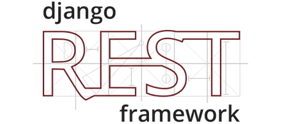
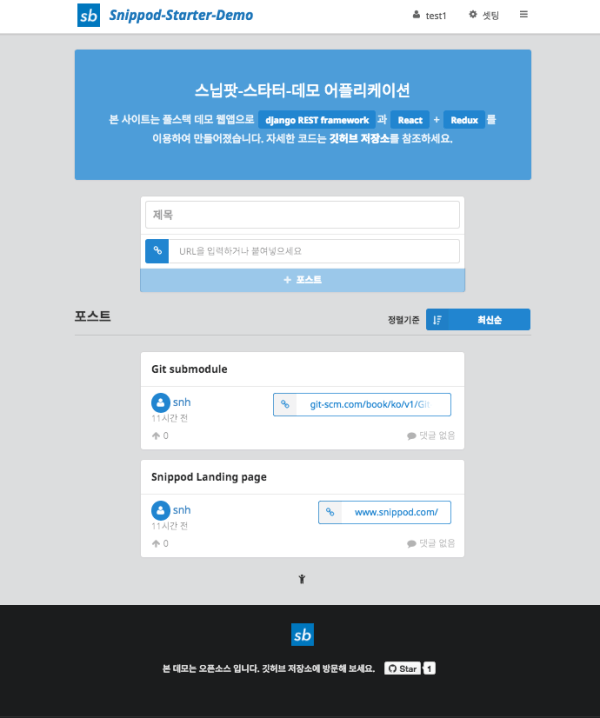
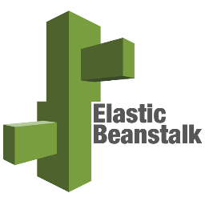

# React with Redux 와 Django를 이용한 SPA 개발

일명 Single Page Application (SPA), 웹 어플리케이션은 네이티브앱과는 별도로 빠르게 성장하고 있는 플랫폼입니다. 여전히 웹은 누구에게나 친숙하고 접근성이 좋은 플랫폼이며, SPA는 네이티브와 유사한 경험을 줄 수 있기 때문에 사용성이 중요한 웹서비스는 웹앱으로 만들어 지고 있습니다.

​

​

이 글에서는 SPA 웹어플리케이션 개발을 위해 [**React**](https://facebook.github.io/react/) JavaScript 라이브러리와 [**Redux**](https://github.com/gaearon/redux)를 이용하여 Front Side 웹앱을 개발하고 동시에 [**Django REST**](http://www.django-rest-framework.org/)를 서버사이드로 사용하여 **Full Stack**을 구현한 오픈소스인 [**Snippod-Starter-Demo-App**](https://github.com/shalomeir/snippod-starter-demo-app) 을 통해 SPA 구조 및 사용된 요소 기술셋/라이브러리를 살펴보고자 합니다. 
대부분의 웹앱 샘플 프로그램의 서버사이드는 JavaScript End to End 구현에 따른 여러 잇점때문에 **Node.js**를 많이 사용하고 있지만 본 글에서 살펴보는 데모어플리케이션은 Django ORM 모델을 활용한 REST API 서버를 이용한 서비스를 위해 [**Django**](https://www.djangoproject.com/)를 통해 REST API 서버를 별도로 구축되어 있습니다. 물론 Static한 Frontside 코드는 **Node.js**를 통해 여전히 서빙되고 있기 때문에 간단한 데모앱이지만 프론트를 위한 서버와 REST API 서버 두개를 동시에 활용하고 있습니다. 그래서 본 글에서 설명하고 있는 데모앱의 저장소에는 프론트 사이드와 서버 사이드 GitHub 저장소를 각각 [Git 서브모듈](https://git-scm.com/book/ko/v1/Git-%EB%8F%84%EA%B5%AC-%EC%84%9C%EB%B8%8C%EB%AA%A8%EB%93%88)로 바라보고 있으며 실제 코드는 개별 서브모듈 내에 존재하고 있습니다.

Snippod Starter Demo Application Full Stack Diagram

&nbsp;

[Snippod Starter Demo Application](http://snippod-demo-front.ap-northeast-2.elasticbeanstalk.com/) 메인화면

* **Git Repository** : [https://github.com/shalomeir/snippod-starter-demo-app](https://github.com/shalomeir/snippod-starter-demo-app)
  * **Git Repository (Front Side)** : [https://github.com/shalomeir/snippod-starter-demo-app-front](https://github.com/shalomeir/snippod-starter-demo-app-front)
  * **Git Repository (Server Side)** : [https://github.com/shalomeir/snippod-starter-demo-app-server](https://github.com/shalomeir/snippod-starter-demo-app-server)
  * **Git Repository For CodeLab (Front Side)** : [https://github.com/shalomeir/snippod-starter-demo-app-front/tree/codelab](https://github.com/shalomeir/snippod-starter-demo-app-front/tree/codelab)
* **Git Repository For CodeLab 설치를 위한 설정 가이드 문서** : [https://docs.google.com/document/d/1PPooko0uzUanYZMwKrEUXUWMD3FXCarKhVxGq5_Kip0/edit?usp=sharing](https://docs.google.com/document/d/1PPooko0uzUanYZMwKrEUXUWMD3FXCarKhVxGq5_Kip0/edit?usp=sharing)
* **Git Repository For CodeLab 강의 PPT 자료[^2]** : [https://drive.google.com/file/d/0B9ltVFRI_UMiTjdNYzc5UklQTVU/view?usp=sharing](https://drive.google.com/file/d/0B9ltVFRI_UMiTjdNYzc5UklQTVU/view?usp=sharing)
&nbsp;
* **DEMO (Updated by [Snippod Inc.](https://www.snippod.com/))** : [http://snippod-demo-front.ap-northeast-2.elasticbeanstalk.com/](http://snippod-demo-front.ap-northeast-2.elasticbeanstalk.com/)

## 사용된 기술 스택

Snippod-Starter-Demo-App에서 사용된 주요 라이브러리 들과 그에 대한 간략한 소개는 다음과 같습니다.

### Frontend side
- [**React**](http://facebook.github.io/react/): UI View 를 만들어 주기 위한 라이브러리. 만들고자 하는 부분들을 Component단위로 구현
- [**Redux**](https://github.com/gaearon/redux): Flux 의 구조에 영향을 받아 단방향 데이터 흐름을 사용하게 해주는 상태 컨테이너 
- [**normalizr**](https://github.com/paularmstrong/normalizr): Flux 와 Redux 앱을 위해 JSON 응답 결과를 정의한 Schema에 따라 정규화 해주는 라이브러리
- [**Redux Form**](http://redux-form.com/): Redux store를 통해 React 콤포넌트 내 form 데이터를 관리해주는 라이브러리
- [**Semantic UI**](http://semantic-ui.com/): UI 스타일링을 위한 프레임워크로 Bootstrap과 유사한 역할을 하지만 더 자유도가 높은 편이며 커스터마이징을 위한 체계적인 스타일 구조를 별도의 빌드 프로세스를 통해 지원함
- [**Radium**](https://github.com/FormidableLabs/radium): [React Inlins Styles](https://facebook.github.io/react/tips/inline-styles.html)을 보다 파워풀하게 사용하기 위한 라이브러리
- [**React-router**](http://rackt.github.io/react-router/): SPA 에서 중요한 Routing (url path) 처리
- [**react-router-redux**](https://github.com/reactjs/react-router-redux): 구 이름은 redux-simple-router. React-router와 Redux store의 sync를 유지해줌
- [**React Intl**](https://github.com/yahoo/react-intl): Yahoo에서 제공하는 국제화(i18n)를 위한 JavaScript 라이브러리 [Format.js](http://formatjs.io/)의 일부로 React 를 위한 바인딩 기능을 제공
- [**superagent**](https://visionmedia.github.io/superagent/): ajax call 을 쉽게 하기 위한 라이브러리
- [**Webpack**](https://webpack.github.io/): 모듈 번들러

### Server side
- [**Django**](https://www.djangoproject.com/): 장고 웹 프레임워크
- [**Django REST Framework**](http://www.django-rest-framework.org/): REST API 서버를 만들기 위한 프레임워크
- [**psycopg2**](http://initd.org/psycopg/): PostgreSQL 을 장고에서 쓰기 위한 어답터

&nbsp;

## 세부 기술별 소개

#### **React + Flux(Redux)**
**React**를 이용한 웹 어플리케이션을 개발할 때 [**Flux**](https://facebook.github.io/flux/docs/overview.html) 아키텍쳐를 쉽게 구현하기 위한 [**redux**](https://github.com/gaearon/redux)가 현재 React 커뮤니티에서 독보적인 지지를 받고 있습니다. [**redux**](https://github.com/gaearon/redux)를 접할때는 [비동기 API 핸들링](http://dobbit.github.io/redux/docs_kr/advanced/AsyncFlow.html)이나 [미들웨어 개념](http://dobbit.github.io/redux/docs_kr/advanced/Middleware.html)등 한번에 잘 이해가 어려운 부분이 있지만 적용하고 사용하시면 [**redux**](https://github.com/gaearon/redux)를 사용하지 않았다면 복잡한 데이터 스토어를 관리하기 위해 얼마나 많은 부분을 직접 관리해야 했을지 걱정이 되실 것입니다.
[**redux**](https://github.com/gaearon/redux)에서 개발자는 기능에 따른 함수인 [ActionCreator](http://dobbit.github.io/redux/docs_kr/basics/Actions.html) 및 [Reducer](http://dobbit.github.io/redux/docs_kr/basics/Reducers.html) 들을 만들고 redux를 통해 조합해주면 모든 웹앱의 상태를 단일 Store로 관리할 수 있게 합니다. Snippod-Starter-Demo-App 오픈소스에서는 ActionCreator 및 Reducer 를 구현하는 과정에서 ['Erik Rasmussen'](https://github.com/erikras)님이 제안한 [**Ducks**](https://github.com/erikras/ducks-modular-redux) 방법을 통해 기능적으로 공통분모가 있는 ActionCreator 와 Reducer, Actions 를 하나의 파일로 관리하고 있습니다. 또한 JSON 데이터 처리를 하는 데 있어 개별 ID에 따라 모든 데이터를 'entities'에 단일 객체로 저장하고 list 는 별도의 pagination 객체로 처리하고 있으며 이를 위해 정규화 과정을 처리해주는 [**normalizr**](https://github.com/paularmstrong/normalizr) 라이브러리를 사용하여 자동화 하였습니다.

#### **React-router**
WebApp을 만들때 routing 처리는 까다롭지만 너무 중요한 요소 입니다. [**React-router**](http://rackt.github.io/react-router/)가 그 역할을 잘 수행해줍니다. 또한 [**react-router-redux**](https://github.com/reactjs/react-router-redux)를 통해 Redux Store와 잘 동기가 되어 있습니다. 실제 router를 셋팅하는 데 있어 처음에는 조금 막막한데, 샘플 소스가 가이드가 될 수 있을 것 같습니다.

#### **Semantic UI**
UI 구현을 위해 사용하는 프레임워크로 본 오픈소스에서는 [**Semantic UI**](http://semantic-ui.com/)가 도입되었습니다. 일반적으로 많이 사용되는 [Bootstrap](http://getbootstrap.com/)과 비교해 보았을 때, Class 네이밍 룰의 의미적인 조합으로만 특정 Dom에 원하는 콤포넌트 스타일링이 적용되기에 사용하기 편리하고 제공하는 기본 콤포넌트들의 수준 또한 굉장히 높고 다양합니다. 최근 많이 적용되고 있는 Google이 제안한 [**Material**](http://www.google.com/design/spec/material-design/introduction.html) 디자인을 활용한 React Meterial Component 도입도 검토하였으나 적용은 쉬운 반면 커스터마이징이 쉽지 않다고 판단되었고 [**Semantic UI**](http://semantic-ui.com/)는 유연하게 스타일 변경이 가능한 점이 큰 장점입니다.
[**Semantic UI**](http://semantic-ui.com/)에서는 테마 적용 및 커스텀 테마를 작성하고 적용 하기 위한 별도의 스타일 선언 및 관리 체계가 구조화되어 있고 이를 위한 별도의 빌드 도구도 [Gulp](http://gulpjs.com/)를 통해 제공합니다. 만약 체계적으로 CSS (SASS or LESS) 스타일을 관리하고 싶다면 [**Semantic UI**](http://semantic-ui.com/)에서 제공하는 스타일을 거의 사용하지 않아도 커스텀 테마 기능이 좋은 가이드가 되어 줍니다. 아쉬운 점이 없는 것은 아니지만 한번 사용해보는 것 추천 드립니다. Quora에 올라온 ["Do you prefer Semantic UI or Bootstrap?"](https://www.quora.com/Do-you-prefer-Semantic-UI-or-Bootstrap) 질문에 대한 답변들도 참고해보세요.

#### **Radium**
[React Inlins Styles](https://facebook.github.io/react/tips/inline-styles.html)은 React 커뮤니티가 성장하면서 이목을 많이 받고 있는 스타일 적용의 한 방안으로 React 에서 기본적으로 제공하는 기능중 하나입니다. React 만으로는 ':hover' 또는 MediaQuery 등의 적용이 까다로운 편인데 이를 편하게 할 수 있고 그외 편의성을 향상시켜주는 라이브러리가 많이 존재합니다. 그중 저는 [**Radium**](https://github.com/FormidableLabs/radium)을 적용하였습니다. Global하게 선언하는 CSS 스타일 외에 직접적으로 Style을 주입시키는 [Inlins Styles](https://facebook.github.io/react/tips/inline-styles.html) 방식을 하이브리드로 함께 사용하는 것이 편하지만 정확히 어떤 경우에만 [Inlins Styles](https://facebook.github.io/react/tips/inline-styles.html)을 통해 스타일을 선언할 지 명확한 기준을 세워서 사용하는 것이 좋을 것 같습니다.

#### **React Intl**
[국제화와 지역화](https://ko.wikipedia.org/wiki/%EA%B5%AD%EC%A0%9C%ED%99%94%EC%99%80_%EC%A7%80%EC%97%AD%ED%99%94) 기능을 앱 프레임워크 차원에서 지원하기 위해 현재 탄탄하게 개발 발전하고 있는 Yahoo에서 제공한 JavaScript 라이브러리 [Format.js](http://formatjs.io/)의 React 바인딩 버전인 [**React Intl**](https://github.com/yahoo/react-intl)을 전면적으로 도입되었습니다. 쉽게 여러 언어로 설정을 변경할 수 있게 되어 있으며 번역 파일을 별도로 관리할 수 있도록 체계화 되어 있습니다. 참고로 GitHub 공유된 [**'redux-react-router-async-example'**](https://github.com/emmenko/redux-react-router-async-example) 오픈소스에서 본 기능을 일부 가져와 적용되어 있습니다.

#### **superagent**
ajax call 을 하기 위해 사용되었습니다.

#### **Django**
서버 프로그래밍에선 비동기 프로그래밍이 더욱 까다롭기에 JavaScript보다 python이 더 편하것 같습니다. 또한 Django Model 에서 제공하는 ORM은 아주 훌륭하고 공식 문서도 너무 잘 되어 있어요.

#### **Django REST Framework**
RESTful 한 API 서버가 서버와 클라이언트간의 기준이라고 할 때, 이 기준을 잘 지킬 수 있게 해주는 고마운 프레임워크 입니다. REST API를 제대로 다 이해하고 직접 구현했어야 한다면 굉장히 많은 시간을 이 부분에 쓰거나, 또는 무시하고 나중에 고생하거나 하지 않을까 싶습니다.

#### **psycopg2**
RDBMS 를 선택하는데 있어 Django 와 함께 사용한다면 [**PostgreSQL**](http://www.postgresql.org/)과 [**MySQL**](https://www.mysql.com/)이라는 두가지 선택지 중에 고민하게 되는 경우가 많을 것 같습니다. [**PostgreSQL**](http://www.postgresql.org/)에서는 Migration 중에 문제가 별로 발생하지 않고 Django와의 궁합이 좋은 편입니다.

&nbsp;

## AWS 배포하기

[**Elastic Beanstalk**](http://aws.amazon.com/ko/elasticbeanstalk/)은 로드 밸런싱, 스케일링 작업도 손쉽게 가능하고 모니터링도 쉽게 가능하며 데모 프로그램 역시 이를 통해 배포되었습니다. 공유된 ['Snippod Starter Demo App'](http://snippod-demo-front.ap-northeast-2.elasticbeanstalk.com/)을 살펴보시면 Elastic Beanstalk에서 제공하는 것을 그대로 사용하였음을 알 수 있는데요. 개발환경에서 올려보는 것과는 여러가지로 다른점이 많아 초기 셋팅에 에로사항이 발생할 수 있습니다.
혹시 Elastic Beanstalk에 Django 배포 셋업을 참고하시고 싶으시다면 공유된 소스 중 './ebextensions' 디렉토리를 살펴보시면 도움이 될 것 같습니다.

&nbsp;

## Reference

#### Snippod-Starter-Demo-App Github repositories 및 소개글
본 글은 스타트업 [**Snippod**](https://www.snippod.com/)에서 제공하고 있는 '[Snippod-Starter-Demo-App 오픈소스](https://github.com/shalomeir/snippod-starter-demo-app)'와 이를 설명한 [블로그 포스팅](http://www.shalomeir.com/2016/07/snippod-starter-demo-app-full-stack-react-redux-django/)을 웹Frameworks 사용자들이 접하기 쉽도록 하기 위해 작성되었습니다.

#### [Instagram Stack](http://stackshare.io/instagram/instagram)
본 Full Stack은 [Instagram](https://instagram.com/)의 [Pete Hunt](https://github.com/petehunt)가 발표했던 [Instagram에서 React를 통해 SPA를 도입한 사례 소개 영상](https://youtu.be/VkTCL6Nqm6Y) 의 영향을 받았고 Instagram 관련 기술 정보 들을 많이 참고하여 만들어 졌습니다. Instagram에서 적극적으로 정보를 공유해주어 참고할 수 있는 자료가 많았는데요, 개발팀이 스타트업 초기 고려했던 기술 스택에 대해 쓴 글인 [**'What Powers Instagram: Hundreds of Instances, Dozens of Technologies'**](http://instagram-engineering.tumblr.com/post/13649370142/what-powers-instagram-hundreds-of-instances)은 [한글로 번역된 포스팅](https://charsyam.wordpress.com/2011/12/17/%EB%B0%9C-%EB%B2%88%EC%97%AD-%EC%88%98%EB%B0%B1%EB%8C%80%EC%9D%98-%EC%9E%A5%EB%B9%84%EC%99%80-%EC%88%98%EC%8B%AD%EA%B0%80%EC%A7%80%EC%9D%98-%EA%B8%B0%EC%88%A0-instagram%EC%9D%98-%ED%9E%98/)도 존재합니다. 결국 본 데모 프로그램에 사용한 주요 기술들인 React+Django+PostgreSQL 은 Instagram 과 정확히 일치합니다.

##### Front side
- [React Redux Universal Hot Example](https://github.com/erikras/react-redux-universal-hot-example) : React 와 Redux를 적용한 boilerplate 중 가장 파워풀한 소스 중 하나로 데모 앱의 기반이 됩니다.
- [Redux Real-World Example](https://github.com/rackt/redux/tree/master/examples/real-world): 특히 [**normalizr**](https://github.com/paularmstrong/normalizr)를 [**paginate**](https://github.com/reactjs/redux/blob/master/examples/real-world/reducers/paginate.js)하는 방식을 잘 보여줍니다.
- [gaeron's Flux React Router Example](https://github.com/gaearon/flux-react-router-example) : 한번 GET 해온 데이터들을 Page 나 Sorting 옵션이 바뀌어도 잘 보관하고 있도록 하는 것은 중복적인 서버와의 통신을 막고 훨씬 빠르게 페이지간 이동을 가능하게 해주는 데요, 이러한 방식의 Store를 구현하기 위해 gaeron이 공유한 소스가 굉장히 도움이 됩니다.
- [redux-react-router-async-example](https://github.com/emmenko/redux-react-router-async-example) : [**React Intl**](https://github.com/yahoo/react-intl)적용 및 빌드 도구는 본 예제소스를 참고하였습니다.

##### Server side
- [Thinkster.io Django and AngularJS Tutorial](https://thinkster.io/django-angularjs-tutorial/) : Django가 Template이 아닌 AngularJS를 주로 사용하는 케이스로 Django REST Framework를 사용하고 있기에 서버 측면에서 참고가 되었습니다.
