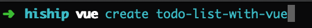
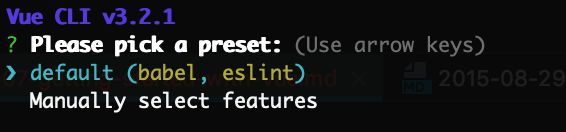

## 시작하기 전에

VueJs란 무엇일까요?
VueJs는 브라우저에서 DOM과 자바스크립트를 이어주는 일종의 훌륭한 매개체 역할을 하는 프론트엔드 프레임워크이죠.
이 역할을 ViewModel이라고 하며 어디선가 많이 들어본 MVVM(Model-View-ViewModel) 패턴중 하나입니다. 
저는 회사에서 VueJs로 내, 외부 프로젝트를 진행하며 알게 된 점들을 앞으로 설명하는데 있어서 최대한 녹여볼까합니다.     

## 어떻게 시작하나요?

VueJs는 다른 프레임워크 중에서도 쉽고 재밌게 배울 수 있는 장점을 가지고 있습니다. 
한글 공식 문서도 너무 잘 설명 되어있죠.
우선 프로젝트를 시작하는 단계에서 본인의 목적에 맞게끔 CDN을 참조하여 프로젝트 개발을 시작하는 방법과 @vue/cli를 이용하여 프로젝트에 필요한 기본적인 셋팅을 하고 개발하는 방법이 있는데 저는 후자로 설명드릴게요.
그 이유는 아무래도 CDN을 단순히 참조해서 필요한 부분만 사용하는 것이 아니라 @vue/cli를 사용하여 VueJs로 프론트엔드 프로젝트를 수행할 수 있는 최적화 된 셋팅(디렉토리 구조, 라이브러리 참조 등)에 대해 설명드리기 위함이죠.
@vue/cli를 이용하기 위해서 설치해주셔야 할 2가지가 있는데요.

1. node
2. yarn

입니다.

#### node 설치
그럼 첫번째로 node를 설치하기 위해서 http://www.nodejs.org에 접속하셔서 10.14.1 LTS 버전을 클릭하여 설치해줍니다.


사실 node를 설치한 이유는 npm이라는 패키지 모듈을 사용하기 위해서 입니다.
터미널을 이용해 npm -v 명령어를 입력하여 해당 버전을 확인하면 설치여부를 알 수 있습니다.


#### yarn 설치
두번째로 yarn을 설치해봅시다.
터미널에서 방금 설치한 npm 명령어로 npm install --global yarn을 입력하시면 npm과 마찬가지로 yarn을 명령어로 사용할 수 있습니다.


#### @vue/cli로 프로젝트 기본 셋팅하기 
그럼 앞서 설치한 node와 yarn을 이용하여 기본적인 VueJs 프로젝트 셋팅을 해봅시다.
먼저 프로젝트를 설치할 디렉토리 폴더로 들어가서 터미널을 열고 npm install -g @vue/cli를 입력해줍니다.
그럼 yarn과 마찬가지로 vue 명령어를 실행할 수 있는데요.
vue create todo-list-with-vue를 입력하면 프로젝트 기본 설정에 대해 몇가지 요청사항들이 있는데 먼저 기본값으로 프로젝트를 만드는 방법과 사용자가 직접 정의하여 만드는 방법이 있습니다.





저희는 기본값으로 프로젝트를 시작하겠습니다.
그리고 기본 npm 저장소에 대한 연결이 느린 경우 https://registry.npm.taobao.org로 대체하여 설치하겠냐는 질문에 Y를 입력하면 됩니다.
설치가 완료되면 다음 사진과 같이 해당 프로젝트 경로로 들어가 npm run serve를 입력하면 8080포트로 VueJs 프로젝트의 첫 페이지에 접근하실 수 있습니다!


#### 디렉토리 구조 살펴보기

```sh
├── README.md
├── babel.config.js #바벨 설정파일
├── package-lock.json
├── package.json # 프로젝트에 필요한 node_moduel, scripts, 각종 설정
├── public #프로젝트에 필요한 각종 공용 파일 보관
│   ├── favicon.ico
│   └── index.html
└── src #프로젝트를 구성하는 소스파일들
    ├── App.vue
    ├── assets
    │   └── logo.png
    ├── components
    │   └── HelloWorld.vue
    └── main.js 
```

저는 프로젝트를 시작할때 @vue/cli 2.0 버전을 사용하였는데 현재 설명드린 버전은 3.0 버전이라 바뀐 부분들이 조금 있네요.
예를 들어 현재 디렉토리에서 각종 설정파일(config.js)들을 숨겨버렸는데 이런 부분들은 터미널에서 vue ui 명령어를 입력하시면 localhost:8000이 자동으로 실행되어 확인하실 수 있습니다.
                                     
 

위 사진의 좌측 카테고리 별로 설명을 드리자면  
                                     
##### dashboard
프로젝트 데쉬보드로 현재 사용하고 있는 Port를 입력하면 kill해주는 기능이 있군요.
가끔 프로젝트를 진행하다보면 보통 저는 프론트 웹 Port를 8080으로 하는데 프로젝트를 닫았다가 다시 열어도 포트가 살아있어서 터미널에 살아있는 포트를 찾아서 kill 해주곤 했는데 좀 더 편리하게 작업할 수 있을 듯 합니다.
                                     
##### 플러그인
@vue/cli에서 지원하면서 현재 설치된 플러그인들을 한눈에 확인할 수 있습니다.
이 부분은 package.json에서도 찾아볼 수 있는데 좀 더 보기 편한 UI를 제공하는군요.
                                     
##### Dependencies 
이 부분은 package.json의 내용중 npm install 명령어로 설치한 모듈들을 보여주고 있네요.
Main Dependencies 같은 경우는 프로젝트에 필요한 모듈들을 나타내고 있으며,
Development Dependencies는 개발에 필요한 모듈들을 나타내고 있습니다.
둘의 차이는 npm run serve로 프로젝트를 실행할 때 node_env를 설정할 수 있는데 보통 local/development/production 모드로 나누어 실행합니다.
세가지 모드 중 어떤 모드로 해도 Main Dependencies의 모듈은 프로젝트에서 참조하여 사용할 수 있지만 Development Dependencies 같은 경우는 production 모드로 실행했을 때 해당 모듈들을 참조하지 않습니다.
그 이유는 개발에는 필요하나 실제로 운영에는 필요없는 모듈들이 있기 때문입니다.

##### 설정
설정 카테고리를 선택하고 들어가면 두 가지 탭이 있습니다.

첫번째로 Vue CLI는 빌드에 대한 설정이나 정적 파일들의 경로 설정 등을 볼 수 있습니다.

두번째는 CSS파일에 대한 설정들을 보여주고 있습니다.

상기 설정 부분들은 프로젝트를 개발하시다가 필요한 설정들을 변경해주면 되는데 todoList를 만들다가 설정을 변경할 필요가 있는 경우 다시 한 번 보도록 하겠습니다.

##### 작업목록
총 4가지 탭으로 구성되어 있는데,
 
첫번째로 serve 탭에서는 터미널에서 npm run serve를 통해 실행시켰던 어플리케이션을 여기서 설정을 통해 실행버튼을 눌러 실행시킬 수 있습니다.
실행버튼 옆의 파라미터 버튼을 눌러서 환경변수(development)와 호스트(localhost), 포트(8080), https(비활성화)으로 저장 후 실행버튼을 누르면 localhost:8080으로 접근 할 수 있습니다.

두번째로 build 탭에서는 프로젝트 파일들을 빌드할 수 있습니다.
파라미터를 기본값으로 두고 실행버튼을 누르면 빌드가 완료되었다는 메세지가 보입니다.
그 후 프로젝트 폴더를 보면 dist라는 폴더가 생성된 걸 알 수 있습니다.
dist 폴더는 브라우저에서 필요한 html, js, css 파일들을 각각 하나의 파일로 묶어서 압축한 폴더이며, 이러한 과정을 build라고 하며, 실제 production 환경에서는 이 부분을 읽어서 클라이언트에게 보여줍니다.

##### lint
lint는 소스코드와 관련하여 좀 더 깔끔한(?) 소스코드를 구성하는데 도움을 주며 실행을 누르면 코드 에러가 있는 부분들을 보여줍니다.

##### inspect
webpack 설정 부분에 대해서 파라미터의 환경변수를 설정하여 각 환경변수 별 webpack 설정파일이 잘 설정되어 있는지 테스트 할 수 있습니다.
webpack이란 모듈 번들러로 좀 전에 설명드린 build를 설정파일에 따라 실행할 수 있게 만들어줍니다.


## 정리
프로젝트 기본 셋팅에 대해 전반적으로 설명을 드렸는데 모든 내용을 완전히 이해하기는 힘들 수 있습니다.(오히려 그게 당연할 수 있죠.)
앞으로 프로젝트를 실습하면서 또는 개인 프로젝트를 진행하시다 보면 하나씩 이해가 가는 부분들이니 걱정마시고 쭈욱 공부하시면 됩니다.

 
 
   
