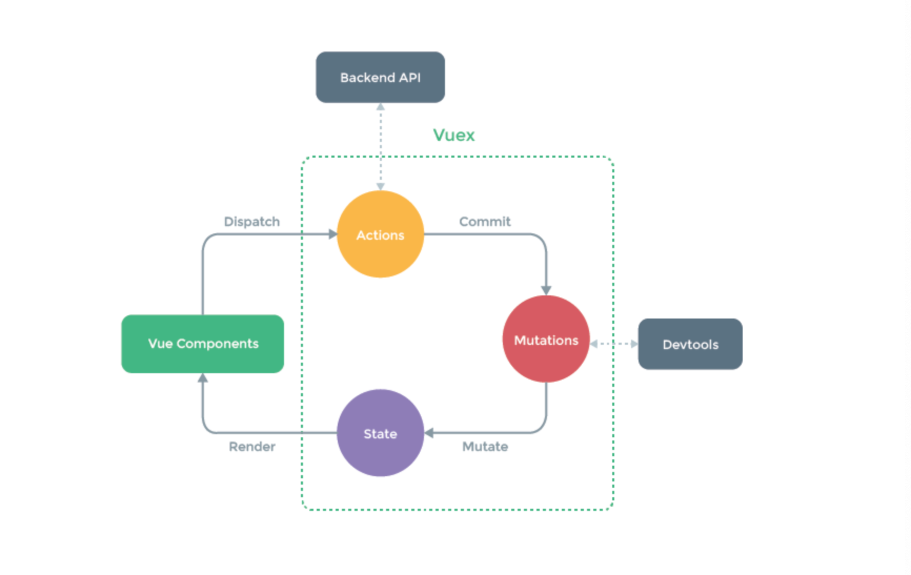

## Vuex란?
오늘은 글로벌 데이터 저장소와 관련된 Vuex에 대해 알아보겠습니다.  
한 컴포넌트에서 데이터를 정의하거나 서버로부터 받아와서 다른 컴포넌트로 전달할 때 이때까지 props를 이용했었죠?  

하지만 이렇게 전달하는 것에는 한계가 있습니다.  
전역적으로 사용할 수 있고 업데이트 할 수 있도록 중앙 저장소가 필요한 경우가 발생할텐데요.  
이런 경우는 보통 어느정도 규모가 있는 어플리케이션을 개발할 때 발생하기 마련입니다.  
  
이때까지 설명드렸던 내용보다는 조금 난이도가 있는 부분입니다.  
하지만 개념과 간단한 사용예제를 보시면 어느정도 이해가 가실테니 한번 같이 보도록 합시다.  

### Vuex 설정
Vuex도 라이브러리라서 모듈을 설치하고 사용해야합니다.  
그렇다면 우선 npm install vuex 먼저 하셔야겠죠?  

설치를 하셨다면 src 디렉토리 하단에 다음과 같이 디렉토리 및 파일을 생성해주세요.  

```sh
├── src
    └── store
        └── modules
        │   └── todoList.js
        └──index.js
```

그럼 index.js 부터 살펴볼까요?  

```javascript
import Vue from 'vue'
import Vuex from 'vuex'
import todoList from './modules/todoList'
import createLogger from 'vuex/dist/logger'

Vue.use(Vuex)

// const debug = process.env.NODE_ENV !== 'production'
const debug = false

export default new Vuex.Store({
  modules: {
    todoList
  },
  strict: debug,
  plugins: debug ? [createLogger()] : []
})
```
우선 설치한 vuex 모듈을 참고하고 Vue.use로 전역으로 사용할 수 있게 선언해주었습니다.  
그리고 modules 안에 todoList라는 파일을 참조하고 있죠?  
이 곳이 저장소입니다.  
한번 확인해볼까요?  

```javascript
const state = {
  info: '초기값입니다.'
}

const actions = {
  updateInfoWithActions ({ commit }, payload) {
    if (payload) commit('updateInfo', payload)
    else commit.reject()
  }
}

const mutations = {
  updateInfo (state, object) {
    state.info = object
  }
}

export default {
  state,
  getters,
  actions,
  mutations
}
```
간단히 저장소에 저장되어 있는 데이터를 불러오는 것과 불러온 데이터를 업데이트 하는 것까지 알아보기 위해서 필요한 부분만 작성해보았습니다.
 - state: 전역으로 사용할 변수를 정의하고 초기값을 설정해줄 수 있습니다. 
 - actions: mutations를 호출할 메소드를 정의합니다.
 - mutations: state에 정의되어 있는 데이터를 업데이트 해주는 역할을 합니다.  
 
우선 간단하게 설명을 드렸고 바로 이해가 안될실 수 있어요.  
실습을 통해서 어떻게 데이터가 전달되고 업데이트되는지 알아보겠습니다.  

Main.vue 파일로 이동해서 아래와 같이 수정해주세요.

```html
<template>
    <div id="app">
        <div class="mainTitle" style="padding: 15px;">
            <h2 v-text="title"></h2>
            <p v-text="subTitle"></p>
            <h5>오늘의 할일 {{todoList.length}}가지</h5>
            <div v-show="showBoolean" v-html="mindControl"></div>
            <div v-if="randomNum < 3">3보다 작군요.</div>
            <div v-else-if="randomNum >= 3 && randomNum < 7">3보다 크거나 같고 7보다 작군요.</div>
            <div v-else>7이거나 7보다 크군요.</div>
            <div>{{randomNum}}</div>
            <div v-pre>{{이걸 보여주고 싶다!}}</div>
            <div style="width: 200px; height: 100px;" v-background="customColor">배경색</div>
            <div>
                <input v-model="title" placeholder="제목을 입력해보세요.">
            </div>
            <div>
                <textarea  v-model="subTitle" placeholder="부제목 입력해보세요."></textarea>
            </div>
            <div>
                <input v-model="storeData" placeholder="스토어에 저장할 내용을 입력해주세요.">
                <button class="btn btn-dark" style="margin: 0 10px" @click="saveStore">저장(커밋)</button>
                <button class="btn btn-dark" @click="saveStoreWithActions">저장(액션)</button>
            </div>
            <div>
                <span>{{this.$store.state.todoList.info}}</span>
            </div>
        </div>
        <todo-list :todoList="todoList" :changeList="changeList" :addList="addList" :deleteList="deleteList"></todo-list>
        <div class="bottomTitle" style="padding: 15px;">
            <h2>VueJs로 만드는 todoList</h2>
            <h5>이번주 목표 {{goal}}가지</h5>
        </div>
    </div>
</template>

<script>

import TodoList from './comp/TodoList'
import {background} from '../../directive'

export default {
  name: 'app',
  directives: {
    background
  },
  components: {
    TodoList
  },
  data () {
    return {
      todoList: [],
      goal: 0,
      title: 'VueJs로 만드는 todoList',
      subTitle: 'VueJs로 만드는 todoList',
      mindControl: `<h6 style="color: red">오늘 할 일을 내일로 미루지 말자</h6>`,
      showBoolean: false,
      randomNum: Math.floor(Math.random() * 10),
      customColor: 'red',
      storeData: ''
    }
  },
  watch: {
    todoList (val, oldVal) {
      console.log(val, oldVal)
      this.goal = val.length * 7
    }
  },
  methods: {
    changeList () {
      this.todoList = this.todoList.splice(0, this.todoList.length - 1)
    },
    addList (v) {
      this.todoList.push({id: this.todoList.length + 1, todo: v})
    },
    deleteList (selectedGroup) {
      selectedGroup.forEach(v => {
        this.todoList.splice(v, 1)
      })
      this.$modal.hide('deleteConfirmModal')
    },
    saveStore () {
      this.$store.commit('updateInfo', this.storeData)
    },
    saveStoreWithActions () {
      this.$store.dispatch('updateInfoWithActions', this.storeData)
    }
  },
  mounted () {
    this.todoList = [
      {id: 1, todo: '아침 먹기'},
      {id: 2, todo: '점심 먹기'},
      {id: 3, todo: '저녁 먹기'}
    ]
  }
}
</script>

```

기존 코드에서 스토어에 초기값을 가져와서 보여주고 저장할 내용을 입력받아 그 데이터를 저장소에 저장할 수 있는 코드를 추가해보았습니다.    

console.log(this.$store.state)를 한번 출력해보세요.  
출력해 보시면 state 안에 module별로 정의한 데이터를 볼 수 있는데요.  
저희는 todoList라는 모듈 안에 state로 info를 정의했었습니다.  
그럼 info를 불러오려면 어떻하면 될까요?  
정답은 this.$store.state.todoList.info입니다!  

일단 위 코드로 수정하여 화면을 출력해보면 처음에 info에 할당했던 '초기값입니다.'라는 데이터가 출력되는 걸 확인할 수 있을겁니다.  

이제 이 데이터를 변경해 봐야겠죠?  

데이터를 변경하는 방법은 두 가지가 있는데요,   
  - commit을 통해 바로 데이터로 접근하여 수정한다.
  - dispatch를 통해 actions를 실행해서 수정한다.  
  
위 코드에서 두 가지 방법을 모두 사용해서 데이터를 변경해보았습니다.  

버튼 중 커밋 버튼이 있죠?  
이 버튼을 누르면 saveStore 메소드를 호출하여 this.$store.commit('updateInfo', this.storeData)가 실행됩니다.  
이 방법이 단순히 commit을 이용하여 데이터를 변경하는 방법인데 updateInfo는 todoList 모듈의 mutations 이름입니다.  
mutations 이름과 함께 사용자로부터 입력받은 값을 파라미터로 넘겨주면 updateInfo 메소드가 state의 info값을 변경해줍니다.  
store의 state값이 변경됨에 따라 자동으로 DOM이 렌더링 되면서 출력값이 바뀌는 걸 확인할 수 있습니다.  

이번엔 버튼 중 액션버튼에 대해 알아보죠.  
액션버튼을 누르면 saveStoreWithActions 메소드를 호출하고 this.$store.dispatch('updateInfoWithActions', this.storeData)를 실행합니다.  
그럼 todoList 모듈 안에 있는 updateInfoWithActions라는 메소드가 실행되는데 해당 메소드의 내용을 보면 데이터가 있을 때 commit으로 mutations의 updateInfo를 호출하죠?  
이렇게 데이터가 업데이트되어 화면에 출력됩니다.  

앞서 말씀드린 두가지의 차이점은 commit은 단순이 데이터만 변경해주는 용도가 되고, dispatch는 로직을 타서 데이터에 무엇인가 추가적으로 작업이 필요할 때 용이합니다.  

그럼 이제 다른 페이지에서 글로벌 메소드에 접근해보겠습니다.

```html
<template>
    <div id="app">
        <div class="mainTitle" style="padding: 15px;">
            <h2>1번째 할 일</h2>
        </div>
        <div style="margin: auto; width: 80%">
            1. 아침 먹기
        </div>
        <div style="margin-top: 10px; margin-left: 10px;">
            <p>Store 저장된 데이터는 {{this.$store.state.todoList.info}}입니다.</p>
        </div>
    </div>
</template>

<script>
  export default {
    name: 'app',
    components: {
    },
    data () {
      return {
        order: 0,
        content: ''
      }
    },
    methods: {
      showListLength () {
        const length = this.todoList.length
        alert(length)
      }
    }
  }
</script>

```

기존에 만들어두었던 MainDetail.vue 파일을 위와 같이 수정했습니다.  
todoList의 첫번째 리스트를 클릭하면 router를 이용해서 페이지 이동하도록 했었죠?  
이동된 페이지에서 store에 저장된 info 데이터를 출력해보았습니다.  
Main.vue 컴포넌트에서 출력했던 데이터가 MainDetail.vue에서도 보이죠?  
이렇게 모든 컴포넌트에서 store의 데이터에 접근할 수 있습니다.  
글로벌한 데이터를 사용하고 관리하기에 좋죠?  

## Vuex 활용
상기 설명드린 방법은 단방향 데이터 흐름으로 아래 그림과 같이 아주 단순한 구조를 가지고 있습니다.  


  
여기까지 따라오는데는 크게 무리가 없으셨을 것 같은데요.  
하지만 제가 프로젝트를 진행하며 Vuex를 활용한 방법은 아래와 같습니다.  



조금 더 복잡한 구조를 가지죠?  
간략히 설명을 드리자면 저희 프로젝트의 todoList 모듈에서 actions에 서버에 요청가능한 api를 호출합니다.  
만약 todoList 데이터를 서버로부터 받아온다면 actions에서 호출하여 commit으로 state에 데이터를 저장하겠죠.  
그런 다음 Main.vue에서 state의 데이터 호출하는 방식입니다.  
이런식으로 서버와의 통신을 구조화 시켜서 사용하는데 프로젝트를 진행하면서 한번 해보시는걸 적극 추천드립니다.    

## 정리
이번엔 글로벌한 데이터를 사용할 수 있도록 도와주는 Vuex에 대해서 알아보았습니다.  
어떤가요? 생각보다 이해하는데 어렵지 않았나요?  
한가지 팁을 드리자면 이전에 말씀드린 개발자도구의 vue devtool을 기억하시나요?  
여기서 현재 컴포넌트에서 사용되고 있는 store에 대한 정보를 확인할 수 있으니 개발하실 때 유용하게 사용할 수 있을겁니다.  
Vuex에 대해선 개념 이해와 시작하는 비용에 대해 고려하는게 좋다고 합니다.  
현재 프로젝트에서 활용하는게 바람직한 방법인지 한번 고민해보는게 첫걸음인듯 합니다!
    


