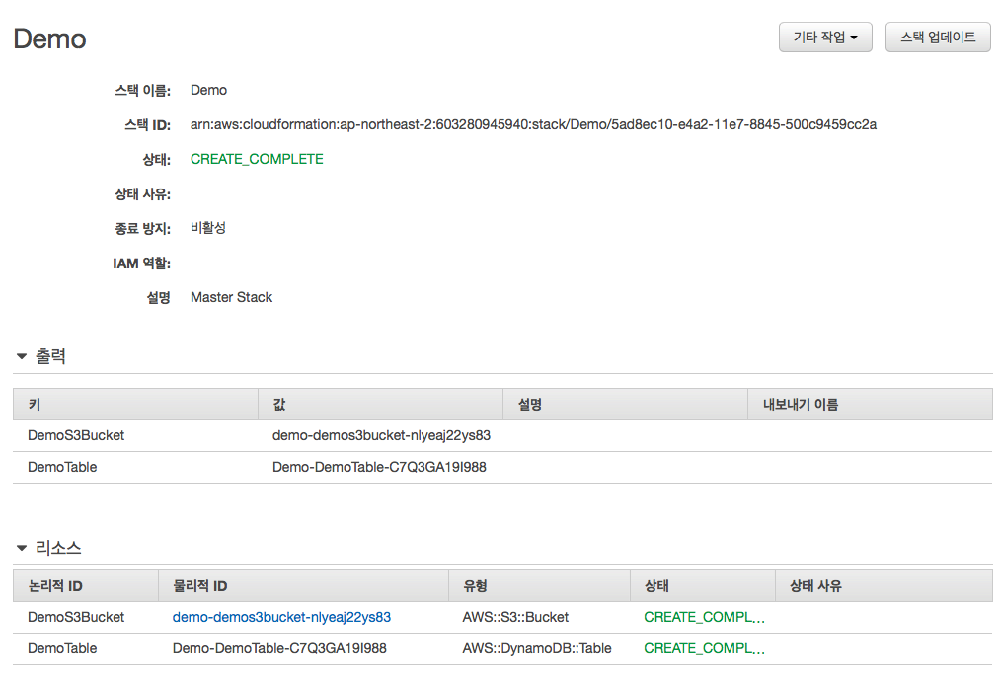

### 사용하게 된 배경

AWS CloudFormation은 개발자와 시스템 관리자가 관련 AWS 리소스 모음을 쉽게 생성 및 관리하고, 이를 순서에 따라 예측 가능한 방식으로 프로비저닝하고 업데이트할 수 있는 간편한 방법을 제공합니다.(https://aws.amazon.com/ko/cloudformation/)


AWS의 설명은 이렇다. 개인 프로젝트가 아닌 이상, 개발 서버와 실서버로 구분되어 있을 것이다. 또한 개발DB, 실DB. 이미지를 업로드 한다면 s3, nosql을 쓴다면 dynamoDB, 보안을 위한 VPC, 각 서비스를 연결하기 위한 Policy와 Role, 스케줄 작업을 한다면 lambda, iot, cognito, cloudwatch..... 

한 서비스를 위해 구축한 인프라의 전체 스택을 설명하는 문서가 필요할 정도다.

Cloudformation은 각 서비스의 사양, 설정들을 aws console이 아닌 json이나 yaml문서로 작성해서 배포하므로 문서 버저닝을 한다면 리소스 생성, 수정, 조회를 쉽게 할 수 있어 유지보수를 한결 편리하게 해주는 서비스다.

Cloudformation 자체는 무료이기 때문에 기존에 AWS를 사용한다면 부담없이 도입할 수 있다.


### Sample의 목적

간단히 S3와 DynamoDB를 Cloudformation으로 만들어 보면서 Cloudformation에 대한 감을 익혀보자.


### Yaml 파일로 Stack 만들기

Cloudformation은 yaml, json 두가지 타입 모두로 만들 수 있다. 조금 더 동적으로 런타임시에 일부 기능을 추가, 삭제, 변경을 하고 싶다면 json으로, 그것이 아니라면 yaml 형식으로 만드는 것이 좀 더 읽기가 쉽다. 여기서는 yaml 파일을 사용하도록 한다.

```yaml
AWSTemplateFormatVersion: 2010-09-09
Description: Master Stack
Resources:
  DemoS3Bucket:
    Type: 'AWS::S3::Bucket'
  DemoTable:
    Type: 'AWS::DynamoDB::Table'
    Properties:
      AttributeDefinitions:
        - AttributeName: roomId
          AttributeType: N
        - AttributeName: commentId
          AttributeType: S
        - AttributeName: createdAt
          AttributeType: S
      KeySchema:
        - AttributeName: roomId
          KeyType: HASH
        - AttributeName: commentId
          KeyType: RANGE
      ProvisionedThroughput:
        ReadCapacityUnits: 5
        WriteCapacityUnits: 5
      GlobalSecondaryIndexes:
        - IndexName: roomId-createdAt-index
          KeySchema:
            - AttributeName: roomId
              KeyType: HASH
            - AttributeName: createdAt
              KeyType: RANGE
          Projection:
            ProjectionType: ALL
          ProvisionedThroughput:
            ReadCapacityUnits: 5
            WriteCapacityUnits: 5
    Metadata:
      'AWS::CloudFormation::Designer':
        id: c5d1eb73-a08b-4028-aa2f-101f72b39d9d
Outputs:
  DemoS3Bucket:
    Value:
      Ref: DemoS3Bucket
  DemoTable:
    Value:
      Ref: DemoTable
```


위 소스로 만드는 AWS stack은 이렇다.

- S3 버킷생성
- DynamoDB 
  - Table 생성
  - 세개의 Attribute 선언 roomId, commentId, createdAt
  - roomId, commentId를 각각 파티션 키, 정렬 키로 지정
  - roomId와 CreatedAt으로 roomId-createdAt-index라는 이름의 GSI 선언
  - 프로비져닝 용량 5로 지정
- Outputs 으로 만들어진 Bucket과 Table의 값을 내보내서 Cloudformation 관리화면에서 확인하거나 다른 Cloudfomation 스택에서 참조가 가능하도록 함

### 만든 Yaml 파일 배포

Aws에 배포하는 방법은 2가지가 있다.

- Cloudformation Console
  - https://ap-northeast-2.console.aws.amazon.com/cloudformation/designer/home
- aws-cli
  - http://docs.aws.amazon.com/cli/latest/reference/cloudformation/index.html


Console에서 파일로 업로드해도 되고, 템플릿 디자인에 소스를 붙여넣기 한 후 눈으로 생성되는 서비스들을 확인하는 것도 가능하다.




Cloud모양의 버튼을 선택한 후 스택 이름을 지정하고 필요한 옵션을 설정하면 아래와 같이 스택 생성이 완료된다.


스택을 삭제하면 리소스들이 모두 삭제되므로 테스트가 끝났다면 안심하고 스택을 삭제하면 된다.


### 결론

사용하는 스택을 한 눈에 살펴 볼 수 있고, 수정사항이 발생한다면 템플릿을 업데이트 하면 되기 때문에

좀 더 유지보수가 편하고, 인수인계가 간편한 것을 선호한다면 Cloudformation을 사용하는 것을 추천한다.


각 파라미터들에 대한 자세한 설명은 AWS에서 한글 문서로 자세하게 설명하고 있으므로 하단의 링크를 참고.

Cloudformation: http://docs.aws.amazon.com/ko_kr/AWSCloudFormation/latest/UserGuide/GettingStarted.Walkthrough.html

Cloudformation S3: http://docs.aws.amazon.com/ko_kr/AWSCloudFormation/latest/UserGuide/aws-properties-s3-bucket.html

Cloudformation DynamoDB: http://docs.aws.amazon.com/ko_kr/AWSCloudFormation/latest/UserGuide/aws-resource-dynamodb-table.html