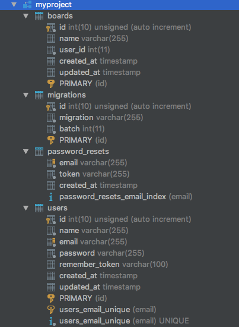

> 생성된 스키마를 데이타베이스에 적용하는 방법을 살펴보도록 하겠습니다.

이제 생성된 스키마를 적용하기 위해 migrate 를 실행할 순서입니다. migrate 는 artisan migrate 명령어로 실행할 수 있으며 먼저 현재 상태를 보기 위해 migrate:status 를 실행하면 migration 파일명과 적용 여부가 표시됩니다.

```
$ php artisan migrate:status

+------+------------------------------------------------+
| Ran? | Migration                                      |
+------+------------------------------------------------+
| N    | 2014_10_12_000000_create_users_table           |
| N    | 2014_10_12_100000_create_password_resets_table |
| N    | 2018_04_06_013450_create_boards_table          |
+------+------------------------------------------------+
```

migration 파일이 생성된 순서대로(중간에 있는 생성날짜 순) 실행되며 정상적으로 종료되면 아래와 같이 migration 한 파일 목록이 출력됩니다

```
$ php artisan migrate

Migration table created successfully.
Migrating: 2014_10_12_000000_create_users_table
Migrated:  2014_10_12_000000_create_users_table
Migrating: 2014_10_12_100000_create_password_resets_table
Migrated:  2014_10_12_100000_create_password_resets_table
Migrating: 2018_04_06_013450_create_boards_table
Migrated:  2018_04_06_013450_create_boards_table

```

`Tip` migrate 시 "Class 'CreateTaskTable' not found"  와  같은 에러가 발생한다면 migration 클래스를 오토로딩하지 못해서 이므로 다음 명령어로 새로 오토로딩 정보를 생성해 주면 됩니다

```
composer dump-autoload
```

아래 그림과 같이 데이타비에서 툴로 생성된 테이블을 확인할 수 있다.


