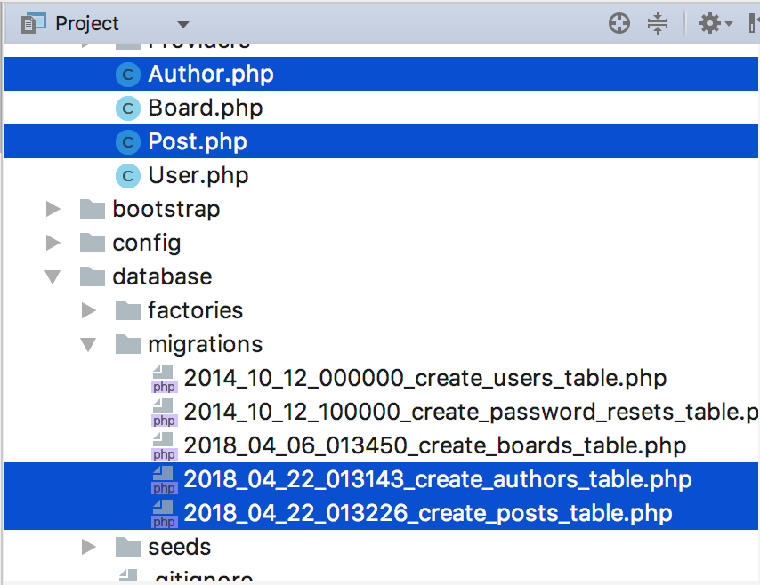

> 엘로퀀트는 라라벨의 ORM입니다.
데이터베이스는 테이블간 관계를 가지고 있고 이러한 관계를 맺어 주는 구현체를 일반적으로 ORM이라 칭합니다.
라라벨 구조에서 config/database.php에 설정된 DB Driver와 ORM 사용으로 데이터베이스와
어플리케이션 간에 디커플링 효과도 얻을 수 있습니다. 어플리케이션 코드 수정 한 줄 없이 mySQL을 SQLite로 바꿀 수 있다는 의미입니다.

지금까지 라라벨의 MVC 중에 V(View)에 대해 알아보았고, 이제 엘로퀀트 ORM을 이용하여 모델(M)에 대해 예제를 통해 알아보도록 하겠습니다.

`중요`*'app/config/database.php'에서 데이터베이스 커넥션을 구성했는지 확인*

`참고` 테이블 이름을 `users`와 같이 복수로, 모델명은 User 처럼 단수로 첫 글자는 대문자로 하는 규칙을 갖도록 하는 것이 좋습니다.
모델은 DB테이블에 담긴 하나의 레코드를 클래스로 표현하기 때문입니다. 가령 테이블이름과 클래스 명이 상이 한 경우 이 간의 관계를 알수있도록
모델 어느 곳이든 코드를 추가해 주눈 것이 현명한 방법입니다.

### 모델 생성

```
$ php artisan make:model Post --migration
$ php artisan make:model Author --migration
```



위와 같이 파일이 생성된 것을 확인합니다.
artisan Cli tinker 를 사용하여 간단히 insert 해보도록 하겠습니다.

```
Psy Shell v0.8.18 (PHP 7.2.4 — cli) by Justin Hileman
>>> $author = new App\Author;
=> App\Author {#748}
>>> $author->email = 'fafa@test.com'
=> "fafa@test.com"
>>> $author->save();
Illuminate\Database\QueryException with message 'SQLSTATE[42S02]: Base table or view not found: 1146 Table 'myproject.authors' doesn't exist (SQL: insert into `authors` (`email`, `updated_at`, `created_at`) values (fafa@test.com, 2018-04-22 01:36:44, 2018-04-22 01:36:44))'
>>>
```

emil을 추가하는 것을 진행했을 때 다음과 같이 예외가 발생합니다. 이유는 엘로퀀트는 모든 모델이 updated_at과 created_at 필드가 있다고 가정하고, 새로운 Instance가 생성될 때 현재의 timestamp값을 입력하려하기 때문입니다.

이 부분을 해결 하기 위해서는 새로 생성한 Author 와 Post 에 timestamp 입력을 모델에 추가하여 disable 시켜보도로합니다.

```php
class Author extends Model
{
    public $timestamps = false;
}
```

적용된 것을 확인 하기 위해서는 다시 타이핑 할 필요 없이 방향키 위쪽 키를 누르면 그동안 커멘드한 내용을 되돌릴 수 있습니다.
이렇게 했을 때, 똑같은 예외가 발생한다면 `control` +  `c` 를 눌러 다시 tinker 를 실행하면 됩니다.

이후에는 다음과 같은 예외가 나타날 것입니다.

```
Psy Shell v0.8.18 (PHP 7.2.4 — cli) by Justin Hileman
>>> $author = new App\Author;
=> App\Author {#748}
>>> $author->email = 'fafa@test.com'
=> "fafa@test.com"
>>> $author->save();
Illuminate\Database\QueryException with message 'SQLSTATE[42S02]: Base table or view not found: 1146 Table 'myproject.authors' doesn't exist (SQL: insert into `authors` (`email`) values (fafa@test.com))'
>>>
```

아직 저장될 저장소에 해당 테이블을 정의하지 않아서 입니다.
해결 방법은 database\migrations\(타임스템프)_create_authors_table.php 에 email, password를 추가하면 이 예외는 나타나지 않을 것입니다.

```php
<?php

use Illuminate\Support\Facades\Schema;
use Illuminate\Database\Schema\Blueprint;
use Illuminate\Database\Migrations\Migration;

class CreateAuthorsTable extends Migration
{
    /**
     * Run the migrations.
     *
     * @return void
     */
    public function up()
    {
        Schema::create('authors', function (Blueprint $table) {
            $table->increments('id');
            $table->string('email',255);
            $table->string('password',255);
        });
    }

    /**
     * Reverse the migrations.
     *
     * @return void
     */
    public function down()
    {
        Schema::dropIfExists('authors');
    }
}
```

위와 같이 수정 후 `$ php artisan migrate` 를 커멘드 하면 먼저 정의한 DB에 authors와 posts가 생성되는 것을 확인할 수 있습니다.

그럼 다시 tinker를 사용하여 인서트를 수행해보겠습니다.

```
Psy Shell v0.8.18 (PHP 7.2.4 — cli) by Justin Hileman
>>> $author = new App\Author;
=> App\Author {#748}
>>> $author->email = 'fafa@test.com'
=> "fafa@test.com"
>>> $author->password = 'password'
=> "password"
>>> $author->save();
=> true
```

다음과 같이 예외 없이 처리됨을 확인 할수 있습니다. 또한 메모리에만 저장된 데이터를 `save()`를 통해 실제 설정한 데이타 베이스에 insert 됨을 확인 할 수 있습니다.
`save()` 대신 `create()` 메소드를 사용해도 됩니다.

```
Psy Shell v0.8.18 (PHP 7.2.4 — cli) by Justin Hileman
>>> >>> App\Author::create(['email' => 'fafa@test.com','password' => bcrypt('password')]);>>> App\Author::create(['email' => 'fafa@test.com','password' => bcrypt('password')]);
```

위와 같이 실행 했을 경우 예외가 발생합니다. 이유는 각 모델이 `$fillable`을 지정하지 않아서 입니다.
각 모델을 파일을 열어 다음과 같이 추가 함으로써 예외에 대해 해결 할 수 있습니다.

* Author

```php
class Author extends Model
{
  public $timestamps = false;
  protected $fillable = ['email', 'password'];
}
```

* Post

```php
class Post extends Model
{
  protected $fillable = ['title', 'body'];
}
```

* 정상 처리 결과

```
$ php artisan tinker
>>> App\Author::create(['email' => 'fafa@test.com','password' => bcrypt('password')]);>>> App\Author::create(['email' => 'fafa@test.com','password' => bcrypt('password')]);
=> App\Author {#769
     email: "fafa@test.com",
     password: "$2y$10$.W2G/wGDqCkA/PJO3QdtBORMghaagomRxs6xGFc/ZhTGqTkrGDk8u",
     id: 2,
   }
```

### $fillable와 $guarded
모델에서 할당 가능한 속성은 다음과 같이 정의 합니다.

```php
class User extends Model {

    protected $fillable = ['first_name', 'last_name', 'email'];

}
```

반대로 보호할 속성은 다음과 같이 정의 합니다.

```php
class User extends Model {

    protected $guarded = ['id', 'password'];

}
```
