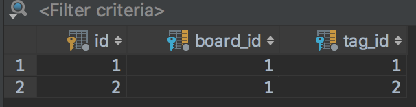

> 앞에서 일대일 / 일대다의 관계에 대한 한 설정과 확인을 해 보았습니다. 마지막으로 다대다 관계에 대해 알아보도록 하겠습니다.


## 다대다(N:M) 관계
예를 들어, 한 게시물에 검색 요소로서의 태그를 설정할 때, 어느 한 게시물에 있는 태그가 다른 게시물에도 있을 수 있다. 이러한 관계를 다대다 관계라는 용어를 사용한다.
이러한 관계는 database에서 주로 3개의 테이블로 관계를 설정하여 설명 할 수 있다.

```
// 태그 테이블
$ php artisan make:migration create_tags_table --create=tags
// 태그와 게시글의 연결
$ php artisan make:migration create_board_tag_table --create=board_tag
```

`경로` database/migrations/TIMESTAMP_create_tags_table.php

```php
class CreateTagsTable extends Migration
{
    public function up()
    {
        Schema::create('tags', function (Blueprint $table) {
            $table->increments('id');
            $table->string('name');
            $table->string('slug')->index();
            $table->timestamps();
        });
    }

    public function down()
    {
        Schema::drop('tags');
    }
}
```


`경로` database/migrations/TIMESTAMP_create_board_tag_table.php

```php
class CreateBoardTagTable extends Migration
{
    public function up()
    {
        Schema::create('board_tag', function (Blueprint $table) {
            $table->increments('id');
            $table->integer('board_id')->unsigned();
            $table->integer('tag_id')->unsigned();

            $table->foreign('board_id')->references('id')->on('boards')->onDelete('cascade');
            $table->foreign('tag_id')->references('id')->on('tags')->onDelete('cascade');
        });
    }

    public function down()
    {
        Schema::drop('board_tag');
    }
}
```

```
$ php artisan migrate
```

#### 관계설정

```
$ php artisan make:model Tag
```

`경로` app/Tag.php

```php
class Tag extends Model
{
    protected $fillable = ['name', 'slug'];

    public function boards()
    {
        return $this->belongsToMany(Board::class);
    }
}
```

`경로`  app/Board.php

```php
class Board extends Model
{
    protected $fillable = ['title', 'content'];

    public function user()
    {
        return $this->belongsTo(User::class);
    }

    public function tags()
    {
        return $this->belongsToMany(Tag::class);
    }
}
```

#### 팅커 링
`boards` 테이블에 2개의 게시물과 `tags`에 두개의 태그를 추가하여 이를 관계를 설정한 대로 출력이 되는지 확인 해 보도록 하겠습니다.

```
$ php artisan tinker
```

```
Psy Shell v0.8.18 (PHP 7.2.4 — cli) by Justin Hileman
>>> App\User::find(1)->boards()->create(['title' => 'First board','content' => 'content']);

>>> App\User::find(1)->boards()->create(['title' => 'Sec board','content' => 'content2']);

>>> App\Tag::create(['name' => '태그1','slug' => 'tag1']);

>>> App\Tag::create(['name' => '태그1','slug' => 'tag1']);

>>> App\Tag::all();
=> Illuminate\Database\Eloquent\Collection {#747
     all: [
       App\Tag {#746
         id: 1,
         name: "태그1",
         slug: "tag1",
         created_at: "2018-04-29 08:29:43",
         updated_at: "2018-04-29 08:29:43",
       },
       App\Tag {#744
         id: 2,
         name: "태그2",
         slug: "tag2",
         created_at: "2018-04-29 08:30:01",
         updated_at: "2018-04-29 08:30:01",
       },
     ],
   }
```

다대다 테스트

```
>>> $board = App\Board::find(1);
>>> $board->tags()->sync([1,2]);
>>> $board->tags->pluck('name', 'id');
```



board_tag 테이블에 위와 같이 관계가 맺어 지는 것을 확인 할 수 있습니다.

```
App\Tag::find(1)->boards;
=> Illuminate\Database\Eloquent\Collection {#775
     all: [
       App\Board {#776
         id: 1,
         user_id: 1,
         title: "First board",
         content: "content",
         created_at: "2018-04-29 07:55:15",
         updated_at: "2018-04-29 07:55:15",
         pivot: Illuminate\Database\Eloquent\Relations\Pivot {#772
           tag_id: 1,
           board_id: 1,
         },
       },
     ],
   }
>>>
```

다형적 관계에 대해서는 공식 문서를 찾아 보시기 바랍니다.
