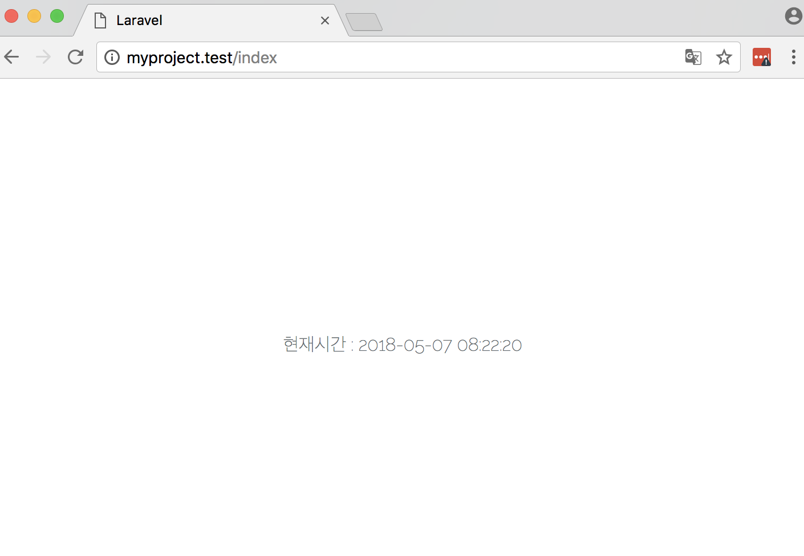

> 앞서 View에 블레이드 템플릿과 Model 에서의 엘로퀀트 ORM 까지 설펴봐았습니다. 이제 모델에서 데이타를 조회/생성/수정/삭제를 할 수
있도록 일반 컨트롤러 컨트롤러 작성 방법과 RESTful Controller 작성방법을 살펴보겠습니다.

지금 까지는 View 와 Model 부분을 살펴보았습니다. Controller 부분은 Router 부분과 연계되어 설정하는 부분이 많습니다.
현재 라라벨 최신 버전이 5.6 임을 확인 할 수 있었습니다.
앞에서 살펴본 구조와 라우터 부분이 변경되어 설명하고 컨트롤 부분을 설명하고자 합니다.

## 라라벨 5.x 프로젝트 구조

```
.
├── .env                              # 글로벌 설정 중 민감한 값, dev/production 등 앱 실행환경에 따라 변경되어야 하는 값을 써 놓는 곳
├── app
│   ├── Console               # 콘솔 코맨드 하우징
│   │   └── Kernel.php                         # 이벤트 클래스 하우징
│   ├── Exceptions                    # Exception 하우징
│   │   └── Handler.php               # 글로벌 Exception 처리 코드
│   ├── Http                          # Http 요청 처리 클래스들의 하우징
│   │   ├── Controllers               # Http Controller
│   │   ├── Kernel.php                # Http 및 Route 미들웨어 등록
│   │   └── Middleware                # Http 미들웨어 하우징
│   └── Providers                     # 서비스 공급자 하우징 (config/app.php에서 바인딩 됨)
│       ├── AppServiceProvider.php
│       ├── AuthServiceProvider.php
│       ├── EventServiceProvider.php  # 이벤트 리스너, 구독 바인딩
│       └── RouteServiceProvider.php  # 라우팅 바인딩 (글로벌 라우팅 파라미터 패턴 등이 등록되어 있음)
├── composer.json                     # 이 프로젝트의 Composer 레지스트리, Autoload 규칙 등이 담겨 있다. (c.f. Node의 package.json)
├── config                            # database, queue, mail 등 글로벌 설정 하우징
├── database
│   ├── factories                     # 데이터베이스 dump data 생성
│   ├── migrations                    # 데이터베이스 스키마
│   └── seeds                         # 생성된 테이블에 Dummy 데이터를 삽입하는 클래스들 (개발 목적)
├── public                            # 웹 서버에 의해 지정된 Document Root
├── routes
│   ├── api.php                       # 애플리케이션에 API 경로를 등록
│   ├── channels.php                  # 이벤트 방송 채널을 등록
│   ├── console.php                   # 클로저 기반 콘솔 명령을 정의
│   └── web.php                       # 어플리케이션을 위한 웹 경로 지정
├── resources
│   ├── assets                        # JavaScript, CSS 하우징
│   ├── lang                          # 다국어 지원을 위한 언어 레지스트리 하우징
│   └── views                         # 뷰 파일 하우징
├── storage                           # Laravel5 파일 저장소
└── vendor                            # composer.json의 저장소
```

> 기존 5.x 초반까지의 구조와  현재의 구조는 app/ 과 routes/ 부분에서 좀더 구조화가 되고, 정리가 되었음을 확인할 수 있습니다.

## 일반적인 Controller

우선, 서버 부트업 한 후 웹 브라우저에서 `http://myproject.test/index`로 연결 시도 시 다음과 같은 화면을 확인 할 수 있을 것입니다.

```
Sorry, the page you are looking for could not be found.
```

위와 같은 메시지는 Index Controller가 아직 생성되지 않아 나타나는 Error 로 확인하시면 되고, 이를 처리 해 보도록 하겠습니다.

#### Controller 생성

1\. artisan CLI 로 컨틀로러를 생성해 줍니다.

```
$ php artisan make:controller IndexController
```

실행 후 다음 `app/Http/Controllers/IndexController.php` 가 생성 되었음을 확인할 수 있습니다.

```php
<?php

namespace App\Http\Controllers;

use Illuminate\Http\Request;

class IndexController extends Controller
{
    //TODO
}
```

이제 View 와 Controller 를 만들어 Router 를 통해 화면을 정상적을 띄워 보도록 하겠습니다.

2\. 처음 생성된 `IndexController.php` 에 index()를 만들어 보도록 합니다.

```php
<?php

namespace App\Http\Controllers;

use Illuminate\Http\Request;

class IndexController extends Controller
{
    public function index() {
        return view('index');
    }

}
```

3\. 컨틀로러에 어떠한 데이타 또는 어떠한 로직을 처리 한 후 리턴될 View 페이지를 블레이트 템플릿으로 완성하겠습니다.
`/resources/views/` 경로에 `index.blade.php` 생성 후 다음과 같은 코드를 작성합니다.

```html
<!doctype html>
<html lang="{{ app()->getLocale() }}">
    <head>
        <meta charset="utf-8">
        <meta http-equiv="X-UA-Compatible" content="IE=edge">
        <meta name="viewport" content="width=device-width, initial-scale=1">

        <title>Laravel</title>

        <!-- Fonts -->
        <link href="https://fonts.googleapis.com/css?family=Raleway:100,600" rel="stylesheet" type="text/css">

        <!-- Styles -->
        <style>
            html, body {
                background-color: #fff;
                color: #636b6f;
                font-family: 'Raleway', sans-serif;
                font-weight: 100;
                height: 100vh;
                margin: 0;
            }

            .full-height {
                height: 100vh;
            }

            .flex-center {
                align-items: center;
                display: flex;
                justify-content: center;
            }

            .position-ref {
                position: relative;
            }
        </style>
    </head>
    <body>
        <div class="flex-center position-ref full-height">
            현재시간 : {{date("Y-m-d H:i:s",time())}}
        </div>
    </body>
</html>
```

4\. `/routes/web.php`에 HTTP 요청을 앞서 생성한 IndexController 에 index() 로 연결 해 보도록 하겠습니다.

```php
<?php

Route::get('/index', 'indexController@index');
```

5\. 마지막으로 웹브라우저에서 해당 라우팅 된 주소로 다시 연결 시도하면 다음과 같은 화면을 확인 할 수 있습니다.


