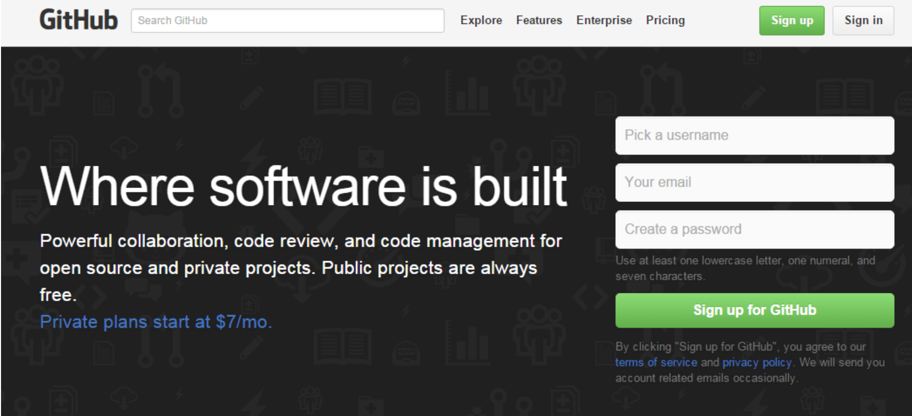
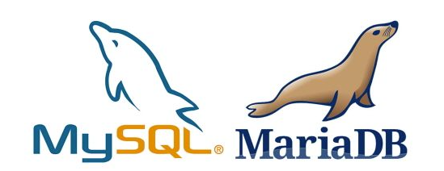
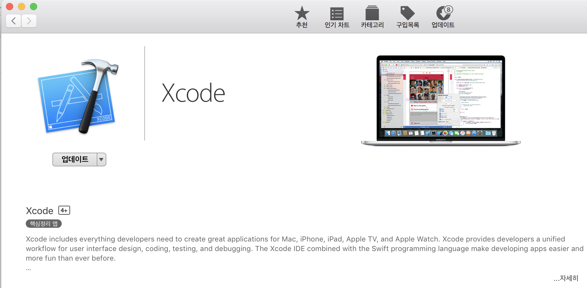
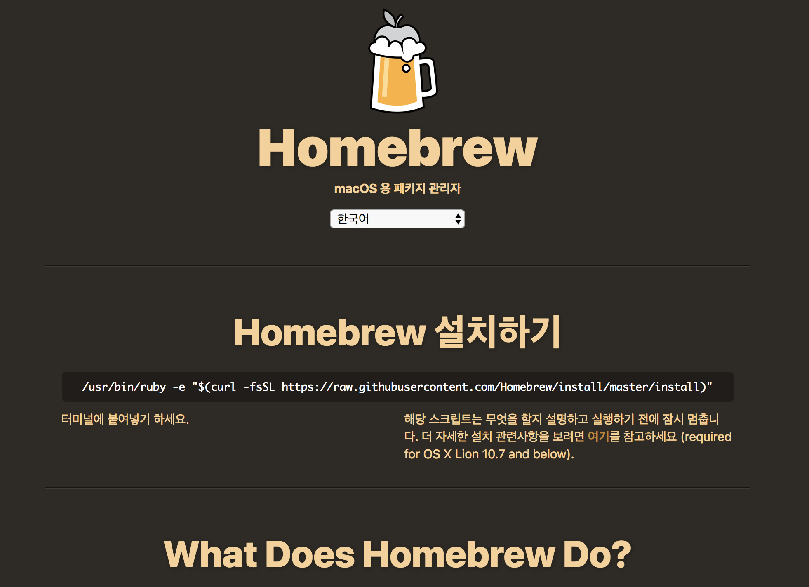

> 프로젝트 생성하여 유지 관리하기 위해 GitHub 계정 생성 및 프로젝트 진행에 사용할 데이타 베이스를 로컬에 설치 하도록 하겠습니다.

### Github 계정 가입

1\. [Gitgub 공식사이트](https://github.com) 우측 상단이 `Sign Up`클릭



2\. 개인 / 회사 가입을 구분하여 가입(지금은 연동 테스트를 위해 개인 Free로 가입)


3\. 입력한 이메일 주소로 온 메일 확인

4\. 오른쪽 중간에 있는 `New repository` 클릭


5\. 원하는 repository 명 입력 후 `Create repository` 클릭 완료!(저는 `laraveBoard`로 하겠습니다)

6\. 생성한 저장소에 Larabel 프로젝트 저장할 수 있도록 설정! Gitgub 관련한 다른 사항 들은 별도로 여러 매체를 통해 찾아 보시면 됩니다.


### MariaDB 세팅 On Mac
마리아 DB(Maria db)는 기존 Mysql에서 파생된 제품입니다.



#### 설치

1\. 애플의 통합개발환경인 엑스코드(Xcode) 설치합니다. 앱스토어에서 다운로드 또는 (https://itunes.apple.com/kr/app/xcode/id497799835?mt=12)에서 다운로드 하여 설치합니다.



2\. 오픈소스 패키지를 손쉽게 관리할 수 있도록 도와 주는 Homebrew를 설치 합니다. 이를 이용하면 마리아 DB 는 물론 각종 패키지를 다운로드하거나 업데이트 할 수 있습니다.



```
$ /usr/bin/ruby -e "$(curl -fsSL https://raw.githubusercontent.com/Homebrew/install/master/install)"
$ brew update
$ brew install mariadb
```

`brew install mariadb` 명령어를 사용하여 다음과 같이 설치하면 의존성 패키지인 openssl등을 포함하여 자동으로 설치됩니다.

3\. 설치 완료 후 MariaDB를 다음과 같이 컨트롤 할 수  있습니다.

```
$ mysql.server status # 상태확인
$ mysql.server stop # 정지
$ mysql.server start # 시작
```

4\. 시스템 새 시작 후에는 위의 명령을 통해 다시 실해을 해야 하기 때문에 MariaDB가 자동으로 실행될 수 있도록
MariaDB 스타트업 plist를 LaunchAgents 디렉토리에 링크시킵니다.

```
$ ln -sfv /usr/local/opt/mariadb/*.plist ~/Library/LaunchAgents
/Users/laravel/Library/LaunchAgents/homebrew.mxcl.mariadb.plist -> /usr/local/opt/mariadb/homebrew.mxcl.mariadb.plist
```

위의 방법으로 설정 완료 후에는 MariaDB 종료 시 자동으로 재 실행이 되기 때문에 관리상 다음의 내용도 확인할 필요가 있습니다.

```
$ launchctl load ~/Library/LaunchAgents/homebrew.mxcl.mariadb.plist # 실행하기
$ launchctl unload ~/Library/LaunchAgents/homebrew.mxcl.mariadb.plist #종료하기
```

5\. 설치가 완료되었습니다. MariaDB에 접속 하도록 하겠습니다.

```
$ mysql -uroot
Welcome to the MariaDB monitor.  Commands end with ; or \g.
Your MariaDB connection id is 254
Server version: 10.2.14-MariaDB Homebrew

Copyright (c) 2000, 2018, Oracle, MariaDB Corporation Ab and others.

Type 'help;' or '\h' for help. Type '\c' to clear the current input statement.

MariaDB [(none)]>
```

위 내용이 나오지 않는다면 에러 내용을 찾기 보다는 다시 처음부터 진행하는 것을 추천드립니다.

6\. MariaDB에 데이타 베이스를 생성합니다.

```
MariaDB [(none)]> create database laravel;  -- laravel 라는 명을 가지는 데이터베이스를 생성합니다.
Query OK, 1 row affected (0.00 sec)

MariaDB [(none)]> show databases;  -- 데이터베이스 목록을 확인합니다.
+--------------------+
| Database           |
+--------------------+
| laravel            |
| information_schema |
| mysql              |
| performance_schema |
| test               |
+--------------------+
5 rows in set (0.00 sec)

MariaDB [(none)]>
```

7\. 비밀번호가 `levaral`인 `laraveler` 계정을 생성합니다.

```
MariaDB [(none)]> create user 'laraveler'@'localhost' identified by 'levaral';
Query OK, 0 rows affected (0.02 sec)
```

`laraveler` 계정에게 `laravel` 데이터베이스의 모든 사용권한을 부여한다.

```
 -- '%' 대신 localhost를 사용할 경우 외부에서 접속 불가
MariaDB [(none)]> grant all privileges on laravel.* to laraveler@'%';
Query OK, 0 rows affected (0.38 sec)

-- 권한설정을 새로 반영합니다.
MariaDB [(none)]> flush privileges;
Query OK, 0 rows affected (0.01 sec)
```

8\. 생성한 계정을 확인 합니다.

```
$ mysql -u laraveler -p
Enter password: *******
Welcome to the MariaDB monitor.  Commands end with ; or \g.
Your MariaDB connection id is 9
Server version: 10.2.14-MariaDB mariadb.org binary distribution

Copyright (c) 2000, 2015, Oracle, MariaDB Corporation Ab and others.

Type 'help;' or '\h' for help. Type '\c' to clear the current input statement.

MariaDB [(none)]>
```

9\. 세팅된 DB에 인코딩 설정을 확인 해 보면 `latin1`과 `utf8`이 썩여 있음을 확인 할 수 있습니다. 우리는 인코딩 관련된 세팅을 `utf8`로 통일 하여 이후 진행에서
글자가 깨지는 것을 방지 하도록 하겠습니다.

```
MariaDB [(none)]> show variables like 'c%';
+--------------------------+----------------------------+
| Variable_name            | Value                      |
+--------------------------+----------------------------+
| character_set_client     | utf8                       |
| character_set_connection | utf8                       |
| character_set_database   | latin1                     |
| character_set_filesystem | binary                     |
| character_set_results    | utf8                       |
| character_set_server     | latin1                     |
| character_set_system     | utf8                       |
| character_sets_dir       | /usr/share/mysql/charsets/ |
| collation_connection     | utf8_general_ci            |
| collation_database       | latin1_swedish_ci          |
| collation_server         | latin1_swedish_ci          |
| completion_type          | NO_CHAIN                   |
| concurrent_insert        | AUTO                       |
| connect_timeout          | 10                         |
+--------------------------+----------------------------+
14 rows in set (0.01 sec)
```

위 상태 확인 후 다음과 같이 설정 변경을 합니다.

```
MariaDB [(none)]> SET character_set_client = utf8;
MariaDB [(none)]> SET character_set_results = utf8;
MariaDB [(none)]> SET character_set_connection = utf8;
MariaDB [(none)]> ALTER DATABASE laravel DEFAULT CHARACTER SET utf8;
MariaDB [(none)]> show variables like 'c%';
+--------------------------+---------------------------------------------------------+
| Variable_name            | Value                                                   |
+--------------------------+---------------------------------------------------------+
| character_set_client     | utf8                                                    |
| character_set_connection | utf8                                                    |
| character_set_database   | utf8                                                    |
| character_set_filesystem | binary                                                  |
| character_set_results    | utf8                                                    |
| character_set_server     | utf8                                                    |
| character_set_system     | utf8                                                    |
| character_sets_dir       | /usr/local/Cellar/mariadb/10.2.14/share/mysql/charsets/ |
| check_constraint_checks  | ON                                                      |
| collation_connection     | utf8_general_ci                                         |
| collation_database       | utf8_general_ci                                         |
| collation_server         | utf8_general_ci                                         |
| completion_type          | NO_CHAIN                                                |
| concurrent_insert        | AUTO                                                    |
| connect_timeout          | 10                                                      |
+--------------------------+---------------------------------------------------------+
15 rows in set (0.05 sec)

```
