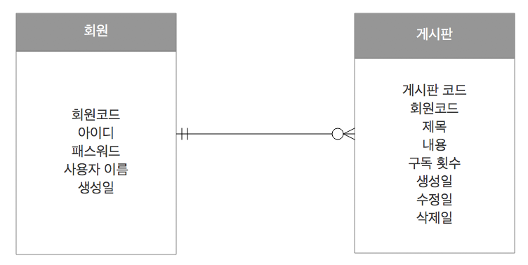
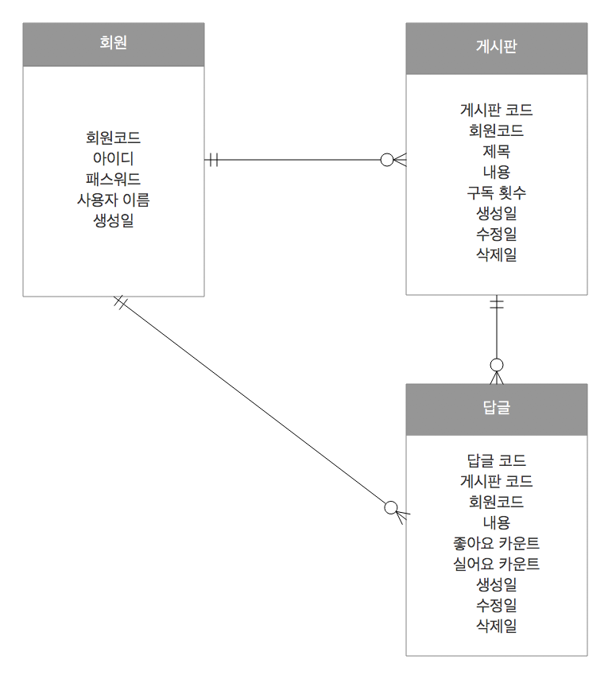

> `E`ntity `R`elationship `D`iagram의 약자로 개체관계도 라고 부릅니다.ERD는 말로서 되어있는 요구분석사항을 그림으로 그려내어 그 관계를 도출하는 것을 말하는데, E-R-D로 모델링하여 실제 데이타베이스의 테이블을 구성해 보도록 하겠습니다.
이에 앞서, 이번 프로젝트를 진행하는 데 있어 모델링은 중요하다고 판단되지만, 라라벨 프레임워크에 초점을 맞춰 최대한 간단히 정리하다록 하겠습니다.


###  객체와 객체와의 관계

* 하나의 A는 하나의 B로 구성되어 있다 - 1:1 관계
* 하나의 A는 하나 이상의 B로 구성되어 있다 - 1:N 관계
* 하나의 A는 하나 이하의 B로 구성되어 있다 - 1: 0 or 1
* 하나의 A는 0 또는 하나 이상의 B로 구성 되어 있다 - 1: 0 or N


### 실전 프로젝트 모델링

1\. `A회원은 여러 개의 게시물을 사용할 수 있다.`라는 요구 사항에서는 회원객체와 게시글 객체를 확인할 수 있습니다. 이를 정의 해 보도록 하겠습니다.

- 회원(Users)

```
+--------------------+
| Users              |
+--------------------+
| id                 |
| userid             |
| password           |
| name               |
| createdAt          |
+--------------------+
```

- 게시판(Boards)

```
+--------------------+
| Boards             |
+--------------------+
| id                 |
| user_id            |
| subject            |
| contexts           |
| count              |
| createdAt          |
| updatedAt          |
| deletedAt          |
+--------------------+
```

위와 같은 테이블로 정의 되었을 때, 한명의 유저 A가 여러개의 게시물을 소유하기 위해서는 일대 다의 관계를  가지고 있어야 합니다. 물론 A는 게시물을 한개도 없을 수도 있습니다.
이를 E-R-D로 표현 한다면 다음과 같습니다.



2\. `A게시물에는 여러개의 답글을 여러 사람이 작성할 수 있다. 그리고  답글에는 좋아요 또는 싫어요를 표시 할 수 있다.`라는 요구사항에서는 게시글 객체와 답글이라는 객체를 확인 할 수 있습니다. 이를 정의 해 보도록 하겠습니다.

- 게시판(Boards)

```
+--------------------+
| Boards             |
+--------------------+
| id                 |
| user_id            |
| subject            |
| contents           |
| count              |
| createdAt          |
| updatedAt          |
| deletedAt          |
+--------------------+
```

- 답글(Replys)

```
+--------------------+
| Replys             |
+--------------------+
| id                 |
| user_id            |
| board_id           |
| contents           |
| good_count         |
| bad_count          |
| createdAt          |
| updatedAt          |
| deletedAt          |
+--------------------+
```

위와 같은 테이블로 정의 되었을 때, 한명의 유저 A가 작성한 여러개의 게시물 중 하나가 여러개의 답글을 소유하기 위해서는 일대 다의 관계를  가지고 있어야 합니다.
물론 A게시물에 대한 답글은 한 개도 없을 수도 있습니다.
이를 E-R-D로 표현 한다면 다음과 같습니다.



위와 같이 부족하지만, 머릿 속에 존재하는 생각을 좀더 구체적으로 실습에 필요한 모델이 대충(?!) 나왔습니다. 위와 같은 명세로 실제 프로젝트를 진행하면서 좀더 다듬어 보겠습니다.
