Slack 이제 국민 메신저로 이용하기 시작했다고 말해도 과언은 아닐듯 싶습니다. 개발시 사용되는 Git 또는 프로젝트에서 실시간으로 중요하게 모니터링 해야하는 메시지에 대해서도 Slack을 이용한다면 보다 효과적인 프로젝트 진행, 관리가 될 듯 합니다. 

### 준비 사항

- Slack 계정 및 채널 생성
- Github 계정 및 채널 생성

### Slack 계정 가입

1\. [슬랙 공식사이트](https://slack.com) 에 방문하여 우측 상단에 Sign up for free 클릭

2\. 이메일 주소 입력 후 Next 클릭

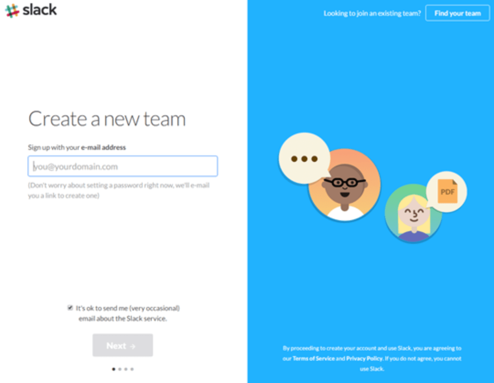

3\. 이메일 주소 입력 후 Next 클릭

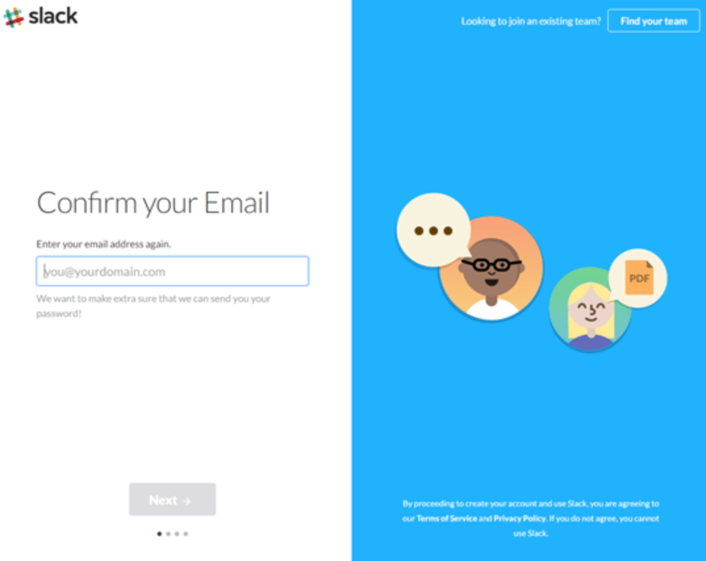

4\. 채널명 입력 Next 클릭

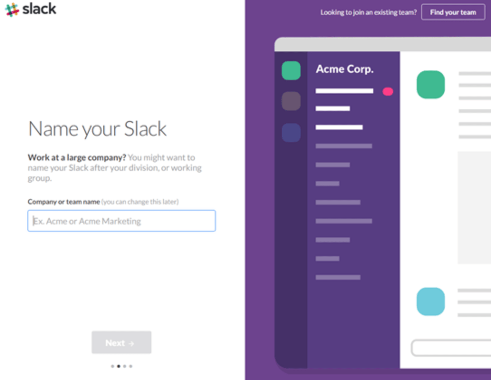

5\. Url 확인 후 Next 클릭

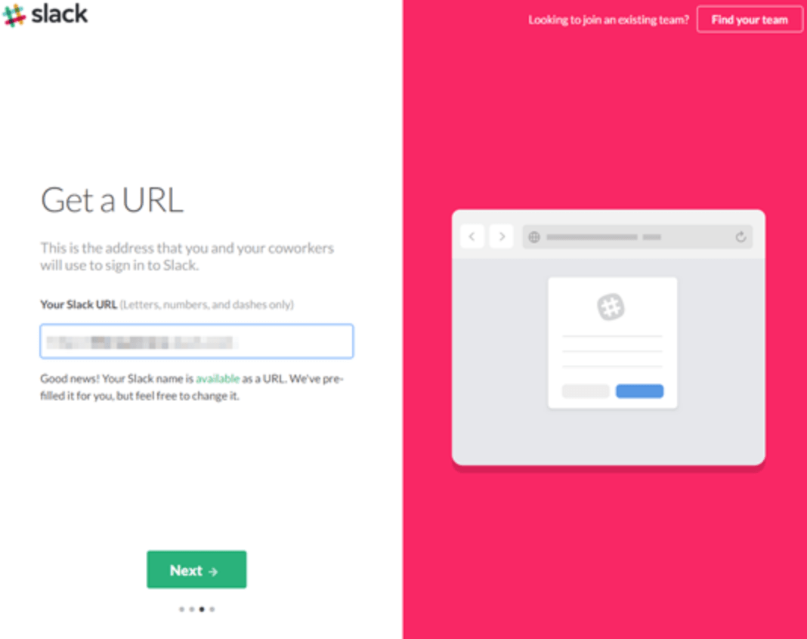

6\. 사용자 이름 입력 후 Next 클릭

7\. 정보확인 후 Create my new Slack team 클릭

8\. 본인이 입력한 이메일 주소로 온 Slack 메일 확인 후 패스워드 설정 후 완료!!

### Github 계정 가입

1\. [Gitgub 공식사이트](https://github.com) 우측 상단의 Sign Up클릭

2\. 개인 / 회사 가입을 구분하여 가입(지금은 연동 테스트를 위해 개인 Free로 가입)

3\. 입력한 이메일 주소로 온 메일 확인

4\. 오른쪽 중간에 있는 New repository 클릭

5\. 원하는 repository 명 입력 후 Create repository 클릭 완료!

6\. 생성한 저장소에 NodeJS 프로젝트 저장할 수 있도록 설정! Gitgub 관련한 다른 사항 들은 별도로 여러 매체를 통해 찾아 보시면 됩니다.

### Github과 Slack 연동

1\. [Slack] 슬랙 App화면에서 우측 상단에 톱니바퀴 버튼을 클릭

2\. Add app 을 클릭하여 App Directory 접속합니다.

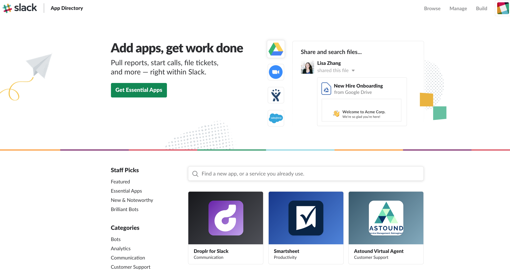

3\. 검색하는 필드에서 github를 검색 후 Github 를 추가합니다.

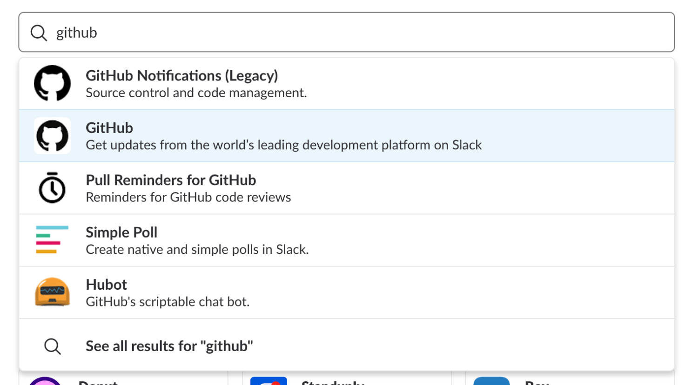

4\. Install 클릭

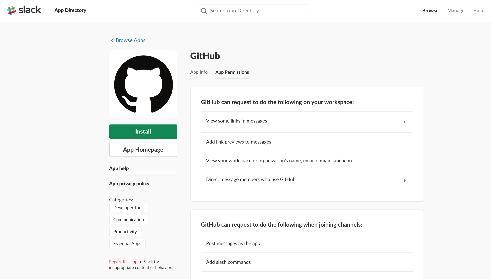

5\. GitHub was individually added to:에 Add App to Cannel에 연결하고 싶은 채널 또는 DM 계정을 선택하여 추가합니다.

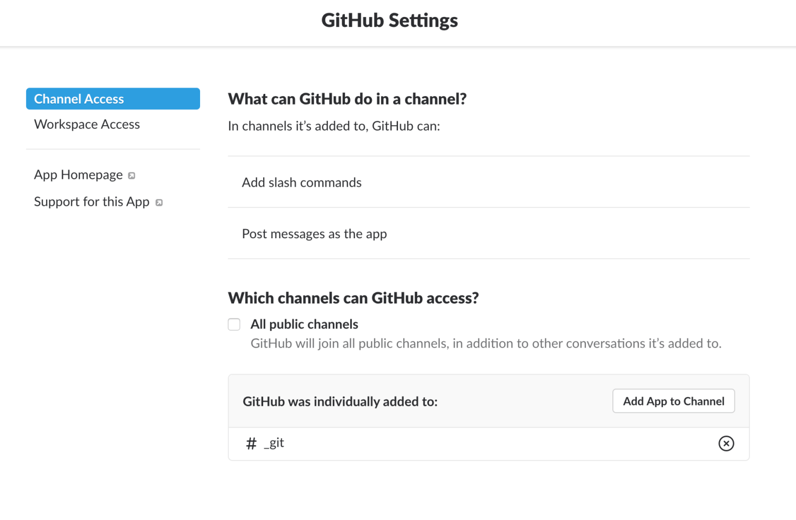

6\. 다시 검색 필드에서 github를 검색후 GitHub Notifications (Legacy)를 선택합니다.

7\. Post to Channel 에서 github notifications 할 채널을 선택합니다. 만약 새로운 채널에 연동하고 싶다면 create a new channel 을 선택합니다. 그리고 Add GitHub Integration 클릭 후 완료

8\. note부분을 보면 switch to unauthed mode 가 나타 날 경우 클릭하여 인증 모드를 꺼주시기 바랍니다. 회사 계정에 유료 github라면 이 부분의 설정이 필요합니다.

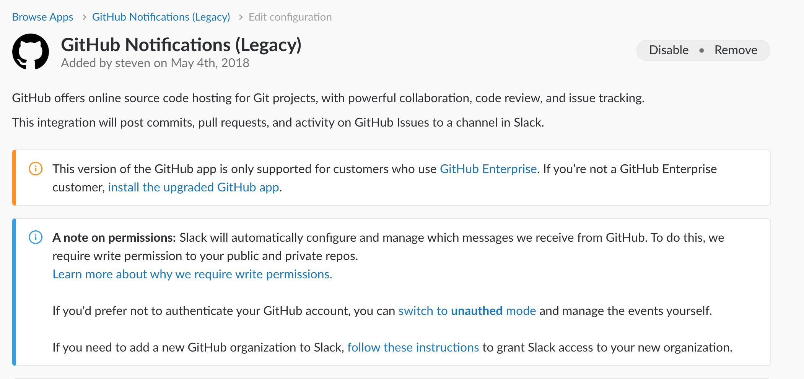

9\. 다음으로 Repositories 에서 [GitHub]계정에 생성한 Repositories를 선택합니다. Authentication 에서 [GitHub] 계정을 로그인하면 본인이 생성한 저장소 리스트가 나올 것입니다.

10\. Webhook URL 부분에 생성된 값을 복사하여 클립보드에 저장합니다. 설정 완료 후 맨 아래에 Save Integration 클릭하여 완료합니다.

11\. 마지막 단계로 [GitHub] 사이트 접속 후 생성한 repository > Settings > Webhooks 로 이동합니다.

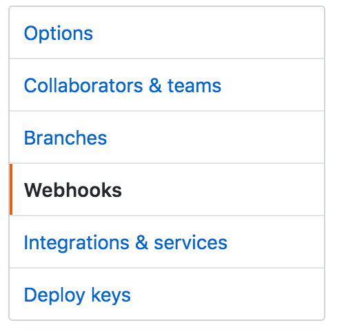

12\. Add Webhook을 클릭 하고, [GitHub] 패스워드를 다시 입력 후 클립보드에 복사해 넣은 payload URL에 붙여 넣기 후 Update Webhook 하면 모든 작업이 완료됩니다.

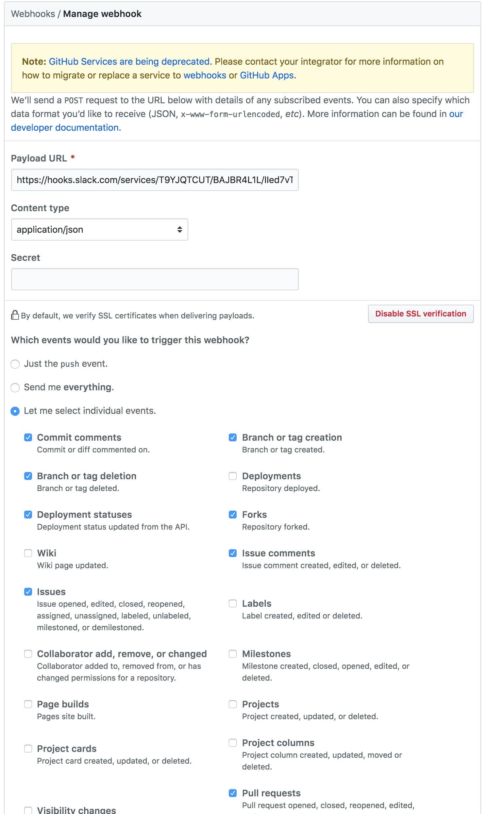

13\. 전 단계에서 Which events would you like to trigger this Webhook? 에서 [GitHub]의 어떤 이벤트가 발생할때 노치 받을 지 추가 선택만 하시면됩니다.

14\. 모든 단계가 완료되면 [Slack]을 통해 연결 되었음에 대한 알람이 올 것입니다.