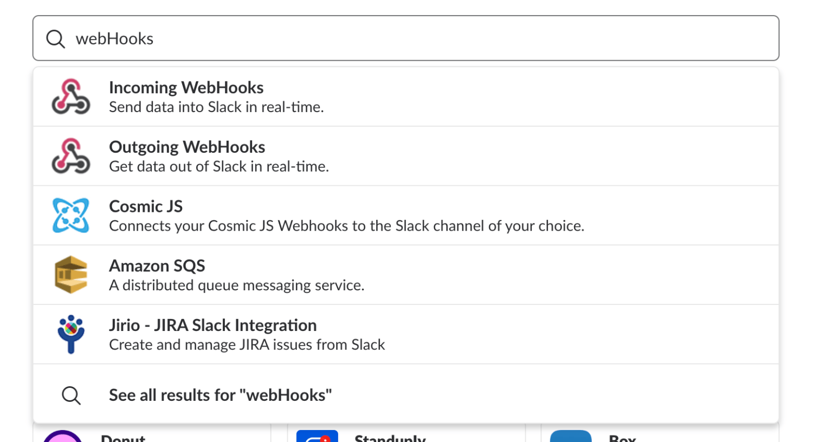
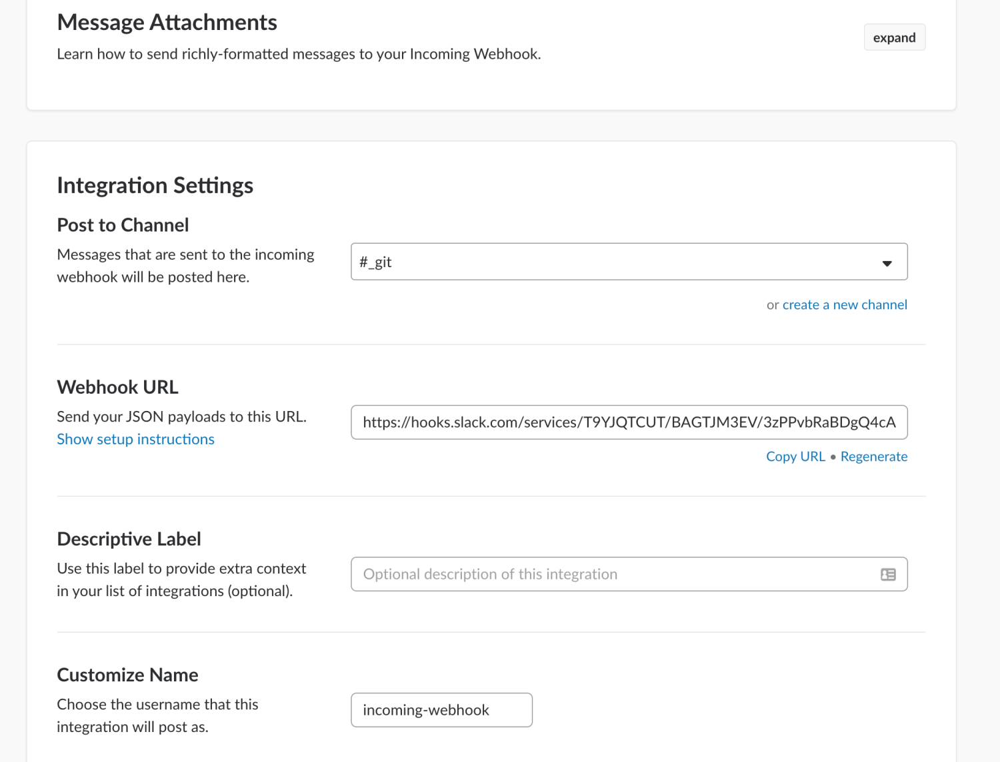

앞서 살펴 본 [Github 와 Slack 연동](http://webframeworks.kr/tutorials/weplanet/slack-github)은 Github 에서 Owner 계정으로 설정하면 되지만, 프로젝트와 Slack 연동은 해당 계정과 권한 그리고 Webhook Url 을 참조 해야 됨을 확인하셔야 합니다.

### Slack 계정 가입

1. 슬랙 공식사이트 에 방문하여 우측 상단에 Sign up for free 클릭

2. 이메일 주소 입력 후 Next 클릭

3. 이메일 주소 입력 후 Next 클릭

4. 채널명 입력 Next 클릭

5. Url 확인 후 Next 클릭

6. 사용자 이름 입력 후 Next 클릭

7. 정보확인 후 Create my new Slack team 클릭

8. 본인이 입력한 이메일 주소로 온 Slack 메일 확인 후 패스워드 설정 후 완료!!


### Slack Add App 세팅

1. 이번에는 검색 필드에서 Webhook를 검색후 Incoming Webhooks를 설치합니다.


2. Incoming Webhooks 화면에서 AddConfiguration 을 클릭 후 Integration Settings 에 Post to Channel에서 연동 시킬 [Slack] 채널을 선택합니다. create a new channel를 선택하여 새로 생성하여 지정해도 됩니다.


3. 다음 줄에 있는 Webhook URL을 복사하여 클립보드에 저장 합니다. 저장된 주소는 이후 NodeJS 프로젝트에 원하는 메소드 또는 클래스에 추가하시면 됩니다.

### NodeJS 프로젝트에 Slack 연동

1\. Install

```
npm install slack-node --save
```
 
2\. 앞서 복사한 Webhook URL을 config 파일 또는 스크립트 내에 webhookUri 에 담습니다.

3\. 다음 코드와 같이 필요한 곳에 추가하면 모든 준비가 끝나고 해당 메소드를 실행하면 [Slack]을 통해 알림이 울리는 것을 확인 할 수 있습니다.

예제

```js
const Slack = require('slack-node');
 
const webhookUri = "Webhook URL";
 
const slack = new Slack();
slack.setWebhook(webhookUri);
const send = async(message) => {
  slack.webhook({
    channel: "#general", // 전송될 슬랙 채널
    username: "webhookbot", //슬랙에 표시될 이름
    text: message
  }, function(err, response) {
    console.log(response);
  });
}
```

참고: 만약 이미지 전송을 원할경우 emoji param을 사용하면됩니다.

마치며

Slack을 활용하여 보다 편리하고 신속한 서비스를 만들었으면 좋겠다라는 생각이 듭니다.