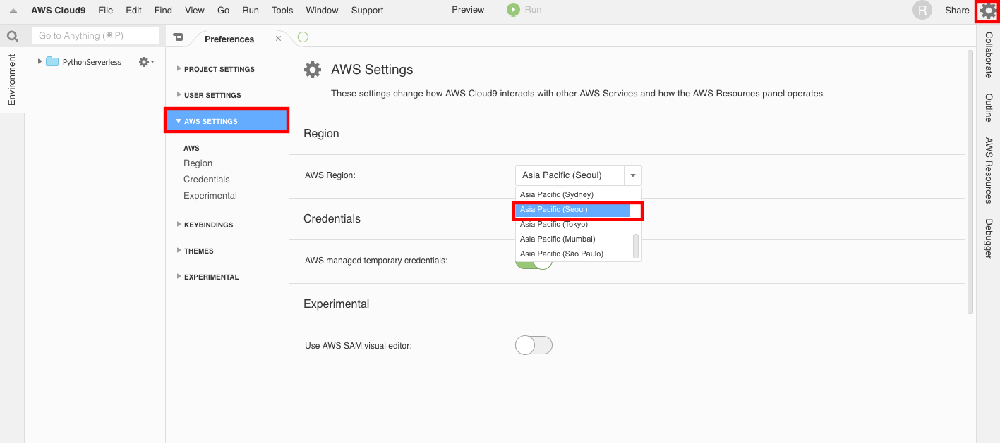
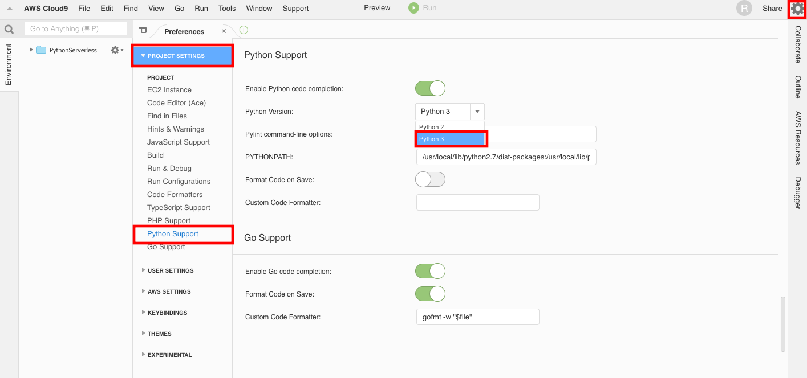

> 본 포스팅은 2018년 9월 29일과 12월 1일에 진행된 김승호님의 "Python Serverless" 코드랩에서 사용되었던 자료입니다. 

# Python Serverless 기초

Python과 AWS Lambda 를 사용한 crawler 만들기 입니다.

[변규현님(novemberde) Github](https://github.com/novemberde) 많이 참고하였습니다.

**변규현님께 감사드립니다.**

## Objective

Amazon Web Service 를 활용하여 Serverless architecture로 웹크롤러를 배포합니다.

크롤링된 데이터는 DynamoDB에 저장합니다.

## AWS Resources

AWS에서 사용하는 리소스는 다음과 같습니다.

- Cloud9: 코드 작성, 실행 및 디버깅을 위한 클라우드 기반 IDE.
- Lambda: 서버를 프로비저닝하거나 관리하지 않고도 코드를 실행할 수 있게 해주는 컴퓨팅 서비스. 서버리스 아키텍쳐의 핵심 서비스.
- DynamoDB: 완벽하게 관리되는 NoSQL 데이터베이스 서비스로, 원활한 확장성과 함께 빠르고 예측 가능한 성능을 제공.

## Cloud 9 시작하기

Cloud9 은 하나의 IDE입니다. 그렇지만 이전의 설치형 IDE와는 다릅니다. 설치형 IDE는 로컬 PC에 프로그램을 설치하던가
실행하는 방식이었다면, Cloud9은 브라우저가 실행가능한 모든 OS에서 사용이 가능합니다.

맨 처음 Cloud9은 AWS 내에서가 아닌 별도의 서비스로 제공되었습니다. AWS에 인수된 이후 Cloud9은 AWS의 Managed Service형태로 바뀌었고, AWS의 서비스와 결합하여 사용이 가능해졌습니다. 코드 편집과 명령줄 지원 등의 평범한 IDE 기능을 지니고 있던 반면에, 현재는 AWS 서비스와
결합되어 직접 Lambda 코드를 배포하던가, 실제로 Cloud9이 실행되고 있는 EC2의 컴퓨팅 성능을 향상시켜서 로컬 PC의 사양에 종속되지 않은 개발을 할 수가 있습니다.

그러면 Cloud9 환경을 시작해봅시다.

[Cloud 9 Console](https://ap-southeast-1.console.aws.amazon.com/cloud9/home?region=ap-southeast-1#)에 접속합니다.

아래와 같은 화면에서 [Create Environment](https://ap-southeast-1.console.aws.amazon.com/cloud9/home/create) 버튼을 누릅니다.

 

Name과 Description을 다음과 같이 입력합니다.

- Name: PythonServerless

 

Configure Setting은 다음과 같이 합니다.

- Environment Type: EC2
- Instance Type: T2.micro
- Cost Save Setting: After 30 minutes
- Network Settings: Default

 

모든 설정을 마쳤다면 Cloud9 Environment를 생성하고 Open IDE를 통해 개발 환경에 접속합니다.

접속하면 다음과 같은 화면을 볼 수 있습니다.

1. 현재 Environment name
2. EC2에서 명령어를 입력할 수 있는 Terminal
3. Lambda Functions
   - Local Functions: 배포되지 않은 편집중인 Functions
   - Remote Functions: 현재 설정해놓은 Region에 배포된 Lambda Functions
4. Preferences

 

- Preferences > AWS SETTINGS > Region > Asia Pacific(Seoul)

현재 ap-southeast-1 region에 Cloud9 Environment를 배포했으므로 Default Region이 ap-southeast-1으로 되어 있습니다.
Preferences(설정 화면)에서 ap-northeast-2(Seoul Region)으로 바꾸어줍니다.
 

- Preferences > AWS SETTINGS > Credentials > off

이번 실습은 관리자 권한의 credentials을 생성하여 진행합니다. Cloud9이 temporary credentials 은 off 합니다.

- Preferences > PROJECT SETTINGS > Python Support > Python Version > Python3

현재 project python version이 python2 로 되어있는데, python3으로 변경합니다.
