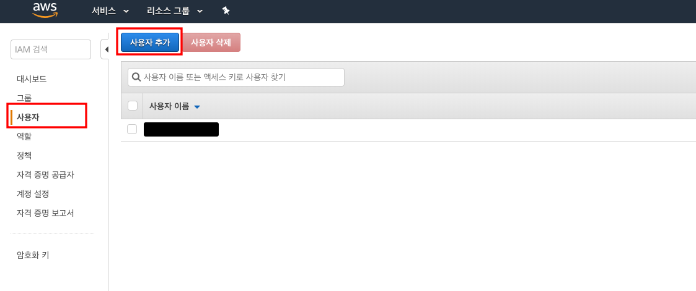
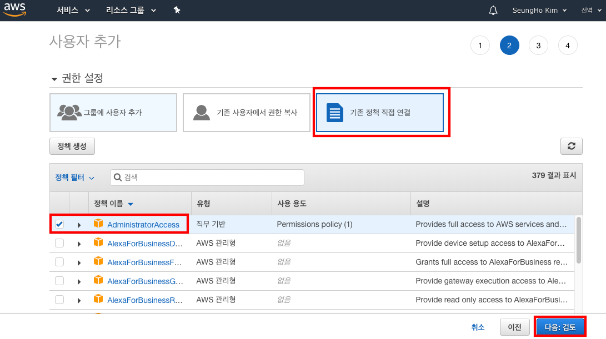
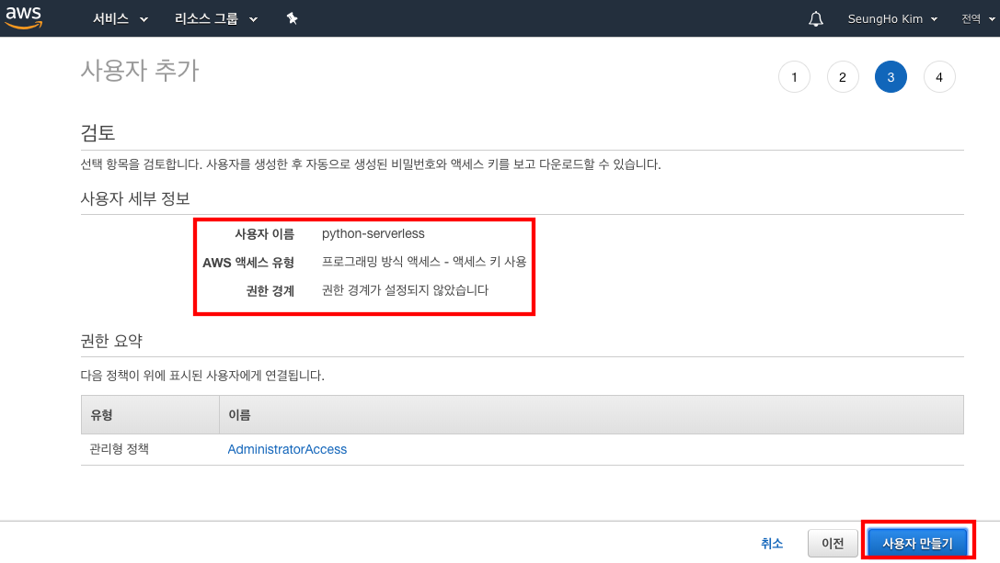

> 본 포스팅은 2018년 9월 29일과 12월 1일에 진행된 김승호님의 "Python Serverless" 코드랩에서 사용되었던 자료입니다. 


## AWS Credentials 설정

오늘 실습하는 Cloud9 환경에은 aws의 여러 리소스를 생성하는 권한(s3, IAM Policy, Role 등 생성)이 필요합니다. Cloud9에 환경에 **관리자 사용자** 를 추가하여 실습을 진행합니다.

### AWS IAM

AWS는 을 통해 [IAM(Identity and Access Management)](https://console.aws.amazon.com/iam/home#/home) AWS resource에 권한을 설정합니다.

IAM 에 관련하여 도움되는 내용입니다.

- [IAM 모범 사례](https://docs.aws.amazon.com/ko_kr/IAM/latest/UserGuide/best-practices.html)
- [자습서: IAM 역할을 사용한 AWS 계정 간 액세스 권한 위임](https://docs.aws.amazon.com/ko_kr/IAM/latest/UserGuide/tutorial_cross-account-with-roles.html)
- [당신이 AWS 계정을 만들고 가장 먼저 해야 할 일 들과 하지 말아야 할 일 들](http://www.awskr.org/2017/01/your-aws-first-days-todo-list/)

#### 관리자 사용자 추가

관리자 사용자와 access key를 생성합니다.

[IAM 사용자](https://console.aws.amazon.com/iam/home#/users) 에 접속하여 사용자 추가 버튼을 선택합니다.



사용자 이름을 입력하고, 액세스 유형에 프로그래밍 방식 액세스를 선택합니다.


'권한 설정: 기존 정책 직접 연결' 탭을 선택 하고 **AdministratorAccess** 를 선택합니다.


사용자 만들기 버튼을 누르면 관라자 사용자가 생성됩니다.


마지막으로 access key를 csv로 다운로드 받으면 access key와 secret key를 얻을 수 있고 다운받은 파일은 다음과 같습니다.


**crentials.csv**

```
User name,Password,Access key ID,Secret access key,Console login link
python-serverless,,YOUR_ACCESS_KEY,YOUR_SECRET_ACCESS_KEY,https://############.signin.aws.amazon.com/console
```


#### Cloud9 에 AWS Credentials 적용

생성한 access key를 Cloud9에 적용합니다.

터미널에서 아래처럼 aws cli 를 사용합니다.

```sh
$ aws configure
AWS Access Key ID [None]: YOUR_ACCESS_KEY
AWS Secret Access Key [None]: YOUR_SECRET_ACCESS_KEY
Default region name [None]: ap-northeast-2
Default output format [None]: json
```

제대로 access key를 입력했는지 확인해 봅니다.

```sh
$ cat ~/.aws/credentials
[default]
aws_access_key_id = YOUR_ACCESS_KEY
aws_secret_access_key = YOUR_SECRET_ACCESS_KEY
aws_session_token =
```

이제 AWS credentials 설정을 마쳤습니다.


