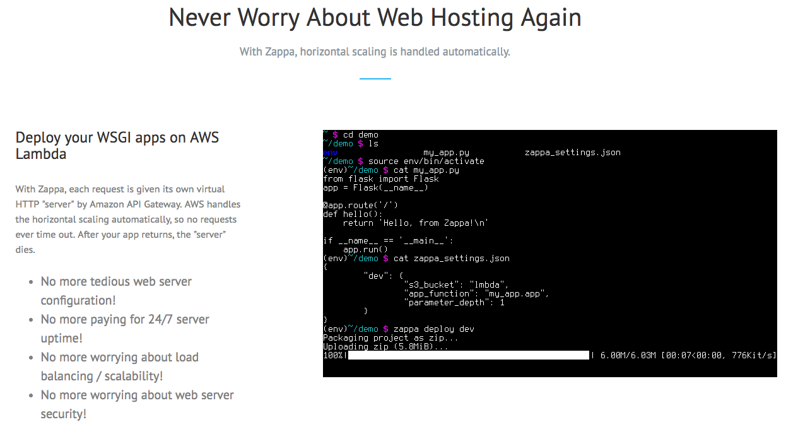

> 본 포스팅은 2018년 9월 29일과 12월 1일에 진행된 김승호님의 "Python Serverless" 코드랩에서 사용되었던 자료입니다. 


## Python 개발 환경 설정

### .bash profile 설정

터미널에서 python 관련 개발환경 명령어를 미리 설정 하도록, Cloud9의 .bash_profile 을 수정합니다.

만약 Cloud9이 아닌 local 에서 실습을 진행하시는 분은, 이 부분은 설정하지 않으셔도 됩니다.

```sh
$ wget https://raw.githubusercontent.com/seunghokimj/python-serverless-demo/master/cloud9_bash_profile
$ cp cloud9_bash_profile ~/.bash_profile

```

현재 터미널을 종료하고 새로운 터미널에서 작업을 시작합니다.


### virtualenv 설정

실습을 위한 독립된 python 개발 환경을 생성합니다.

Python 개발 환경 관리는 [virtualenv](https://virtualenv.pypa.io/) 라는 툴을 사용합니다.

```sh
$ virtualenv -p python3 venv
$ . venv/bin/activate
(venv) $ python
Python 3.6.5 (default, Apr 26 2018, 00:14:31)
[GCC 4.8.5 20150623 (Red Hat 4.8.5-11)] on linux
Type "help", "copyright", "credits" or "license" for more information.
>>>
```

python version 설정을 완료하였습니다.

다시 새로운 터미널을 열면, **(venv)** 라고 virtualenv 가 activate 되어있음을 확인할 수 있습니다.

## [Zappa - Serverless Python Web Services](https://www.zappa.io/)



Zappa는 AWS Lambda serverless 를 위한 python framework 입니다.

> Zappa makes it super easy to build and deploy server-less, event-driven Python applications (including, but not limited to, WSGI web apps) on AWS Lambda + API Gateway.
> Think of it as "serverless" web hosting for your Python apps.
> That means infinite scaling, zero downtime, zero maintenance - and at a fraction of the cost of your current deployments!

Zappa는 python이 설치되어 있는 환경에서 사용할 수 있습니다.

open source로 기여하고 싶다면 [https://github.com/Miserlou/Zappa](https://github.com/Miserlou/Zappa)에서 issue와 pull request를 등록해주세요.


### Zappa 살펴보기

Zappa를 사용하기 위해서 명령어들을 살펴봅시다.

위에서 설정한 virtualenv 환경에서 작업합니다.

```sh
# Zappa 설치
(venv) $ pip install zappa
Successfully installed PyYAML-3.12 Unidecode-1.0.22 ... zappa-0.46.2

# 명령어들을 확인해봅니다.
(venv) $ zappa --help
usage: zappa [-h] [-v] [--color {auto,never,always}]
             {certify,deploy,init,package,template,invoke,manage,rollback,schedule,status,tail,undeploy,unschedule,update,shell}
             ...

Zappa - Deploy Python applications to AWS Lambda and API Gateway.

optional arguments:
  -h, --help            show this help message and exit
  -v, --version         Print the zappa version
  --color {auto,never,always}

subcommands:
  {certify,deploy,init,package,template,invoke,manage,rollback,schedule,status,tail,undeploy,unschedule,update,shell}
    certify             Create and install SSL certificate
    deploy              Deploy application.
    init                Initialize Zappa app.
    package             Build the application zip package locally.
    template            Create a CloudFormation template for this API Gateway.
    invoke              Invoke remote function.
    manage              Invoke remote Django manage.py commands.
    rollback            Rollback deployed code to a previous version.
    schedule            Schedule functions to occur at regular intervals.
    status              Show deployment status and event schedules.
    tail                Tail deployment logs.
    undeploy            Undeploy application.
    unschedule          Unschedule functions.
    update              Update deployed application.
    shell               A debug shell with a loaded Zappa object.
```

여기서 자주 사용하게 될 명령어는 다음과 같습니다.

- init: 프로젝트 생성시 사용
- deploy: 첫 배포할 때 사용
- update: deploy 이 후 변경시 사용
- package: 배포될 패키지의 구조를 보고싶을 때 사용
- invoke: 특정 handler를 동작시킬 때 사용
- undeploy: 배포된 리소스를 제거할 때 사용

간단하게 zappa init 명령어를 확인해 봅니다. deploy 명령어는 추후에 사용하겠습니다.

```sh
# first zappa project dir 생성
(venv) ec2-user:~/environment $ mkdir first_zappa && cd first_zappa
# init 으로 기본 설정
(venv) ec2-user:~/environment/first_zappa $ zappa init

███████╗ █████╗ ██████╗ ██████╗  █████╗
╚══███╔╝██╔══██╗██╔══██╗██╔══██╗██╔══██╗
  ███╔╝ ███████║██████╔╝██████╔╝███████║
 ███╔╝  ██╔══██║██╔═══╝ ██╔═══╝ ██╔══██║
███████╗██║  ██║██║     ██║     ██║  ██║
╚══════╝╚═╝  ╚═╝╚═╝     ╚═╝     ╚═╝  ╚═╝

Welcome to Zappa!

Zappa is a system for running server-less Python web applications on AWS Lambda and AWS API Gateway.
This `init` command will help you create and configure your new Zappa deployment.
Let's get started!

Your Zappa configuration can support multiple production stages, like 'dev', 'staging', and 'production'.
What do you want to call this environment (default 'dev'): dev

AWS Lambda and API Gateway are only available in certain regions. Let's check to make sure you have a profile set up in one that will work.
Okay, using profile default!

Your Zappa deployments will need to be uploaded to a private S3 bucket.
If you don't have a bucket yet, we'll create one for you too.
What do you want to call your bucket? (default 'zappa-ld67k976y'):

What's the modular path to your app's function?
This will likely be something like 'your_module.app'.
Where is your app's function?: first_zappa

You can optionally deploy to all available regions in order to provide fast global service.
If you are using Zappa for the first time, you probably don't want to do this!
Would you like to deploy this application globally? (default 'n') [y/n/(p)rimary]:

Okay, here's your zappa_settings.json:

{
    "dev": {
        "app_function": "first_zappa",
        "aws_region": "ap-northeast-2",
        "profile_name": "default",
        "project_name": "first-zappa",
        "runtime": "python3.6",
        "s3_bucket": "zappa-ld67k976y"
    }
}

Does this look okay? (default 'y') [y/n]:

Done! Now you can deploy your Zappa application by executing:

        $ zappa deploy dev

After that, you can update your application code with:

        $ zappa update dev

To learn more, check out our project page on GitHub here: https://github.com/Miserlou/Zappa
and stop by our Slack channel here: https://slack.zappa.io

Enjoy!,
 ~ Team Zappa!
```

zappa_settings.json 파일을 확인하면 기본적인 zappa 설정 내용을 확인할 수 있습니다.

자세한 설정 내용은 [zappa github](https://github.com/Miserlou/Zappa) 을 통해 확인하면 알 수 있습니다.


